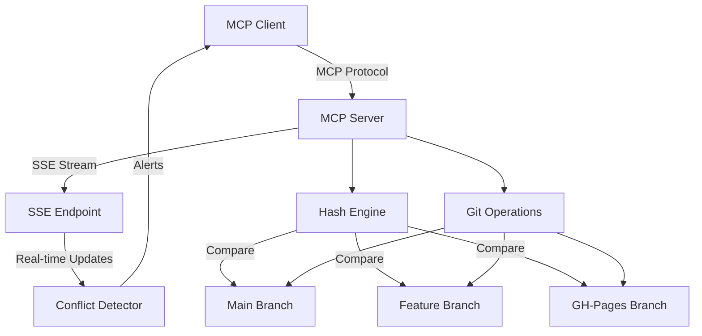
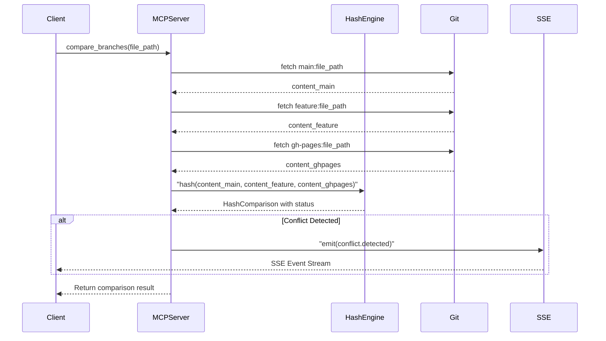

# SSE MCP Connector for GitHub Pages Branch Synchronization

## Meta-Markup Notation System

This project uses a higher-level meta-markup notation for defining MCP protocol structures and schemas:

- `$` replaces `#` - Defines structural hierarchy (resources, tools, schemas)
- `^` replaces `%` - Defines variable placeholders and parameters
- `*` replaces `&` - Defines entity references and cross-references

### Meta-Markup Usage

**Schema Definition Example:**

```
$$ BranchResource
  ^branch_name: string
  ^file_path: string
  *content_hash: HashComparison
  *conflict_status: ConflictStatus
```

**Tool Definition Example:**

```
$$$ compare_branches
  Input:
    ^file_path: string
    ^branches: [^main, ^feature, ^ghpages]
  Output:
    *HashComparison
  Emits:
    *SSE:conflict.detected
```

This meta-notation will be used in:

1. `schemas/` directory - Define all data structures
2. `docs/protocol.meta` - Document MCP protocol extensions
3. Tool and resource specifications in code comments
4. Auto-generation of TypeScript types and Python dataclasses

### File Structure Addition

```
sse-mcp-connector/
├── schemas/
│   ├── meta-markup.grammar     # Meta-markup language grammar
│   ├── hash_comparison.meta    # HashComparison schema
│   ├── conflict_status.meta    # ConflictStatus schema
│   └── sse_events.meta         # SSE event schemas
├── docs/
│   └── protocol.meta           # Complete protocol documentation
```

## Architecture Overview



## Core Components

### 1. Hash Engine (`hash_engine.py`)

Implements a three-way content hashing algorithm:

- **SHA-256 hashing** for file content fingerprinting
- **Three-way comparison logic**:
  - Previous version (main branch)
  - New version (feature branch)
  - Existing version (gh-pages branch)
- **Conflict detection patterns**:
  - Fast-forward: `main == existing, feature != main` (safe merge)
  - Diverged: `main != existing != feature` (three-way conflict)
  - Already synced: `main == feature == existing` (no action)
  - Dirty state: `feature != existing, main == existing` (feature ahead)
```python
class HashComparison:
    previous_hash: str  # main branch
    new_hash: str       # feature branch
    existing_hash: str  # gh-pages branch
    status: ConflictStatus
    
    def detect_conflict_type(self) -> ConflictType:
        # Three-way comparison logic
```


### 2. MCP Server (`mcp_server.py`)

Node.js-based MCP server following the Model Context Protocol specification:

- **Tools exposed**:
  - `compare_branches`: Compare file hashes across three branches
  - `sync_to_ghpages`: Sync files with conflict resolution
  - `get_file_status`: Get current hash status for a file
  - `list_conflicts`: List all detected conflicts

- **Resources exposed**:
  - `branch://main/*`: Access to main branch files
  - `branch://feature/*`: Access to feature branch files
  - `branch://gh-pages/*`: Access to gh-pages files

### 3. SSE Endpoint (`sse_handler.py`)

Real-time streaming of conflict events:

- **Event types**:
  - `conflict.detected`: When hash mismatches indicate conflicts
  - `conflict.resolved`: When conflicts are manually or auto-resolved
  - `sync.started`: Synchronization operation began
  - `sync.completed`: Synchronization finished
  - `file.changed`: Individual file hash changed

- **Connection management**:
  - Long-lived connections with heartbeat
  - Automatic reconnection logic
  - Client-side event source handling

### 4. Git Operations (`git_ops.py`)

Interface with Git repositories:

- Fetch file contents from specific branches
- Compute hashes without checking out branches
- Use `git show branch:path` for efficient access
- Cache branch HEADs to detect updates

### 5. Conflict Resolution Strategy

Implement automatic and manual resolution modes:

**Auto-resolution rules**:

- Fast-forward: Automatically apply feature to gh-pages
- Identical: Skip (already synced)

**Manual resolution required**:

- Three-way divergence: User must choose version
- Custom merge: User provides merged content

## Implementation Flow



## File Structure

```
sse-mcp-connector/
├── src/
│   ├── mcp_server.ts          # Main MCP server (Node.js)
│   ├── hash_engine.py         # Hash comparison logic
│   ├── sse_handler.py         # SSE endpoint handler
│   ├── git_ops.py             # Git operations wrapper
│   ├── conflict_detector.py   # Conflict detection rules
│   └── types.py               # Shared type definitions
├── tests/
│   ├── test_hash_engine.py
│   ├── test_conflict_detection.py
│   └── test_git_ops.py
├── package.json               # Node.js dependencies
├── requirements.txt           # Python dependencies
├── mcp-config.json           # MCP server configuration
└── README.md
```

## Key Algorithms

### Three-Way Hash Comparison

```python
def compare_three_way(previous: bytes, new: bytes, existing: bytes) -> ConflictStatus:
    h_prev = sha256(previous).hexdigest()
    h_new = sha256(new).hexdigest()
    h_exist = sha256(existing).hexdigest()
    
    if h_prev == h_new == h_exist:
        return ConflictStatus.SYNCED
    elif h_prev == h_exist and h_new != h_prev:
        return ConflictStatus.FAST_FORWARD
    elif h_prev != h_exist and h_new == h_prev:
        return ConflictStatus.DIVERGED_GHPAGES
    else:
        return ConflictStatus.THREE_WAY_CONFLICT
```

### SSE Event Streaming

```python
async def stream_conflicts(repo_path: str):
    while True:
        conflicts = detect_all_conflicts(repo_path)
        for conflict in conflicts:
            yield {
                "event": "conflict.detected",
                "data": json.dumps({
                    "file": conflict.path,
                    "hashes": {
                        "main": conflict.main_hash,
                        "feature": conflict.feature_hash,
                        "gh-pages": conflict.ghpages_hash
                    },
                    "type": conflict.type
                })
            }
        await asyncio.sleep(5)  # Poll interval
```

## Integration Points

1. **GitHub Pages Deployment**: Hook into `.github/workflows/` to trigger on push
2. **MCP Client**: Can be called from Cursor IDE or other MCP clients
3. **Local Development**: Works with local Git repositories
4. **CI/CD**: Can be integrated into GitHub Actions for automated conflict checks

## Configuration

```json
{
  "mcpServers": {
    "github-pages-sync": {
      "command": "node",
      "args": ["src/mcp_server.ts"],
      "env": {
        "REPO_PATH": "/Users/sdw/Documents/gh/profile",
        "MAIN_BRANCH": "main",
        "FEATURE_BRANCH": "feature",
        "GHPAGES_BRANCH": "gh-pages",
        "SSE_PORT": "3002"
      }
    }
  }
}
```

## Technology Stack

- **MCP Server**: Node.js + TypeScript (MCP SDK)
- **Hash Engine**: Python 3.10+ (hashlib, dataclasses)
- **Meta-Markup Parser**: Python (pyparsing or custom PEG parser)
- **SSE**: FastAPI or Node.js EventSource
- **Git Operations**: GitPython or subprocess
- **Schema Generation**: Jinja2 templates for code generation from .meta files
- **Testing**: pytest, jest

## Meta-Markup to Code Generation

The meta-markup schemas will automatically generate:

1. **TypeScript Interfaces** from `$$` definitions
2. **Python Dataclasses** from `$$` definitions  
3. **JSON Schema** for validation
4. **MCP Tool Specifications** from `$$$` definitions
5. **Documentation** in markdown format

Example generation flow:

```
hash_comparison.meta → meta_parser.py → [types.ts, types.py, schema.json, docs.md]
```

## Next Steps After Implementation

1. Test with actual Jekyll blog repository
2. Add UI for conflict resolution
3. Implement merge strategies (theirs, ours, manual)
4. Add webhook support for GitHub push events
5. Create dashboard for monitoring sync status