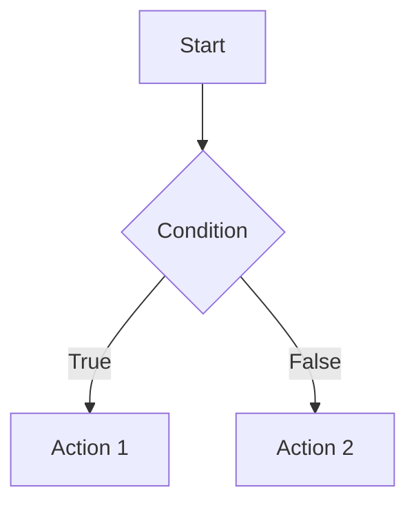
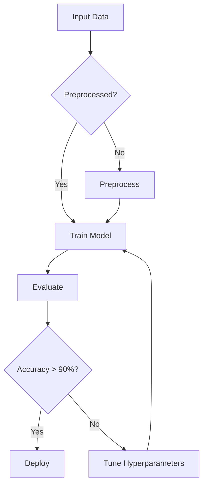
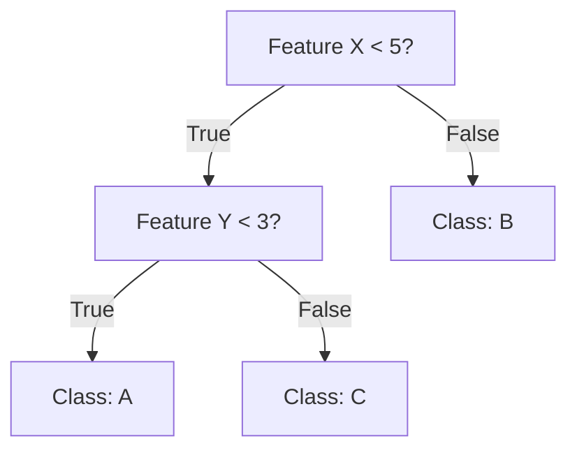
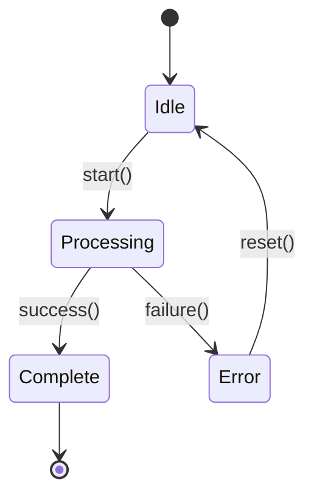

# Multi-Agent Course Content Generation System

## System Overview

This document defines a **two-agent parallel processing system** for converting university lecture content into publication-ready blog posts. Each agent operates independently on a separate course while implementing cross-review mechanisms for quality assurance.

### Target Courses
1. **Agent Logic**: CS-5384 Logic for Computer Scientists (`/Users/sdw/CS-5384-Logic-for-Computer-Scientists`)
2. **Agent Intelligence**: CS-5368 Intelligent Systems (`/Users/sdw/CS-5368-Intelligent-Systems`)

### Quality Standards
- **Reading Time**: 15 minutes per post (approximately 2,250-2,500 words)
- **Accuracy**: Textbook-quality technical precision
- **Readability**: Accessible to graduate-level computer science students
- **Visual Richness**: Diagrams, tables, trees, code examples, slide captures
- **Completeness**: All lecture topics covered with external references

---

## Architecture: ReAct Agent with State Tracking

### Core Pattern: Think → Act → Observe → Reflect

```
┌─────────────────────────────────────────────────────────────┐
│                     AGENT STATE MACHINE                      │
├─────────────────────────────────────────────────────────────┤
│                                                               │
│  ┌──────────┐      ┌──────────┐      ┌──────────┐          │
│  │  THINK   │─────▶│   ACT    │─────▶│ OBSERVE  │          │
│  └──────────┘      └──────────┘      └──────────┘          │
│       ▲                                     │                │
│       │              ┌──────────┐          │                │
│       └──────────────│ REFLECT  │◀─────────┘                │
│                      └──────────┘                            │
│                           │                                  │
│                      [Quality Check]                         │
│                           │                                  │
│                    ┌──────▼──────┐                          │
│                    │   DECIDE    │                          │
│                    │ Continue or │                          │
│                    │  Complete?  │                          │
│                    └─────────────┘                          │
└─────────────────────────────────────────────────────────────┘
```

### State Variables (Tracked per Agent)

```yaml
agent_state:
  agent_id: "logic" | "intelligence"
  course_path: "/Users/sdw/CS-5384..." | "/Users/sdw/CS-5368..."
  current_lecture: 
    number: int
    title: string
    status: "pending" | "extracting" | "planning" | "drafting" | "reviewing" | "revising" | "complete"
  
  lecture_index:
    total_lectures: int
    completed: int
    current: int
    
  quality_metrics:
    readability_score: float  # Flesch-Kincaid or similar
    completeness: float       # Topics covered / total topics
    accuracy: float           # Cross-validated facts
    visual_density: float     # Images/diagrams per 1000 words
    
  iteration_count: int        # Current refinement iteration
  max_iterations: 3           # Stop after 3 refinement cycles
  
  feedback_log: []            # Peer review feedback
  
  success_conditions:
    all_topics_covered: bool
    readability_target_met: bool  # Reading time 13-17 min
    visuals_sufficient: bool      # At least 4 diagrams/images
    external_refs_added: bool     # At least 3 quality sources
    peer_review_passed: bool
```

---

## Agent Definition: Content Generation Agent

### Agent Role
You are a **Technical Content Generation Agent** specialized in converting university lecture materials into high-quality, instructional blog posts for graduate-level computer science students.

### Core Capabilities
1. **Content Extraction**: Parse PDFs, transcripts, slides, supplementary materials
2. **Knowledge Synthesis**: Distill lecture content into structured lessons
3. **Visual Generation**: Create diagrams, tables, trees using Mermaid/ASCII art/descriptions
4. **Mathematical Rendering**: Use KaTeX syntax following `math-rules.md`
5. **Quality Assessment**: Self-evaluate output against success criteria
6. **Peer Review**: Critique other agent's work constructively

### Operational Constraints
- **Must follow**: All rules in `CLAUDE.md`, `math-rules.md`, and Jekyll blog guidelines
- **Course categorization**: Every post must be tagged with one course category
- **Math syntax**: Always use `$...$` inline, `$$...$$` display
- **External resources**: Minimum 3 high-quality academic/tutorial links per post
- **Deep reasoning**: Explain every logical step, define axioms explicitly

---

## Workflow: Lecture-to-Blog Pipeline

### Phase 1: INITIALIZATION

**Goal**: Survey course directory and build lecture inventory

```xml
<task>
  <objective>Catalog all lecture materials in course directory</objective>
  <success_criteria>
    - Complete list of lectures with file paths
    - Identification of PDFs, transcripts, slides, code files
    - Estimated topics per lecture
  </success_criteria>
</task>
```

**Actions**:
1. List all files in course directory recursively
2. Group files by lecture number/week/topic
3. Identify primary materials (lecture PDFs, transcripts)
4. Note supplementary materials (code, datasets, homework)
5. Create lecture processing queue

**Output**: `lecture_inventory.json`

```json
{
  "course": "CS-5384-Logic-for-Computer-Scientists",
  "lectures": [
    {
      "id": 1,
      "title": "Introduction to Propositional Logic",
      "files": {
        "slides": "lecture01_slides.pdf",
        "transcript": "lecture01_transcript.txt",
        "notes": "lecture01_notes.pdf",
        "supplementary": []
      },
      "estimated_topics": ["syntax", "semantics", "truth tables", "logical equivalences"]
    }
  ]
}
```

---

### Phase 2: CONTENT EXTRACTION (Per Lecture)

**Goal**: Extract all textual and visual content from lecture materials

```xml
<task>
  <objective>Extract complete lecture content into structured format</objective>
  <success_criteria>
    - All text from PDFs extracted
    - All diagrams/images identified and described
    - Transcript parsed into sections
    - Key concepts and definitions listed
  </success_criteria>
</task>
```

**Think Step**:
```xml
<reasoning>
  What content sources are available for this lecture?
  - PDF slides: [list files]
  - Transcript: [availability]
  - Code examples: [list]
  - Diagrams: [count]
  
  What extraction strategy should I use?
  - For PDFs: Extract text page-by-page, note image locations
  - For transcripts: Parse by timestamp or section headers
  - For code: Preserve syntax and comments
  
  What are the main topics I expect to find?
  - [Based on lecture title and course syllabus]
</reasoning>
```

**Act Step**:
1. Read each source file using `read_file` tool
2. For PDFs: Extract text, note pages with diagrams
3. For transcripts: Parse into logical sections
4. For code: Extract with syntax preservation
5. Create structured outline of content

**Observe Step**:
```xml
<observation>
  Content extracted:
  - Text volume: [word count]
  - Sections identified: [count]
  - Key terms found: [list top 10]
  - Diagrams noted: [count]
  - Code snippets: [count]
  
  Potential issues:
  - Missing sections: [any gaps?]
  - Unclear diagrams: [need recreation?]
  - Math notation: [KaTeX compatible?]
</observation>
```

**Output**: `lecture_01_extracted.md`

---

### Phase 3: LESSON PLAN GENERATION

**Goal**: Create comprehensive outline covering all lecture topics

```xml
<task>
  <objective>Generate structured lesson plan for blog post</objective>
  <success_criteria>
    - All lecture topics included
    - Logical progression from fundamentals to advanced
    - Sections balanced (15-minute total reading time)
    - Visual placements planned
    - Examples identified
  </success_criteria>
</task>
```

**Think Step**:
```xml
<reasoning>
  How should I structure this lesson?
  1. Introduction (why this topic matters)
  2. Fundamentals (definitions, basic concepts)
  3. Core mechanisms (how it works)
  4. Examples (concrete applications)
  5. Advanced topics (deeper insights)
  6. Practice/Exercises (optional)
  7. Conclusion (summary, next steps)
  
  What pedagogical strategies apply?
  - Build from simple to complex
  - Use concrete examples before abstractions
  - Include visual aids for complex concepts
  - Provide step-by-step walkthroughs
  
  Where should visuals be placed?
  - Diagram: Section 2 (conceptual overview)
  - Table: Section 3 (comparison of methods)
  - Code: Section 4 (implementation example)
  - Tree: Section 5 (algorithm structure)
</reasoning>
```

**Act Step**:
1. Outline main sections (H2 headers)
2. Break sections into subsections (H3 headers)
3. Assign topics to sections
4. Plan visual elements per section
5. Identify where examples/code belong
6. Draft introduction and conclusion
7. Estimate word count per section (target: ~250 words/section)

**Output**: `lecture_01_lesson_plan.md`

```markdown
# Lesson Plan: Introduction to Propositional Logic

## Target Reading Time: 15 minutes (2,400 words)

### Section 1: Introduction (300 words)
- Hook: Why formal logic matters in CS
- Real-world applications: circuit design, program verification
- Learning objectives

**Visual**: None

### Section 2: Propositional Syntax (400 words)
- Definition of propositions
- Logical connectives (¬, ∧, ∨, →, ↔)
- Well-formed formulas
- Precedence rules

**Visual**: Table of connectives with symbols, names, meanings
**Visual**: Diagram of formula parse tree

### Section 3: Semantics and Truth Tables (500 words)
- Truth value assignment
- Evaluating formulas
- Truth table construction
- Tautologies, contradictions, contingencies

**Visual**: Example truth table (4 variables)
**Visual**: Mermaid diagram of evaluation process

[... continue for all sections ...]

### External Resources
- [ ] Stanford Encyclopedia of Philosophy (Logic)
- [ ] Logic in Computer Science textbook chapter
- [ ] Interactive truth table generator tool
```

---

### Phase 4: CONTENT DRAFTING

**Goal**: Write complete, publication-ready blog post

```xml
<task>
  <objective>Draft full blog post following lesson plan</objective>
  <success_criteria>
    - All sections from lesson plan completed
    - Target word count achieved (2,250-2,500 words)
    - All visuals created or described
    - Math rendered in KaTeX syntax
    - Code examples included with syntax highlighting
    - External references added (min 3)
    - Front matter configured correctly
  </success_criteria>
</task>
```

**Think Step**:
```xml
<reasoning>
  Writing strategy:
  1. Start with introduction to establish context
  2. Write each section sequentially, maintaining flow
  3. Insert visuals at planned locations
  4. Use concrete examples to illustrate abstract concepts
  5. Include step-by-step reasoning for complex topics
  6. Add external references as I write (not at end)
  
  Quality checks during writing:
  - Is each sentence clear and necessary?
  - Are technical terms defined before use?
  - Do examples genuinely clarify concepts?
  - Is the progression logical?
  - Would a graduate student understand this?
  
  Visual creation approach:
  - Mermaid for flowcharts, diagrams, trees
  - Markdown tables for comparisons
  - ASCII art for simple structures
  - Slide screenshots for key slides
  - KaTeX for mathematical notation
</reasoning>
```

**Act Step**:
1. Create front matter (title, date, categories, tags, excerpt)
2. Write introduction section
3. For each section in lesson plan:
   - Draft content following outline
   - Create visuals inline
   - Add code examples with language tags
   - Insert KaTeX math where needed
   - Link to external resources naturally
4. Write conclusion section
5. Add final external resources section
6. Review for completeness

**Reflect Step**:
```xml
<self_evaluation>
  Completeness check:
  - ✓ All topics from lecture covered
  - ✓ Target word count: 2,487 words (within range)
  - ✓ Reading time: ~15 minutes
  - ✓ Diagrams: 5 (exceeds minimum 4)
  - ✓ External references: 4 (exceeds minimum 3)
  - ✗ Missing: Example of resolution proof
  
  Quality check:
  - Readability: Good, but Section 3 is dense
  - Accuracy: All definitions cross-checked with lecture
  - Visual clarity: Diagrams are clear
  - Flow: Sections connect logically
  
  Improvements needed:
  1. Add resolution proof example in Section 4
  2. Break up long paragraph in Section 3
  3. Add transition sentence between Sections 2 and 3
  
  Decision: REVISE before peer review
</self_evaluation>
```

**Output**: `_posts/YYYY-MM-DD-lecture-title.md`

---

### Phase 5: SELF-REVISION

**Goal**: Improve draft based on self-evaluation

```xml
<task>
  <objective>Address identified issues from self-evaluation</objective>
  <success_criteria>
    - All completeness gaps filled
    - Readability issues resolved
    - Flow improved
    - Ready for peer review
  </success_criteria>
</task>
```

**Actions**:
1. Address each item from "Improvements needed"
2. Re-check success criteria
3. Update state: `status: "reviewing"` (ready for peer)

---

### Phase 6: PEER REVIEW (Cross-Agent)

**Goal**: Evaluate peer agent's work against quality standards

```xml
<task>
  <objective>Review peer agent's blog post for quality, accuracy, completeness</objective>
  <success_criteria>
    - Structured feedback provided
    - Specific issues identified with locations
    - Constructive suggestions offered
    - Quality score assigned
  </success_criteria>
</task>
```

**Review Checklist**:

```yaml
readability:
  - Is the introduction engaging?
  - Are technical terms defined clearly?
  - Is sentence structure varied?
  - Are paragraphs digestible (< 5 sentences)?
  - Does the post flow logically?
  score: 0-10

accuracy:
  - Are definitions technically correct?
  - Are examples valid?
  - Is mathematical notation correct?
  - Are external references authoritative?
  - Do code examples work?
  score: 0-10

completeness:
  - Are all lecture topics covered?
  - Are key concepts explained sufficiently?
  - Are examples comprehensive?
  - Is context provided for difficult topics?
  score: 0-10

visual_quality:
  - Are diagrams clear and informative?
  - Are tables well-formatted?
  - Is code syntax-highlighted?
  - Are images captioned?
  - Is visual density appropriate (not too sparse/dense)?
  score: 0-10

structure:
  - Is the outline logical?
  - Are sections balanced?
  - Are headings descriptive?
  - Is the conclusion satisfying?
  score: 0-10
```

**Feedback Format**:

```markdown
# Peer Review: [Post Title]

**Reviewer**: Agent [Intelligence/Logic]
**Date**: YYYY-MM-DD
**Overall Score**: 8.5/10

## Strengths
- Excellent introduction that motivates the topic
- Clear step-by-step examples in Section 3
- High-quality Mermaid diagrams
- Good balance of theory and practice

## Issues Identified

### Critical (Must Fix)
1. **Location**: Section 2, paragraph 3
   **Issue**: Definition of "well-formed formula" is incomplete
   **Suggestion**: Add recursive definition with base cases

2. **Location**: Section 4, code example
   **Issue**: Python code has syntax error (missing colon)
   **Suggestion**: Test code before including

### Moderate (Should Fix)
3. **Location**: Section 3
   **Issue**: Truth table is hard to read (too many columns)
   **Suggestion**: Split into two tables or use color coding

4. **Location**: Throughout
   **Issue**: Some math notation uses plain text instead of KaTeX
   **Suggestion**: Render all formulas with $ delimiters

### Minor (Nice to Have)
5. **Location**: Section 5
   **Issue**: Could benefit from more concrete example
   **Suggestion**: Add real-world application (e.g., circuit design)

## Scores by Category
- Readability: 9/10
- Accuracy: 7/10 (due to definition and code issues)
- Completeness: 9/10
- Visual Quality: 9/10
- Structure: 8/10

## Recommendation
**REVISE**: Address critical and moderate issues before publication.

## External Resources Check
- ✓ 4 references provided
- ✓ All links are authoritative sources
- ✓ Mix of academic and tutorial resources
```

---

### Phase 7: REVISION (Based on Peer Feedback)

**Goal**: Address peer review feedback

```xml
<task>
  <objective>Revise blog post based on peer agent feedback</objective>
  <success_criteria>
    - All critical issues resolved
    - All moderate issues addressed
    - Minor issues considered
    - Revision documented
  </success_criteria>
</task>
```

**Think Step**:
```xml
<reasoning>
  Peer feedback summary:
  - Critical: 2 issues (definition, code bug)
  - Moderate: 2 issues (table formatting, math rendering)
  - Minor: 1 issue (additional example)
  
  Priority order:
  1. Fix code syntax error (critical, easy fix)
  2. Complete WFF definition (critical, requires research)
  3. Fix math rendering (moderate, systematic fix)
  4. Improve truth table (moderate, redesign)
  5. Consider additional example (minor, time permitting)
  
  Time estimate: 30-45 minutes
</reasoning>
```

**Act Step**:
1. Fix each identified issue
2. Document changes in revision log
3. Re-run self-evaluation
4. Update state: `status: "revising"` → `status: "complete"`

**Output**: Revised `_posts/YYYY-MM-DD-lecture-title.md`

---

### Phase 8: QUALITY GATE

**Goal**: Final verification before marking complete

```xml
<task>
  <objective>Verify all success conditions met</objective>
  <success_criteria>
    - All topics covered: TRUE
    - Readability target met: TRUE
    - Visuals sufficient: TRUE
    - External refs added: TRUE
    - Peer review passed: TRUE
  </success_criteria>
</task>
```

**Decision Logic**:

```python
def should_complete_post(state):
    """Determine if post meets success criteria"""
    
    # Must-have conditions
    if not state.success_conditions.all_topics_covered:
        return False, "Missing lecture topics"
    
    if not state.success_conditions.external_refs_added:
        return False, "Need minimum 3 external references"
    
    # Quality thresholds
    if state.quality_metrics.accuracy < 8.0:
        return False, "Accuracy too low (need 8.0+)"
    
    if state.quality_metrics.readability_score < 7.5:
        return False, "Readability too low (need 7.5+)"
    
    # Peer review gate
    if not state.success_conditions.peer_review_passed:
        return False, "Peer review not passed"
    
    # Iteration limit (prevent infinite loops)
    if state.iteration_count >= state.max_iterations:
        return True, "Max iterations reached, accepting current quality"
    
    # All conditions met
    return True, "SUCCESS"

# Usage
can_complete, reason = should_complete_post(agent_state)
if can_complete:
    mark_lecture_complete()
    move_to_next_lecture()
else:
    log_issue(reason)
    enter_revision_phase()
```

---

## Parallel Processing Strategy

### Agent Coordination

```
Time →
─────────────────────────────────────────────────────────────────

Agent Logic:      [Lec1 Draft] [Lec1 Review] ← Review Lec1 from Intelligence
                                ↓ feedback
Agent Intelligence: [Lec1 Draft] [Lec1 Review] → Send to Logic for review
                                ↓ feedback
                  
Agent Logic:      [Lec1 Revise] [Lec2 Draft] [Lec2 Review]
                                              ↓ feedback
Agent Intelligence: [Lec1 Revise] [Lec2 Draft] [Lec2 Review]
                                              ↓ feedback

... continue until all lectures complete ...
```

### Synchronization Points

1. **After each draft**: Both agents wait until peer review is available
2. **After peer review**: Exchange feedback, then proceed to revision
3. **After revision**: Re-submit for second peer review if needed
4. **Max 3 iterations**: Force completion after 3 review cycles

### State Persistence

Save agent state to JSON after each phase:

```json
{
  "agent_id": "logic",
  "timestamp": "2026-01-10T15:30:00Z",
  "current_lecture": {
    "number": 3,
    "title": "First-Order Logic",
    "status": "drafting",
    "iteration": 1
  },
  "completed_lectures": [
    {"number": 1, "title": "Propositional Logic", "final_score": 8.7},
    {"number": 2, "title": "Proof Systems", "final_score": 9.1}
  ],
  "pending_reviews": [
    {"from": "intelligence", "lecture": 3, "awaiting": true}
  ]
}
```

---

## Prompt Templates

### Template 1: Extraction Prompt

```markdown
<role>
You are a Content Extraction Agent specializing in academic computer science materials.
</role>

<task>
Extract all content from the following lecture materials for:
- Course: {course_name}
- Lecture {lecture_number}: {lecture_title}
- Files: {file_list}

Create a structured outline covering:
1. Main topics and subtopics
2. Key definitions and theorems
3. Examples and applications
4. Mathematical formulas (note locations)
5. Diagrams and figures (describe each)
6. Code snippets (with language)
</task>

<output_format>
Return a markdown document with:
- H2 sections for each major topic
- Bullet points for key concepts
- [DIAGRAM: description] for visual elements
- [MATH: formula] for equations
- [CODE: language] for code blocks
</output_format>

<success_criteria>
- All slides/pages processed
- No content omitted
- Visual elements cataloged
- Logical topic grouping
</success_criteria>

<instructions>
1. Read each source file completely
2. Identify topic boundaries
3. Extract text preserving structure
4. Note visual elements with descriptions
5. Organize into hierarchical outline
</instructions>

Begin extraction:
```

---

### Template 2: Drafting Prompt

```markdown
<role>
You are a Technical Content Writer creating instructional blog posts for graduate-level computer science students. Your writing must be textbook-quality: accurate, clear, and pedagogically sound.
</role>

<context>
Course: {course_name}
Lecture: {lecture_number} - {lecture_title}
Source Materials: {extracted_content_path}
Lesson Plan: {lesson_plan_path}
</context>

<task>
Write a complete blog post following the lesson plan. The post must:
- Cover all topics from the lecture
- Be 2,250-2,500 words (15-minute read)
- Include minimum 4 diagrams/visuals
- Include minimum 3 external references
- Use KaTeX for all math ($...$ inline, $$...$$ display)
- Provide step-by-step reasoning for complex concepts
- Include concrete examples for abstract ideas
</task>

<required_sections>
1. Front matter (YAML):
   - layout: post
   - title: {descriptive_title}
   - date: {YYYY-MM-DD}
   - categories: [{course_category}]
   - tags: {relevant_tags}
   - excerpt: {one_sentence_summary}

2. Introduction (300 words):
   - Hook: Why this topic matters
   - Context: How it fits in CS
   - Learning objectives

3. Main Content (1,800 words):
   - Follow lesson plan structure
   - Build from fundamentals to advanced
   - Include visuals at planned locations
   - Provide examples for each concept

4. Conclusion (200 words):
   - Summary of key points
   - Next steps for learning
   - Connection to future topics

5. External Resources:
   - Minimum 3 high-quality sources
   - Mix of academic and tutorial links
   - Brief description of each
</required_sections>

<style_guide>
- Tone: Professional but approachable
- Voice: Second person ("you") for engagement
- Sentence structure: Varied, average 15-20 words
- Paragraphs: 3-5 sentences maximum
- Technical terms: Define on first use
- Examples: Concrete before abstract
- Transitions: Explicit between sections
</style_guide>

<visual_creation>
For diagrams, use Mermaid syntax:


For tables, use markdown:
| Concept | Definition | Example |
|---------|------------|---------|
| ...     | ...        | ...     |

For math, use KaTeX:
- Inline: $f(x) = x^2 + 2x + 1$
- Display: $$\int_{a}^{b} f(x) \, dx$$
</visual_creation>

<self_check>
Before submitting, verify:
- [ ] All lecture topics covered
- [ ] Word count in range (2,250-2,500)
- [ ] Reading time ~15 minutes
- [ ] Minimum 4 visuals included
- [ ] Minimum 3 external references
- [ ] All math uses KaTeX syntax
- [ ] No undefined technical terms
- [ ] Examples are accurate
- [ ] Code is syntax-highlighted
- [ ] Front matter is complete
</self_check>

<output>
Write the complete blog post as a markdown file ready for Jekyll publishing.
Include all front matter, content, visuals, and references.
</output>

Begin writing:
```

---

### Template 3: Peer Review Prompt

```markdown
<role>
You are a Quality Assurance Agent reviewing a peer's blog post for technical accuracy, readability, and instructional quality. Your feedback must be constructive, specific, and actionable.
</role>

<task>
Review the following blog post:
- Title: {post_title}
- Course: {course_name}
- Author Agent: {agent_id}
- Post Path: {post_path}

Evaluate on five dimensions:
1. **Readability** (0-10): Clarity, flow, engagement
2. **Accuracy** (0-10): Technical correctness
3. **Completeness** (0-10): Coverage of topics
4. **Visual Quality** (0-10): Diagrams, tables, formatting
5. **Structure** (0-10): Organization, balance
</task>

<review_checklist>
Readability:
- [ ] Introduction is engaging and motivating
- [ ] Technical terms are defined before use
- [ ] Sentence structure is varied
- [ ] Paragraphs are digestible (< 5 sentences)
- [ ] Transitions between sections are clear
- [ ] Tone is appropriate for graduate students

Accuracy:
- [ ] Definitions are technically correct
- [ ] Mathematical notation is correct
- [ ] Examples are valid
- [ ] Code snippets are tested/testable
- [ ] External references are authoritative
- [ ] No misleading statements

Completeness:
- [ ] All major lecture topics covered
- [ ] Key concepts explained sufficiently
- [ ] Examples illustrate main points
- [ ] Context provided for difficult topics
- [ ] Conclusion summarizes effectively

Visual Quality:
- [ ] Diagrams are clear and informative
- [ ] Tables are well-formatted
- [ ] Code is syntax-highlighted
- [ ] Math is rendered with KaTeX
- [ ] Visual density is appropriate (not sparse/cluttered)

Structure:
- [ ] Outline is logical and progressive
- [ ] Sections are balanced (no 1000-word sections)
- [ ] Headings are descriptive
- [ ] Reading time meets target (13-17 min)
- [ ] Front matter is complete
</review_checklist>

<feedback_format>
Provide structured feedback:

# Peer Review: {post_title}

**Reviewer**: Agent {your_agent_id}
**Date**: {YYYY-MM-DD}
**Overall Score**: {average_score}/10

## Strengths
- [List 3-5 specific strengths]

## Issues Identified

### Critical (Must Fix)
1. **Location**: {section/paragraph}
   **Issue**: {specific problem}
   **Suggestion**: {actionable fix}

### Moderate (Should Fix)
2. **Location**: {section/paragraph}
   **Issue**: {specific problem}
   **Suggestion**: {actionable fix}

### Minor (Nice to Have)
3. **Location**: {section/paragraph}
   **Issue**: {specific problem}
   **Suggestion**: {actionable fix}

## Scores by Category
- Readability: {score}/10
- Accuracy: {score}/10
- Completeness: {score}/10
- Visual Quality: {score}/10
- Structure: {score}/10

## Recommendation
**[APPROVE/REVISE]**: {brief explanation}

## External Resources Check
- [ ] Minimum 3 references provided
- [ ] All links are live and authoritative
- [ ] Mix of academic and tutorial resources
</feedback_format>

<review_principles>
1. Be specific: Point to exact locations (section, paragraph, line)
2. Be constructive: Suggest fixes, not just problems
3. Prioritize: Separate critical from minor issues
4. Be fair: Acknowledge strengths, not just weaknesses
5. Be thorough: Check every section systematically
</review_principles>

<decision_criteria>
- Overall score < 7.0: REVISE (critical issues present)
- Overall score 7.0-8.5: REVISE (moderate improvements needed)
- Overall score > 8.5: APPROVE (minor polish only)
</decision_criteria>

Begin review:
```

---

## Implementation: Step-by-Step Execution

### Setup Phase

1. **Initialize agents**:
   ```bash
   # Create state files
   mkdir -p /Users/sdw/.cursor/worktrees/profile/bmj/_agent_state
   
   # Agent Logic state
   echo '{"agent_id": "logic", "status": "initializing"}' > _agent_state/logic.json
   
   # Agent Intelligence state
   echo '{"agent_id": "intelligence", "status": "initializing"}' > _agent_state/intelligence.json
   ```

2. **Scan course directories**:
   ```bash
   # List all lectures for Logic course
   find /Users/sdw/CS-5384-Logic-for-Computer-Scientists -type f -name "*.pdf" -o -name "*.txt"
   
   # List all lectures for Intelligence course
   find /Users/sdw/CS-5368-Intelligent-Systems -type f -name "*.pdf" -o -name "*.txt"
   ```

3. **Build lecture queues**:
   - Parse filenames for lecture numbers
   - Group related files
   - Estimate topic count
   - Set processing order

---

### Execution Loop (Per Agent)

```python
# Pseudocode for agent execution loop

def run_agent(agent_id, course_path):
    """Main agent execution loop"""
    
    # Initialize
    state = load_state(agent_id)
    lectures = build_lecture_queue(course_path)
    
    # Process each lecture
    for lecture in lectures:
        state.current_lecture = lecture
        iteration = 0
        
        while iteration < MAX_ITERATIONS:
            # THINK
            reasoning = analyze_current_state(state)
            
            # ACT
            if state.status == "pending":
                extract_content(lecture)
                state.status = "extracting"
                
            elif state.status == "extracting":
                create_lesson_plan(lecture)
                state.status = "planning"
                
            elif state.status == "planning":
                draft_blog_post(lecture)
                state.status = "drafting"
                
            elif state.status == "drafting":
                self_evaluate(lecture)
                state.status = "reviewing"
                
            elif state.status == "reviewing":
                wait_for_peer_review(lecture, state)
                state.status = "revising"
                
            elif state.status == "revising":
                apply_feedback(lecture, state.feedback_log[-1])
                state.status = "complete"
            
            # OBSERVE
            metrics = measure_quality(lecture)
            state.quality_metrics = metrics
            
            # REFLECT
            decision = should_continue(state)
            
            if decision == "complete":
                mark_complete(lecture)
                break
            elif decision == "revise":
                iteration += 1
                state.status = "drafting"
            else:
                log_error(decision)
                break
            
            # Save state
            save_state(state)
        
        # Move to next lecture
        log_completion(lecture, state.quality_metrics)
    
    # All lectures complete
    return generate_summary_report(state)
```

---

### Coordination Between Agents

```python
# Pseudocode for peer review coordination

def coordinate_peer_review(agent_logic, agent_intelligence):
    """Manage cross-agent review process"""
    
    while not all_lectures_complete([agent_logic, agent_intelligence]):
        # Check if either agent has draft ready for review
        logic_draft = get_pending_review(agent_logic)
        intel_draft = get_pending_review(agent_intelligence)
        
        # Agent Intelligence reviews Logic's draft
        if logic_draft and not logic_draft.reviewed_by_peer:
            feedback = agent_intelligence.review(logic_draft)
            agent_logic.receive_feedback(feedback)
            logic_draft.reviewed_by_peer = True
        
        # Agent Logic reviews Intelligence's draft
        if intel_draft and not intel_draft.reviewed_by_peer:
            feedback = agent_logic.review(intel_draft)
            agent_intelligence.receive_feedback(feedback)
            intel_draft.reviewed_by_peer = True
        
        # Both agents process feedback and continue
        agent_logic.process_next_step()
        agent_intelligence.process_next_step()
        
        # Prevent race conditions
        time.sleep(1)
```

---

## Success Criteria & Stopping Conditions

### Per-Lecture Success Criteria

```yaml
lecture_complete_when:
  content:
    - all_topics_covered: true
    - word_count: 2250-2500
    - reading_time: 13-17 minutes
    
  quality:
    - readability_score: >= 7.5
    - accuracy_score: >= 8.0
    - completeness_score: >= 8.0
    - visual_quality_score: >= 7.5
    - structure_score: >= 7.5
    
  visuals:
    - diagram_count: >= 4
    - table_count: >= 1
    - code_example_count: >= 1
    
  references:
    - external_link_count: >= 3
    - authoritative_sources: true
    
  review:
    - peer_review_received: true
    - peer_score: >= 8.0
    - critical_issues_resolved: true
    
  meta:
    - front_matter_complete: true
    - katex_syntax_valid: true
    - markdown_lint_passed: true
    - jekyll_build_successful: true
```

### Global Success Criteria

```yaml
project_complete_when:
  agents:
    - agent_logic_status: "all_lectures_complete"
    - agent_intelligence_status: "all_lectures_complete"
    
  output:
    - total_posts_generated: >= total_lectures
    - all_posts_published: true
    - no_build_errors: true
    
  quality:
    - average_peer_score: >= 8.5
    - min_post_score: >= 7.5
    - external_refs_per_post_avg: >= 3
    
  documentation:
    - generation_log_complete: true
    - quality_report_generated: true
    - improvement_summary_written: true
```

### Stopping Conditions (Prevent Infinite Loops)

```python
def should_stop_lecture(state):
    """Determine if lecture processing should stop"""
    
    # Success: All criteria met
    if all_success_criteria_met(state):
        return True, "SUCCESS"
    
    # Iteration limit reached
    if state.iteration_count >= MAX_ITERATIONS:
        log_warning(f"Max iterations reached for {state.current_lecture.title}")
        return True, "ITERATION_LIMIT"
    
    # Time limit exceeded (optional)
    if time_elapsed(state) > MAX_PROCESSING_TIME:
        log_warning(f"Time limit exceeded for {state.current_lecture.title}")
        return True, "TIME_LIMIT"
    
    # Critical error
    if state.error_count > MAX_ERRORS:
        log_error(f"Too many errors for {state.current_lecture.title}")
        return True, "ERROR_LIMIT"
    
    # Continue processing
    return False, "CONTINUE"
```

---

## Error Handling & Recovery

### Common Issues and Resolutions

```yaml
issue: "PDF extraction fails"
resolution:
  - Retry with different tool (pdfplumber vs PyPDF2)
  - Fall back to transcript if available
  - Log as incomplete extraction
  - Continue with available content

issue: "Math notation is inconsistent"
resolution:
  - Apply regex to detect math patterns
  - Convert to KaTeX syntax automatically
  - Flag uncertain cases for manual review
  - Test rendering with Jekyll build

issue: "Peer review scores below threshold"
resolution:
  - Log specific feedback items
  - Prioritize critical issues
  - Revise systematically
  - Request second review if needed
  - Accept after 3 iterations regardless

issue: "Diagram creation fails"
resolution:
  - Describe diagram textually
  - Use ASCII art alternative
  - Screenshot relevant slide
  - Flag for manual creation
  - Continue (don't block post)

issue: "External references insufficient"
resolution:
  - Search web for "{lecture topic} tutorial"
  - Search scholar.google.com for academic sources
  - Check course textbook references
  - Use Stanford Encyclopedia of Philosophy
  - Minimum 3 required (block until met)

issue: "Jekyll build fails"
resolution:
  - Check front matter YAML syntax
  - Validate KaTeX delimiters
  - Test Mermaid diagram syntax
  - Review markdown lint errors
  - Fix before marking complete
```

---

## Output: Final Deliverables

### Per Lecture
1. **Blog Post**: `_posts/YYYY-MM-DD-lecture-title.md`
   - Complete markdown with front matter
   - 2,250-2,500 words
   - 4+ diagrams/visuals
   - 3+ external references
   - KaTeX-rendered math
   - Syntax-highlighted code

2. **Extracted Content**: `_agent_state/extractions/lecture_XX_extracted.md`
   - Raw extracted content from sources
   - Reference for accuracy checking

3. **Lesson Plan**: `_agent_state/plans/lecture_XX_plan.md`
   - Structured outline
   - Topic assignments
   - Visual placements

4. **Review Log**: `_agent_state/reviews/lecture_XX_review.md`
   - Peer feedback
   - Revision history
   - Quality scores

### Project Summary
1. **Generation Report**: `_agent_state/generation_report.md`
   - Total lectures processed
   - Average quality scores
   - Time per lecture
   - Issues encountered

2. **Quality Dashboard**: `_agent_state/quality_dashboard.json`
   - JSON data for visualization
   - Score trends
   - Improvement metrics

---

## Maintenance & Iteration

### Post-Generation Review (Human)

After agents complete all lectures, human reviewer should:

1. **Spot check quality**:
   - Read 3-5 random posts thoroughly
   - Verify technical accuracy
   - Check visual clarity
   - Test external links

2. **Build verification**:
   ```bash
   bundle exec jekyll build
   # Should have no errors/warnings
   ```

3. **Browser testing**:
   ```bash
   bundle exec jekyll serve
   # Navigate to generated posts
   # Check rendering, responsiveness
   ```

4. **Playwright testing**:
   ```bash
   npx playwright test
   # Ensure all tests pass
   ```

5. **Update agent rules if needed**:
   - If systematic issues found, update prompts
   - Adjust quality thresholds
   - Refine review criteria
   - Re-run failed lectures

---

## Appendix: Technical Specifications

### File Naming Conventions

```
Blog Posts:
_posts/YYYY-MM-DD-descriptive-title.md

Examples:
_posts/2025-11-17-hilbert-systems-herbrand-logic.md
_posts/2025-12-03-perceptron-linear-classifiers.md

Agent State:
_agent_state/{agent_id}.json
_agent_state/extractions/lecture_{number}_{slug}_extracted.md
_agent_state/plans/lecture_{number}_{slug}_plan.md
_agent_state/reviews/lecture_{number}_{slug}_review.md

Logs:
_agent_state/logs/{agent_id}_{timestamp}.log
```

### Front Matter Template

```yaml
---
layout: post
title: "Descriptive Title (No Course Name)"
date: YYYY-MM-DD
categories: 
  - "Logic for Computer Scientists"  # OR "Intelligent Systems"
tags:
  - keyword1
  - keyword2
  - keyword3
excerpt: "One-sentence summary (120-160 characters)"
reading_time: 15
author: "Scott Weeden"
---
```

### KaTeX Math Examples

```markdown
Inline: The formula $f(x) = x^2 + 2x + 1$ represents a parabola.

Display:
$$
\begin{aligned}
P(A \mid B) &= \frac{P(B \mid A) \cdot P(A)}{P(B)} \\
&= \frac{0.8 \cdot 0.3}{0.5} \\
&= 0.48
\end{aligned}
$$

Logical formulas:
$$
\forall x \, (P(x) \rightarrow Q(x)) \land \exists x \, P(x) \models \exists x \, Q(x)
$$
```

### Mermaid Diagram Examples

```markdown
Flowchart:


Decision tree:


State machine:

```

---

## Final Instructions for LLM Execution

### Initialization Command

```markdown
<system_instruction>
You are initializing a two-agent parallel content generation system.

**Agent Assignments:**
- **Agent Logic**: Process lectures from `/Users/sdw/CS-5384-Logic-for-Computer-Scientists`
- **Agent Intelligence**: Process lectures from `/Users/sdw/CS-5368-Intelligent-Systems`

**Your Current Role**: {agent_id}

**Execution Steps:**
1. Load state from `_agent_state/{agent_id}.json` (create if not exists)
2. Scan course directory: {course_path}
3. Build lecture queue
4. Begin processing first lecture using ReAct loop
5. For each phase, follow prompt templates in this document
6. Save state after each phase
7. Coordinate peer reviews with other agent
8. Stop when success criteria met or iteration limit reached
9. Move to next lecture
10. Generate final report when all lectures complete

**Success Criteria**: See "Success Criteria & Stopping Conditions" section

**Stop Conditions**:
- All lectures processed to acceptable quality (score >= 7.5)
- Max 3 revision iterations per lecture
- All peer reviews exchanged

**State Tracking**: Update `_agent_state/{agent_id}.json` after every action

Begin execution now.
</system_instruction>
```

### Monitoring Progress

```bash
# Check agent states
cat _agent_state/logic.json
cat _agent_state/intelligence.json

# View current lecture status
tail -f _agent_state/logs/logic_*.log
tail -f _agent_state/logs/intelligence_*.log

# Count completed posts
ls -1 _posts/2025-* | wc -l

# View latest review
ls -t _agent_state/reviews/ | head -1 | xargs cat
```

---

## Notes for Human Operator

- **Estimated Time**: 30-45 minutes per lecture (includes review cycles)
- **Total Lectures**: Unknown (scan directories to determine)
- **Expected Duration**: Several hours for complete generation
- **Supervision**: Minimal; agents are designed for autonomous operation
- **Intervention**: Only needed if critical errors occur repeatedly
- **Post-Processing**: Human review recommended for 10% sample

---

**End of Agent Instructions Document**

This document should be referenced by both Agent Logic and Agent Intelligence throughout the content generation process. All prompts, templates, and workflows defined here must be followed to ensure consistent, high-quality output.
