# Intelligent Systems – Assignment 4 Problem Solving

- **Course**: Intelligent Systems  
- **Assignment**: 4 – Problem Solving  
- **Due date**: December 1st
  - Before class for 001
  - By the end of the day for D01
- **Max grade**: 50 points

Please answer the following questions and submit them through Canvas. Be sure to submit it to the **Assignment 4 problem-solving** link.

---

## Problem 1 [15 pts]: Probabilities

### A. [5 pts] Probability Table Sizes

Let $X$, $Y$, and $Z$ be discrete random variables with the following domains:
- $X \in \{x_1, x_2, x_3\}$ (3 values)
- $Y \in \{y_1, y_2, y_3\}$ (3 values)
- $Z \in \{z_1, z_2, z_3, z_4\}$ (4 values)

How many entries are in the following probability tables, and what is the sum of the values in each table? Write a "?" in the box if there is not enough information given.

| Table | Size | Sum |
|-------|------|-----|
| $P(X,Z \mid Y)$ | ? | ? |
| $P(Y \mid X,Z)$ | ? | ? |
| $P(z_1 \mid X)$ | ? | ? |
| $P(X, z_3)$ | ? | ? |
| $P(X \mid y_2, z_3)$ | ? | ? |

**Solution:**

<!-- TODO: Fill in the table with sizes and sums -->

---

### B. [5 pts] True or False

State whether each of the following statements is True or False. Justify. No independence assumptions are made.

1. $P(A, B) = P(A \mid B) P(A)$

**Solution:**

<!-- TODO: Write True/False and justification -->

2. $P(A \mid B) P(C \mid B) = P(A, C \mid B)$

**Solution:**

<!-- TODO: Write True/False and justification -->

3. $P(B,C) = \sum_{a \in A} P(B, C \mid A)$

**Solution:**

<!-- TODO: Write True/False and justification -->

4. $P(A, B, C, D) = P(C) P(D \mid C) P(A \mid C, D) P(B \mid A, C, D)$

**Solution:**

<!-- TODO: Write True/False and justification -->

5. $P(C \mid B, D) = \frac{P(C) P(B \mid C) P(D \mid C, B)}{\sum_c P(C) P(B \mid C) P(D \mid c, B)}$

**Solution:**

<!-- TODO: Write True/False and justification -->

---

### C. [5 pts] Probability Expressions

For the following questions, you will be given a set of probability tables and a set of conditional independence assumptions. Given these tables and independence assumptions, write an expression for the requested probability tables. Keep in mind that your expressions cannot contain any probabilities other than the given probability tables. If it is not possible, write "Not possible."

#### (i) Using probability tables $P(A)$, $P(A \mid C)$, $P(B \mid C)$, $P(C \mid A, B)$ and no conditional independence assumptions, write an expression to calculate the table $P(A, B \mid C)$.

**Solution:**

$P(A, B \mid C) = $ <!-- TODO: Write expression -->

---

#### (ii) Using probability tables $P(A)$, $P(A \mid C)$, $P(B \mid A)$, $P(C \mid A, B)$ and no conditional independence assumptions, write an expression to calculate the table $P(B \mid A, C)$.

**Solution:**

$P(B \mid A, C) = $ <!-- TODO: Write expression -->

---

#### (iii) Using probability tables $P(A \mid B)$, $P(B)$, $P(B \mid A, C)$, $P(C \mid A)$ and conditional independence assumption $A \perp B$, write an expression to calculate the table $P(C)$.

**Solution:**

$P(C) = $ <!-- TODO: Write expression -->

---

#### (iv) Using probability tables $P(A \mid B, C)$, $P(B)$, $P(B \mid A, C)$, $P(C \mid B, A)$ and conditional independence assumption $A \perp B \mid C$, write an expression for $P(A, B, C)$.

**Solution:**

$P(A, B, C) = $ <!-- TODO: Write expression -->

---

## Problem 2 [15 pts]: BN Representation

### A. [2 pts] Joint Probability Distribution

Write down the joint probability distribution associated with the following Bayes Net. Express the answer as a product of terms representing individual conditional probabilities tables associated with this Bayes Net.

**Bayes Net Diagram:**

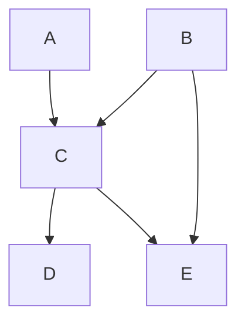

**Solution:**

$P(A, B, C, D, E) = $ <!-- TODO: Write the joint distribution expression -->

---

### B. [2 pts] Draw Bayes Net

Draw the Bayes net associated with the following joint distribution:

$$P(A) \cdot P(B) \cdot P(C \mid A, B) \cdot P(D \mid C) \cdot P(E \mid B, C)$$

**Solution:**

<!-- TODO: Verify the diagram matches the joint distribution -->

---

### C. [5 pts] Space Complexity

Consider a joint distribution over $N$ variables. Let $k$ be the domain size for all of these variables, and let $d$ be the maximum indegree of any node in a Bayes net that encodes this distribution.

#### (i) What is the space complexity of storing the entire joint distribution? Give an answer of the form $O(\cdot)$.

**Solution:**

<!-- TODO: Write the space complexity in Big-O notation -->

---

#### (ii) Draw an example of a Bayes net over four binary variables such that it takes less space to store the Bayes net than to store the joint distribution.

**Solution:**

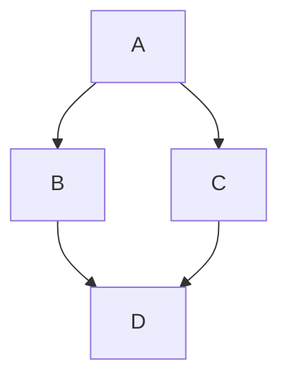

<!-- TODO: Verify that this Bayes net requires less space than the full joint distribution -->

**Explanation:**

<!-- TODO: Explain why this Bayes net requires less space -->

---

#### (iii) Draw an example of a Bayes net over four binary variables such that it takes more space to store the Bayes net than to store the joint distribution.

**Solution:**

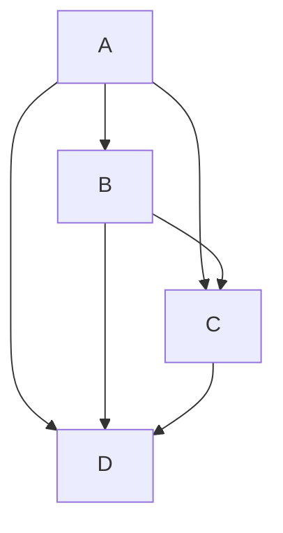

<!-- TODO: Verify that this Bayes net requires more space than the full joint distribution -->

**Explanation:**

<!-- TODO: Explain why this Bayes net requires more space -->

---

### D. [2 pts] Factor Multiplication

What factor can be multiplied with the following factors to form a valid joint distribution? (Write "none" if the given set of factors can't be turned into a joint by the inclusion of exactly one more factor.)

#### (i) $P(A) \cdot P(B \mid A) \cdot P(C \mid A) \cdot P(E \mid B, C, D)$

**Solution:**

<!-- TODO: Identify the missing factor or write "none" -->

---

#### (ii) $P(D) \cdot P(B) \cdot P(C \mid D, B) \cdot P(E \mid C, D, A)$

**Solution:**

<!-- TODO: Identify the missing factor or write "none" -->

---

### E. [4 pts] Directed Acyclic Graphs

Recall that any directed acyclic graph $G$ has an associated family of probability distributions, which consists of all probability distributions that can be represented by a Bayes' net with structure $G$.

For the following questions, consider the following six directed acyclic graphs:

**Graph 1:**
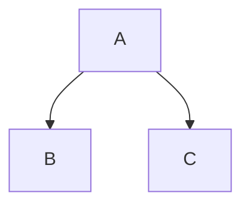

**Graph 2:**
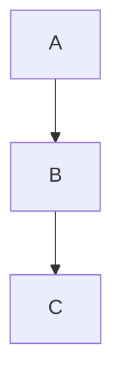

**Graph 3:**
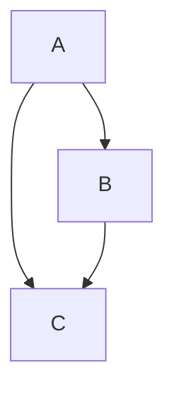

**Graph 4:**
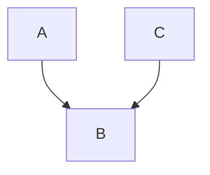

**Graph 5:**

**Graph 6:**
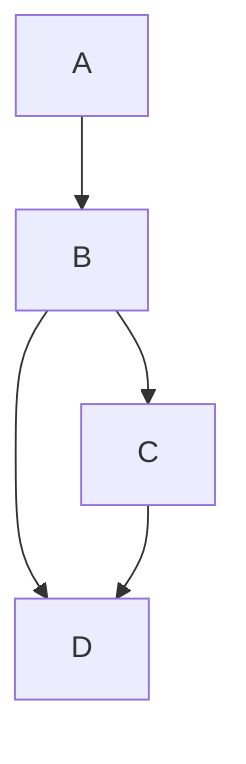

**Questions:**

<!-- TODO: Add specific questions about these graphs if they are in the original PDF -->

**Solution:**

<!-- TODO: Answer questions about the graphs -->

---

## Problem 3 [10 pts]: BN Independence

Consider the Bayes' net given below.

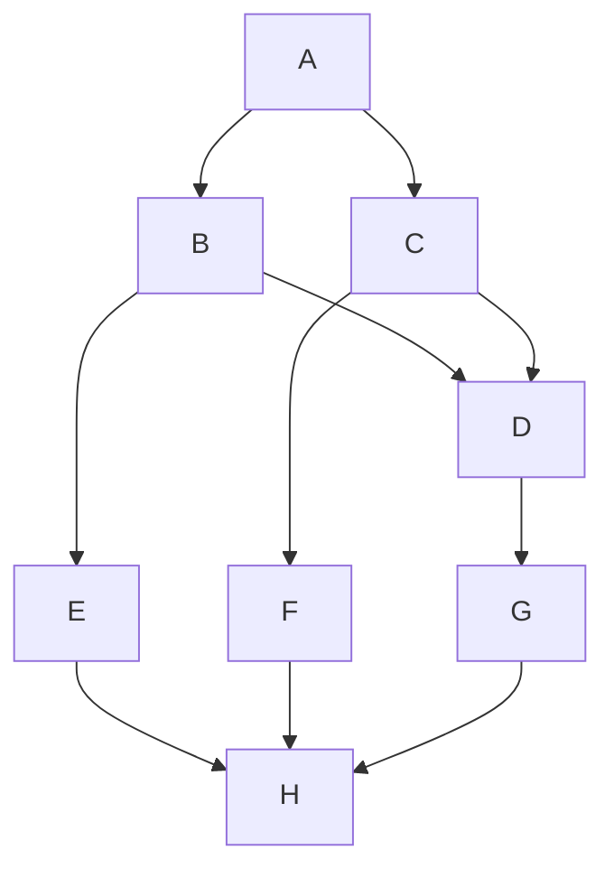

Remember that $X \perp Y$ reads as "X is independent of Y given nothing" and $X \perp Y \mid Z$ reads as "X is independent of Y given Z". For each expression, indicate whether it is true or false. Explain.

### 1. It is guaranteed that $A \perp B$

**Solution:**

<!-- TODO: True/False and explanation -->

---

### 2. It is guaranteed that $A \perp C$

**Solution:**

<!-- TODO: True/False and explanation -->

---

### 3. It is guaranteed that $A \perp D \mid \{B, H\}$

**Solution:**

<!-- TODO: True/False and explanation -->

---

### 4. It is guaranteed that $A \perp E \mid F$

**Solution:**

<!-- TODO: True/False and explanation -->

---

### 5. It is guaranteed that $C \perp H \mid G$

**Solution:**

<!-- TODO: True/False and explanation -->

---

## Problem 4 [10 pts]: BN Inference

### a. [7 pts] Medical Diagnosis Bayes Net

Consider the following Bayes net to answer the questions below.

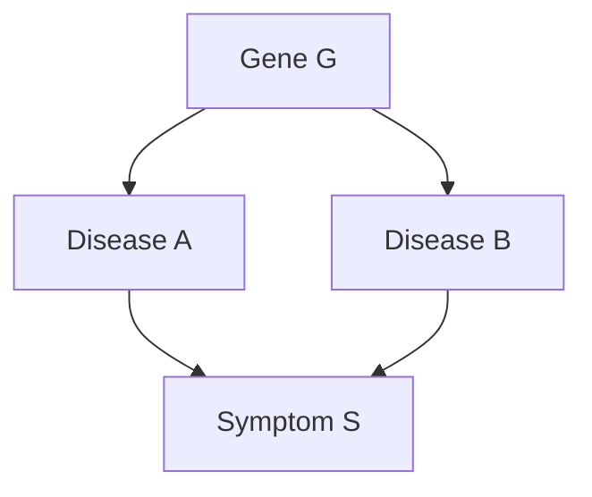

#### (i) [1 pt] Compute $P(g, a, b, s)$

**Solution:**

$P(g, a, b, s) = $ <!-- TODO: Write the expression using the chain rule -->

---

#### (ii) [2 pts] What is the probability that a patient has disease A?

**Solution:**

$P(A) = $ <!-- TODO: Write the expression and compute if possible -->

---

#### (iii) [2 pts] What is the probability that a patient has disease A given that they have symptom S and disease B?

**Solution:**

$P(A \mid S, B) = $ <!-- TODO: Write the expression using Bayes' rule -->

---

#### (iv) [2 pts] What is the probability that a patient has the disease-carrying gene variation G given that they have disease B?

**Solution:**

$P(G \mid B) = $ <!-- TODO: Write the expression using Bayes' rule -->

---

### b. [3 pts] Variable Elimination

Consider the following Bayes Net, where each variable can take two possible values.

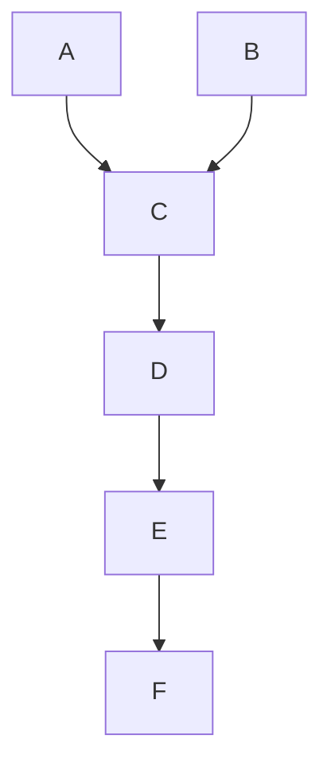

#### (i) [1 pt] What is the size of this Bayes Net?

**Solution:**

<!-- TODO: Calculate the total number of parameters needed -->

---

#### (ii) [2 pts] You are given the query $P(C \mid F)$, which you would like to answer using variable elimination. What is the variable elimination ordering where the largest intermediate factor created during variable elimination is as small as possible?

**Solution:**

Elimination ordering: <!-- TODO: List the order of variable elimination -->

**Explanation:**

<!-- TODO: Explain why this ordering minimizes the largest intermediate factor -->

---

## Notes

- All mathematical expressions should use proper MathJax notation
- Diagrams can be created using Mermaid syntax
- Show all work and justify all answers
- Check that probability distributions sum to 1 where applicable
- Verify independence relationships using d-separation criteria
