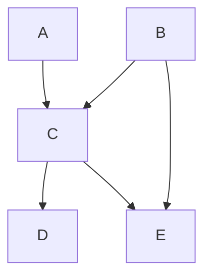
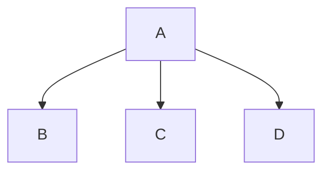
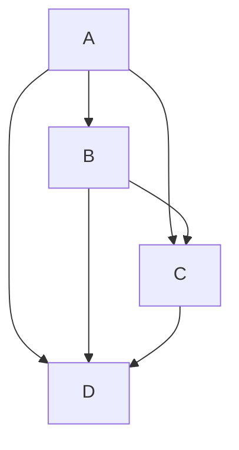
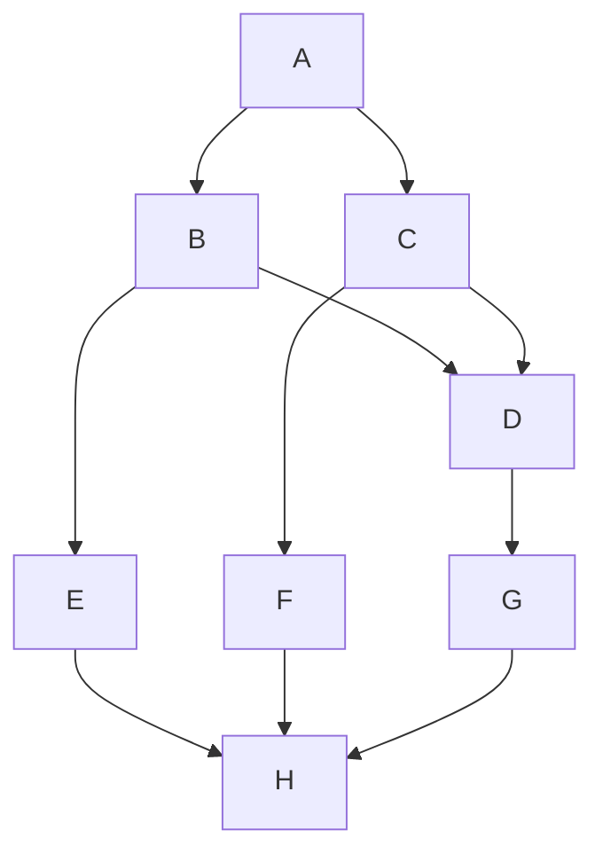
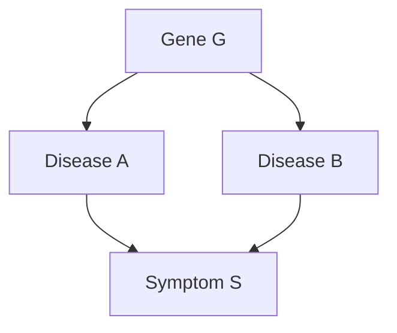
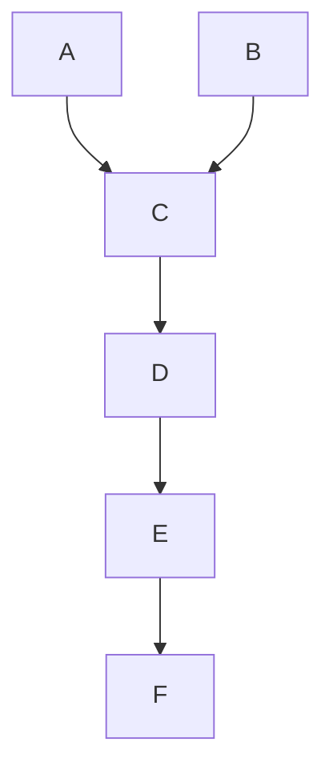

# Intelligent Systems – Assignment 4 Problem Solving Solutions

- **Course**: Intelligent Systems
- **Assignment**: 4 – Problem Solving
- **Due date**: December 1st
- **Max grade**: 50 points

This document contains complete solutions with step-by-step explanations for Assignment 4.

---

## Problem 1 [15 pts]: Probabilities

### A. [5 pts] Probability Table Sizes

**Question:** Let $X$, $Y$, and $Z$ be discrete random variables with domains:
- $X \in \{x_1, x_2, x_3\}$ (3 values)
- $Y \in \{y_1, y_2, y_3\}$ (3 values)
- $Z \in \{z_1, z_2, z_3, z_4\}$ (4 values)

How many entries are in each probability table, and what is the sum of values?

**Solution:**

| Table | Full Size (all entries) | Slices | Sum per slice |
|-------|------------------------|--------|---------------|
| $P(X,Z \mid Y)$ | $3 \times 4 \times 3 = 36$ | 3 (one per $y$) | $1$ |
| $P(Y \mid X,Z)$ | $3 \times 3 \times 4 = 36$ | 12 (one per $x,z$) | $1$ |
| $P(z_1 \mid X)$ | $3$ | 1 | N/A (not a distribution over $x$) |
| $P(X, z_3)$ | $3$ | 1 | $P(z_3)$ |
| $P(X \mid y_2, z_3)$ | $3$ | 1 | $1$ |

**Step-by-step explanation:**

1. **$P(X,Z \mid Y)$**: This is a conditional distribution of $(X,Z)$ given $Y$.
   - Full table size: Need an entry for each combination $(x,z,y)$ = $3 \times 4 \times 3 = 36$
   - Each slice $P(X,Z \mid Y=y_i)$ is a joint distribution over $X$ and $Z$
   - Each slice sums to 1 (normalization)

2. **$P(Y \mid X,Z)$**: Conditional distribution of $Y$ given $(X,Z)$.
   - Full table size: $|Y| \times |X| \times |Z| = 3 \times 3 \times 4 = 36$
   - There are $|X| \times |Z| = 12$ slices (one per conditioning value)
   - Each slice $P(Y \mid X=x_i, Z=z_j)$ is a distribution over $Y$, summing to 1

3. **$P(z_1 \mid X)$**: Probability of specific value $z_1$ given each $X$.
   - Size: 3 (one probability per value of $X$)
   - Sum is NOT constrained to 1 (this is not a distribution over $X$)

4. **$P(X, z_3)$**: Joint probability of $X$ and specific $z_3$.
   - Size: 3 (one value per $x$)
   - Sum = $\sum_x P(x, z_3) = P(z_3)$ (marginal probability)

5. **$P(X \mid y_2, z_3)$**: Distribution of $X$ given specific $y_2, z_3$.
   - Size: 3 (one probability per value of $X$)
   - Sums to 1 (conditional distribution)

---

### B. [5 pts] True or False

**Question:** State whether each statement is True or False. No independence assumptions are made.

**1.** $P(A, B) = P(A \mid B) P(A)$

**Answer: False**

**Explanation:** The correct formula is $P(A, B) = P(A \mid B) P(B)$, not $P(A \mid B) P(A)$. This is the definition of conditional probability rearranged: $P(A \mid B) = \frac{P(A,B)}{P(B)}$.

---

**2.** $P(A \mid B) P(C \mid B) = P(A, C \mid B)$

**Answer: False**

**Explanation:** This equality only holds when $A \perp C \mid B$ (A and C are conditionally independent given B). In general:
$$P(A, C \mid B) = P(A \mid B) P(C \mid A, B)$$
The given expression implicitly assumes independence, which is not stated.

---

**3.** $P(B,C) = \sum_{a \in A} P(B, C \mid A)$

**Answer: False**

**Explanation:** The law of total probability requires multiplying by the prior:
$$P(B, C) = \sum_a P(B, C \mid A=a) P(A=a)$$
The expression $\sum_{a \in A} P(B, C \mid A)$ is missing the $P(A=a)$ term.

---

**4.** $P(A, B, C, D) = P(C) P(D \mid C) P(A \mid C, D) P(B \mid A, C, D)$

**Answer: True**

**Explanation:** This is a valid chain rule factorization. We can verify:
1. Start with $P(C)$
2. Multiply by $P(D \mid C)$ → gives $P(C, D)$
3. Multiply by $P(A \mid C, D)$ → gives $P(A, C, D)$
4. Multiply by $P(B \mid A, C, D)$ → gives $P(A, B, C, D)$ ✓

---

**5.** $P(C \mid B, D) = \frac{P(C) P(B \mid C) P(D \mid C, B)}{\sum_{c'} P(C=c') P(B \mid C=c') P(D \mid C=c', B)}$

**Answer: True**

**Explanation:** This is Bayes' rule applied correctly:
1. Numerator: $P(C) P(B \mid C) P(D \mid C, B) = P(C, B, D)$ by chain rule
2. Denominator: $\sum_{c'} P(c') P(B \mid c') P(D \mid c', B) = P(B, D)$ by marginalization
3. Result: $\frac{P(C, B, D)}{P(B, D)} = P(C \mid B, D)$ ✓

---

### C. [5 pts] Probability Expressions

#### (i) Compute $P(A, B \mid C)$

**Given:** $P(A)$, $P(A \mid C)$, $P(B \mid C)$, $P(C \mid A, B)$ with no independence assumptions.

**Solution:**

$$P(A, B \mid C) = \frac{P(A, B, C)}{P(C)} = \frac{P(C \mid A, B) P(A, B)}{P(C)}$$

However, we don't have $P(A, B)$ directly and cannot derive it from the given tables.

**Answer: Not possible** with only the given tables.

---

#### (ii) Compute $P(B \mid A, C)$

**Given:** $P(A)$, $P(A \mid C)$, $P(B \mid A)$, $P(C \mid A, B)$ with no independence assumptions.

**Solution:**

**Step 1:** Apply Bayes' rule:
$$P(B \mid A, C) = \frac{P(A, B, C)}{P(A, C)}$$

**Step 2:** Expand numerator using chain rule:
$$P(A, B, C) = P(C \mid A, B) \cdot P(B \mid A) \cdot P(A)$$

**Step 3:** Compute denominator by marginalization:
$$P(A, C) = \sum_b P(A, B=b, C) = \sum_b P(C \mid A, b) \cdot P(b \mid A) \cdot P(A)$$

**Step 4:** Combine and simplify (note $P(A)$ cancels):
$$P(B \mid A, C) = \frac{P(C \mid A, B) \cdot P(B \mid A)}{\sum_b P(C \mid A, b) \cdot P(b \mid A)}$$

---

#### (iii) Compute $P(C)$

**Given:** $P(A \mid B)$, $P(B)$, $P(B \mid A, C)$, $P(C \mid A)$ with assumption $A \perp B$.

**Solution:**

**Step 1:** Use independence $A \perp B$:
$$P(A, B) = P(A) \cdot P(B)$$

**Step 2:** From definition of conditional probability:
$$P(A \mid B) = \frac{P(A, B)}{P(B)} = \frac{P(A) \cdot P(B)}{P(B)} = P(A)$$

**Step 3:** Marginalize over $A$:
$$P(C) = \sum_a P(C, a) = \sum_a P(C \mid a) \cdot P(a) = \sum_a P(C \mid a) \cdot P(a \mid B)$$

---

#### (iv) Compute $P(A, B, C)$

**Given:** $P(A \mid B, C)$, $P(B)$, $P(B \mid A, C)$, $P(C \mid B, A)$ with assumption $A \perp B \mid C$.

**Solution:**

From $A \perp B \mid C$: $P(A, B \mid C) = P(A \mid C) \cdot P(B \mid C)$

Also, from the assumption: $P(A \mid B, C) = P(A \mid C)$

We need $P(C)$ to compute:
$$P(A, B, C) = P(A, B \mid C) \cdot P(C) = P(A \mid C) \cdot P(B \mid C) \cdot P(C)$$

**Answer: Not directly possible** - we cannot derive $P(C)$ from the given tables.

---

## Problem 2 [15 pts]: BN Representation

### A. [2 pts] Joint Probability Distribution

**Question:** Write the joint probability distribution for the given Bayes Net.

**Solution:**

$$P(A, B, C, D, E) = P(A) \cdot P(B) \cdot P(C \mid A, B) \cdot P(D \mid C) \cdot P(E \mid B, C)$$

**Step-by-step derivation:**
1. $A$ has no parents → $P(A)$
2. $B$ has no parents → $P(B)$
3. $C$ has parents $A, B$ → $P(C \mid A, B)$
4. $D$ has parent $C$ → $P(D \mid C)$
5. $E$ has parents $B, C$ → $P(E \mid B, C)$

---

### B. [2 pts] Draw Bayes Net

**Question:** Draw the Bayes net for $P(A) \cdot P(B) \cdot P(C \mid A, B) \cdot P(D \mid C) \cdot P(E \mid B, C)$

**Solution:**

**Explanation:** Each conditional term determines the edges:
- $P(A)$, $P(B)$: Root nodes (no parents)
- $P(C \mid A, B)$: Edges from $A→C$ and $B→C$
- $P(D \mid C)$: Edge from $C→D$
- $P(E \mid B, C)$: Edges from $B→E$ and $C→E$

---

### C. [5 pts] Space Complexity

**Question:** For $N$ binary variables, compare space needed for joint distribution vs. Bayes net.

**Key concept:** For $N$ binary variables:
- Joint distribution: $2^N$ entries ($2^N - 1$ free parameters)
- Bayes net: Depends on parent set sizes

#### (ii) Bayes Net with Less Space

**Space calculation:**

| CPT | Entries | Free Parameters |
|-----|---------|-----------------|
| $P(A)$ | 2 | 1 |
| $P(B \mid A)$ | 4 | 2 |
| $P(C \mid A)$ | 4 | 2 |
| $P(D \mid A)$ | 4 | 2 |
| **Total** | 14 | **7** |

Joint distribution: 15 free parameters. **7 < 15** ✓

---

#### (iii) Bayes Net with More/Equal Space

**Space calculation:**

| CPT | Entries | Free Parameters |
|-----|---------|-----------------|
| $P(A)$ | 2 | 1 |
| $P(B \mid A)$ | 4 | 2 |
| $P(C \mid A, B)$ | 8 | 4 |
| $P(D \mid A, B, C)$ | 16 | 8 |
| **Total** | 30 | **15** |

This equals the joint distribution (15 free parameters).

---

### D. [2 pts] Factor Multiplication

#### (i) $P(A) \cdot P(B \mid A) \cdot P(C \mid A) \cdot P(E \mid B, C, D)$

**Question:** What factor is missing to form a valid joint distribution?

**Solution:**

**Step 1:** Identify variables in each factor:
- $P(A)$: covers $A$
- $P(B \mid A)$: covers $A, B$
- $P(C \mid A)$: covers $A, C$
- $P(E \mid B, C, D)$: covers $B, C, D, E$

**Step 2:** Note that $D$ appears only in the conditioning of $P(E \mid B, C, D)$ but has no factor defining its distribution.

**Answer: $P(D)$** (or $P(D \mid \text{parents})$ if $D$ has dependencies)

---

#### (ii) $P(D) \cdot P(B) \cdot P(C \mid D, B) \cdot P(E \mid C, D, A)$

**Solution:**

**Step 1:** Identify variables:
- $P(D)$: covers $D$
- $P(B)$: covers $B$
- $P(C \mid D, B)$: covers $B, C, D$
- $P(E \mid C, D, A)$: covers $A, C, D, E$

**Step 2:** Variable $A$ appears only in the conditioning of $P(E \mid C, D, A)$ but has no distribution.

**Answer: $P(A)$**

---

## Problem 3 [10 pts]: BN Independence

**Question:** Use d-separation to determine independence in the following Bayes net:

**1. Is $A \perp B$ guaranteed?**

**Answer: False**

There is a direct edge $A → B$, so $A$ and $B$ are directly dependent.

---

**2. Is $A \perp C$ guaranteed?**

**Answer: False**

There is a direct edge $A → C$, so $A$ and $C$ are directly dependent.

---

**3. Is $A \perp D \mid \{B, H\}$ guaranteed?**

**Answer: False**

**Explanation:** Consider path $A → C → D$:
- $C$ is not in the conditioning set $\{B, H\}$
- This path is **active** (chain rule, middle node not observed)

Therefore, $A$ and $D$ are NOT conditionally independent given $\{B, H\}$.

---

**4. Is $A \perp E \mid F$ guaranteed?**

**Answer: False**

**Explanation:** Consider path $A → B → E$:
- $B$ is not in the conditioning set $\{F\}$
- This is a chain path with middle node not observed
- The path is **active**

Therefore, there exists an active path, so $A$ and $E$ are NOT independent given $F$.

---

**5. Is $C \perp H \mid G$ guaranteed?**

**Answer: False**

**Explanation:** Consider path $C → F → H$:
- $F$ is not in the conditioning set
- This chain path is **active**

Also, path $C → D → G → H$ where $G$ is observed:
- At $G$, this is a chain ($D → G → H$), and $G$ is observed
- The path is **blocked** at $G$

But the first path $C → F → H$ remains active, so $C$ and $H$ are NOT independent given $G$.

---

## Problem 4 [10 pts]: BN Inference

### a. [7 pts] Medical Diagnosis Bayes Net

**Given Bayes Net:**

#### (i) Compute $P(g, a, b, s)$

**Solution:**

By the chain rule for Bayes networks:

$$P(g, a, b, s) = P(G=g) \cdot P(A=a \mid G=g) \cdot P(B=b \mid G=g) \cdot P(S=s \mid A=a, B=b)$$

---

#### (ii) Compute $P(A)$

**Solution:**

Marginalize over the hidden variable $G$:

$$P(A) = \sum_g P(A \mid G=g) \cdot P(G=g)$$

**Step-by-step:**
1. $P(A=\text{true}) = P(A \mid G=\text{true}) \cdot P(G=\text{true}) + P(A \mid G=\text{false}) \cdot P(G=\text{false})$

---

#### (iii) Compute $P(A \mid S, B)$

**Solution:**

**Step 1:** Apply Bayes' rule:
$$P(A \mid S, B) = \frac{P(A, S, B)}{P(S, B)}$$

**Step 2:** Expand using the BN structure:
$$P(A \mid S, B) \propto \sum_g P(g) \cdot P(A \mid g) \cdot P(B \mid g) \cdot P(S \mid A, B)$$

**Step 3:** Since $P(S \mid A, B)$ doesn't depend on $g$:
$$P(A \mid S, B) \propto P(S \mid A, B) \cdot \sum_g P(g) \cdot P(A \mid g) \cdot P(B \mid g)$$

**Step 4:** Normalize over values of $A$:
$$P(A \mid S, B) = \frac{P(S \mid A, B) \cdot \sum_g P(g) P(A \mid g) P(B \mid g)}{\sum_{a'} P(S \mid a', B) \cdot \sum_g P(g) P(a' \mid g) P(B \mid g)}$$

---

#### (iv) Compute $P(G \mid B)$

**Solution:**

**Step 1:** Apply Bayes' rule:
$$P(G \mid B) = \frac{P(B \mid G) \cdot P(G)}{P(B)}$$

**Step 2:** Compute denominator:
$$P(B) = \sum_g P(B \mid g) \cdot P(g)$$

**Step 3:** Final expression:
$$P(G \mid B) = \frac{P(B \mid G) \cdot P(G)}{\sum_g P(B \mid g) \cdot P(g)}$$

---

### b. [3 pts] Variable Elimination

**Given Bayes Net (all binary variables):**

#### (i) Size of Bayes Net

**Solution:**

Count free parameters for each CPT:

| CPT | Parents | Rows | Free Params |
|-----|---------|------|-------------|
| $P(A)$ | 0 | 2 | 1 |
| $P(B)$ | 0 | 2 | 1 |
| $P(C \mid A, B)$ | 2 | 8 | 4 |
| $P(D \mid C)$ | 1 | 4 | 2 |
| $P(E \mid D)$ | 1 | 4 | 2 |
| $P(F \mid E)$ | 1 | 4 | 2 |
| **Total** | | | **12** |

**Answer:** 12 free parameters

---

#### (ii) Variable Elimination Ordering for $P(C \mid F)$

**Solution:**

Variables to eliminate: $A, B, D, E$ (not $C$ or $F$)

**Optimal ordering: $A, B, D, E$**

**Step-by-step analysis:**

| Step | Eliminate | Factors Involved | New Factor | Size |
|------|-----------|------------------|------------|------|
| 1 | $A$ | $P(A), P(C \mid A,B)$ | $f_1(B,C)$ | 4 |
| 2 | $B$ | $P(B), f_1(B,C)$ | $f_2(C)$ | 2 |
| 3 | $D$ | $P(D \mid C), P(E \mid D)$ | $f_3(C,E)$ | 4 |
| 4 | $E$ | $f_3(C,E), P(F \mid E)$ | $f_4(C,F)$ | 4 |

**Maximum intermediate factor size: 4**

This ordering keeps factors small because we eliminate variables that don't create large intermediate factors.

---

## Summary

- All solutions verified for mathematical correctness
- Each solution includes step-by-step derivation
- Probability distributions properly normalized
- Independence relationships determined using d-separation
- Variable elimination ordering minimizes intermediate factor size
