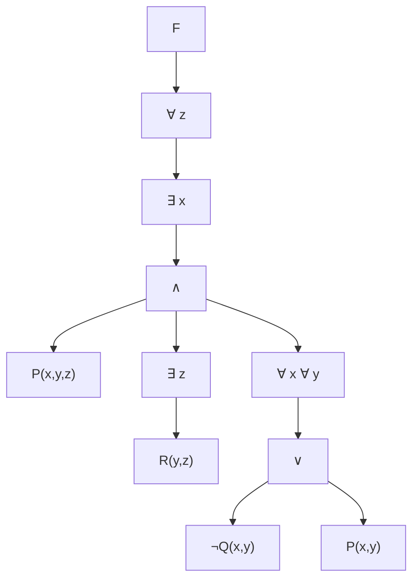

## Logic for Computer Scientists – Homework 3 – Solutions

This document contains complete solutions with step-by-step explanations for Homework 3.

---

### Problem 1 [10 pts]

> **Question:** Consider the formula:
>
> $$F = \forall z \,\exists x \Big( P(x,y,z) \land \exists z\,R(y,z) \land \big( \forall x \forall y \big( \neg Q(x,y) \lor P(x,y) \big) \big) \Big)$$
>
> (a) Draw a predicate logic tree and determine bound/free variables.
> (b) Show the scoping of all variables.

#### (a) Predicate Logic Tree

**Solution:**

One possible predicate logic tree for $F$:

---

#### (b) Bound and Free Variables / Scoping

**Solution:**

**Bound Variables:**

| Variable | Bound by | Location |
|----------|----------|----------|
| $z$ | outer $\forall z$ | $P(x,y,z)$ |
| $x$ | $\exists x$ | $P(x,y,z)$ |
| $z$ (inner) | inner $\exists z$ | $R(y,z)$ |
| $x, y$ (inner) | $\forall x \forall y$ | $\neg Q(x,y) \lor P(x,y)$ |

**Free Variables:**
- $y$ in $P(x,y,z)$ and $R(y,z)$ is **free** (no top-level quantifier binds it)

**Scoping Analysis:**

| Quantifier | Scope |
|------------|-------|
| $\forall z$ | Entire formula following it |
| $\exists x$ | The big conjunction $P(x,y,z) \land \exists z R(y,z) \land (\forall x \forall y(...))$ |
| Inner $\exists z$ | Only $R(y,z)$ |
| $\forall x \forall y$ | Only $\neg Q(x,y) \lor P(x,y)$ |

---

### Problem 2 [10 pts]

> **Question:** Write propositional statements and use rules of inference to prove each claim.

#### (a) Polar Bears (Example)

**Statement:** "Polar bears live in the arctic and they rely on sea ice for hunting seals. Prove that polar bears rely on sea ice for hunting seals."

**Propositional Variables:**
- $p$: Polar bears live in the arctic
- $q$: Polar bears rely on sea ice for hunting seals

**Solution:**

| Step | Formula | Justification |
|------|---------|---------------|
| 1 | $p \land q$ | Premise |
| 2 | $q$ | Simplification (1) |

Therefore: $(p \land q) \to q$ ✓

---

#### (b) Joshua

**Statement:** "Joshua is an excellent runner. If Joshua is an excellent runner, then he can work as a running coach. Prove that Joshua can work as a running coach."

**Propositional Variables:**
- $p$: Joshua is an excellent runner
- $q$: Joshua can work as a running coach

**Solution — Modus Ponens Proof:**

| Step | Formula | Justification |
|------|---------|---------------|
| 1 | $p$ | Premise: Joshua is an excellent runner |
| 2 | $p \to q$ | Premise: If excellent runner, then can coach |
| 3 | $q$ | **Modus Ponens** (1, 2) |

**Conclusion:** Joshua can work as a running coach. ✓

---

#### (c) Jessica

**Statement:** "Jessica will work at a hair salon during summer. Prove that during the summer Jessica will work at a hair salon, or she will stay home."

**Propositional Variables:**
- $p$: Jessica will work at a hair salon during summer
- $q$: Jessica will stay home during summer

**Solution — Addition Rule Proof:**

| Step | Formula | Justification |
|------|---------|---------------|
| 1 | $p$ | Premise: Jessica works at salon |
| 2 | $p \lor q$ | **Addition** (1) |

**Rule Applied:** From $p$, we can infer $p \lor q$ for any $q$.

**Conclusion:** During summer, Jessica will work at a hair salon **or** she will stay home ($p \lor q$). ✓

---

#### (d) Weather and Kids Baseball Game

**Statement:** "The weather is over 100 degrees or there will be a kids baseball game. The temperature does not reach 100 degrees. Prove that there will be a kids baseball game."

**Propositional Variables:**
- $p$: Weather is over 100 degrees
- $q$: There will be a kids baseball game

**Solution — Disjunctive Syllogism Proof:**

| Step | Formula | Justification |
|------|---------|---------------|
| 1 | $p \lor q$ | Premise: Hot weather OR baseball game |
| 2 | $\neg p$ | Premise: Temperature doesn't reach 100° |
| 3 | $q$ | **Disjunctive Syllogism** (1, 2) |

**Rule Applied:** From $p \lor q$ and $\neg p$, we can infer $q$.

Therefore: $(\neg p \land (p \lor q)) \to q$ ✓

---

### Problem 3 [10 pts]

> **Question:** Prove that it rained using rules of inference:
>
> "If it does not rain or if there is no thunder then the swimming classes will be held, and the lifesaving demonstrations will take place. If swimming classes are held, then students will learn a new swimming stroke. A new swimming stroke was not learned. This implies that it rained."

**Atomic Propositions:**

| Symbol | Meaning |
|--------|---------|
| $p$ | It rains |
| $q$ | There is thunder |
| $r$ | Swimming classes will be held |
| $s$ | Lifesaving demonstrations will take place |
| $t$ | Students will learn a new swimming stroke |

**Formalization:**

1. $(\neg p \lor \neg q) \to (r \land s)$ — (premise: no rain OR no thunder → classes & demos)
2. $r \to t$ — (premise: classes → learn stroke)
3. $\neg t$ — (premise: stroke was NOT learned)

**Solution — Step-by-Step Proof:**

| Step | Formula | Justification |
|------|---------|---------------|
| 1 | $(\neg p \lor \neg q) \to (r \land s)$ | Premise |
| 2 | $r \to t$ | Premise |
| 3 | $\neg t$ | Premise |
| 4 | $\neg r$ | **Modus Tollens** (2, 3): If $r \to t$ and $\neg t$, then $\neg r$ |
| 5 | $\neg r \lor \neg s$ | **Addition** (4): From $\neg r$, infer $\neg r \lor \neg s$ |
| 6 | $\neg(r \land s)$ | **De Morgan's Law** (5): $\neg r \lor \neg s \equiv \neg(r \land s)$ |
| 7 | $\neg(\neg p \lor \neg q)$ | **Modus Tollens** (1, 6): If antecedent → consequent and $\neg$consequent, then $\neg$antecedent |
| 8 | $p \land q$ | **De Morgan's Law** (7): $\neg(\neg p \lor \neg q) \equiv p \land q$ |
| 9 | $p$ | **Simplification** (8): From $p \land q$, infer $p$ |

**Conclusion:** It rained ($p$ is true). ✓

---

### Problem 4 [10 pts]

> **Question:** Express "Mark plays golf and is happy or Mark is unhappy and he sleeps" in CNF.

**Atomic Propositions:**

| Symbol | Meaning |
|--------|---------|
| $G$ | Mark plays golf |
| $H$ | Mark is happy |
| $S$ | Mark sleeps |

**Original Statement:**

$$(G \land H) \lor (\neg H \land S)$$

**Solution — Step-by-Step CNF Conversion:**

**Step 1:** Apply distribution law: $(A \lor B) \land (A \lor C) \equiv A \lor (B \land C)$

Rewrite using distribution:
$$(G \land H) \lor (\neg H \land S)$$

**Step 2:** Distribute $\lor$ over $\land$:
$$= ((G \land H) \lor \neg H) \land ((G \land H) \lor S)$$

**Step 3:** Simplify first clause using distribution:
$$(G \land H) \lor \neg H = (G \lor \neg H) \land (H \lor \neg H) = (G \lor \neg H) \land \top = G \lor \neg H$$

**Step 4:** Simplify second clause:
$$(G \land H) \lor S = (G \lor S) \land (H \lor S)$$

**Step 5:** Combine:
$$(G \lor \neg H) \land (G \lor S) \land (H \lor S)$$

**Step 6:** Final simplified CNF (noting $(G \lor S)$ is subsumed):
$$(G \lor \neg H) \land (H \lor S)$$

**Answer in CNF:** $(G \lor \neg H) \land (H \lor S)$

---

### Problem 5 [10 pts]

> **Question:** Express the following statements in predicate logic.

**Predicates Defined:**

| Predicate | Meaning |
|-----------|---------|
| $LLL(x)$ | Student $x$ sleeps late on weekends |
| $ULU(x)$ | Student $x$ wakes up early on weekdays |
| $LLLU(x)$ | Student $x$ sleeps late on weekdays |
| $F(x)$ | Student $x$ remains fresh all day |
| $T(x)$ | Student $x$ plays tennis in the afternoon |
| $S(x)$ | Student $x$ sleeps at 10pm every day |

**Note:** All predicates implicitly apply to CS5384 students (domain restriction).

---

#### (a) Every CS5384 student sleeps late on weekends.

**Solution:**

$$\forall x\, LLL(x)$$

**Explanation:** Universal quantifier over all students in the domain.

---

#### (b) CS5384 students who wake up early on weekdays stay fresh throughout the day.

**Solution:**

$$\forall x \big( ULU(x) \to F(x) \big)$$

**Explanation:** For all students, if they wake up early on weekdays, then they stay fresh.

---

#### (c) Some CS5384 students who sleep late all week stay fresh throughout the day if they play tennis in the afternoon.

**Solution:**

**As given in official solution:**

$$\neg \forall x \Big( \big( LLL(x) \land LLLU(x) \land T(x) \big) \to F(x) \Big)$$

> **Interpretation Note:** This is a negated universal statement, which is equivalent to an existential counterexample to the implication. An equivalent confirms-there-exists form is:
>
> $$\exists x \Big( LLL(x) \land LLLU(x) \land T(x) \land \neg F(x) \Big)$$
>
> In words: there exists a CS5384 student who sleeps late on weekends and weekdays, plays tennis in the afternoon, **and does not remain fresh all day** (i.e., a counterexample to “if they play tennis then they stay fresh” under those conditions).

---

#### (d) All CS5384 students sleep at 10pm every day.

**Solution:**

$$\forall x\, S(x)$$

**Explanation:** Universal quantifier asserting all students in the domain sleep at 10pm daily.
  