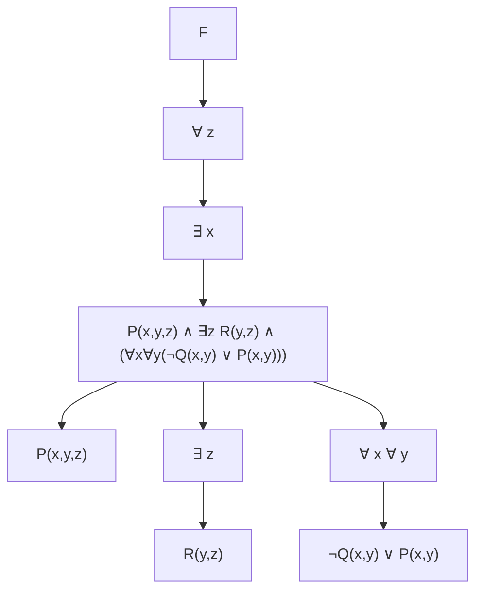

## Logic for Computer Scientists – Homework 3

- **Course**: CS 5384-001/-D01 – Logic for Computer Scientists
- **Assigned**: 11/17/25
- **Due**: 11/23/25, 12pm – scan and submit on Canvas
- **Points**: Each problem carries 10 points for a total of 50 points.
- **Notes**:
  - Please show all work.
  - You are encouraged to share ideas, but please submit your original and unique work.
  - If you have a question, please ask and do not make assumptions.

---

### Problem 1

Consider the formula

$$F = \forall z \,\exists x \Big( P(x,y,z) \land \exists z\,R(y,z) \land \big( \forall x \forall y \big( \neg Q(x,y) \lor P(x,y) \big) \big) \Big).$$

1. **(a)** Draw a predicate logic tree of $F$. Determine the bound and free variables.
2. **(b)** Show the scoping of all variables. You may use different colors as in class.

> **Example:** One possible tree structure for $F$ using Mermaid:

You should add your own annotations for scopes and quantifier binding.

---

### Problem 2

Write propositional statements for each of the following and use rules of inference to show the proof.
Part (a) is solved as an example.

1. **(a)** "Polar bears live in the arctic and they rely on sea ice for hunting seals. Prove that polar bears rely on sea ice for hunting seals."
   - Let $P$ = "Polar bears live in the arctic", $Q$ = "They rely on sea ice"
   - Given: $P \land Q$
   - Apply Simplification to prove $Q$

2. **(b)** "Joshua is an excellent runner. If Joshua is an excellent runner, then he can work as a running coach. Prove that Joshua can work as a running coach."
   - Let $R$ = "Joshua is an excellent runner", $C$ = "He can work as a running coach"
   - Given: $R$ and $R \rightarrow C$
   - Apply Modus Ponens to prove $C$

3. **(c)** "Jessica will work at a hair salon during summer. Prove that during the summer Jessica will work at a hair salon, or she will stay home."
   - Let $W$ = "Jessica works at a hair salon", $H$ = "She stays home"
   - Given: $W$
   - Apply Addition to prove $W \lor H$

4. **(d)** "The weather is over 100 degrees or there will be a kids baseball game. The temperature does not reach 100 degrees. Prove that there will be a kids baseball game."
   - Let $T$ = "Weather is over 100 degrees", $B$ = "Kids baseball game"
   - Given: $T \lor B$ and $\neg T$
   - Apply Disjunctive Syllogism to prove $B$

Use standard propositional rules (e.g., Modus Ponens, Addition, Disjunctive Syllogism, etc.).

---

### Problem 3

Consider the following English argument:

> “If it does not rain or if there is no thunder then the swimming classes will be held, and the lifesaving demonstrations will take place. If swimming classes are held, then students will learn a new swimming stroke. A new swimming stroke was not learned. This implies that it rained.”

1. Define atomic propositions for the information statements.
2. Express the statements above using propositional logic.
3. Use rules of inference (no tree or truth table) to prove that it rained.

You should use propositional theorems and inference rules rather than text explanation.

---

### Problem 4

> “Mark plays golf and is happy or Mark is unhappy and he sleeps.”

1. Define a maximum of three atomic propositions.
2. Express the underlined statement from the handout in CNF.

---

### Problem 5

Define appropriate propositional letters and express the following statements in predicate logic.

1. Every CS5384 student sleeps late on weekends.
2. CS5384 students who wake up early on weekdays stay fresh throughout the day.
3. Some CS5384 students who sleep late all week stay fresh throughout the day if they play tennis in the afternoon.
4. All CS5384 students sleep at 10pm every day.
