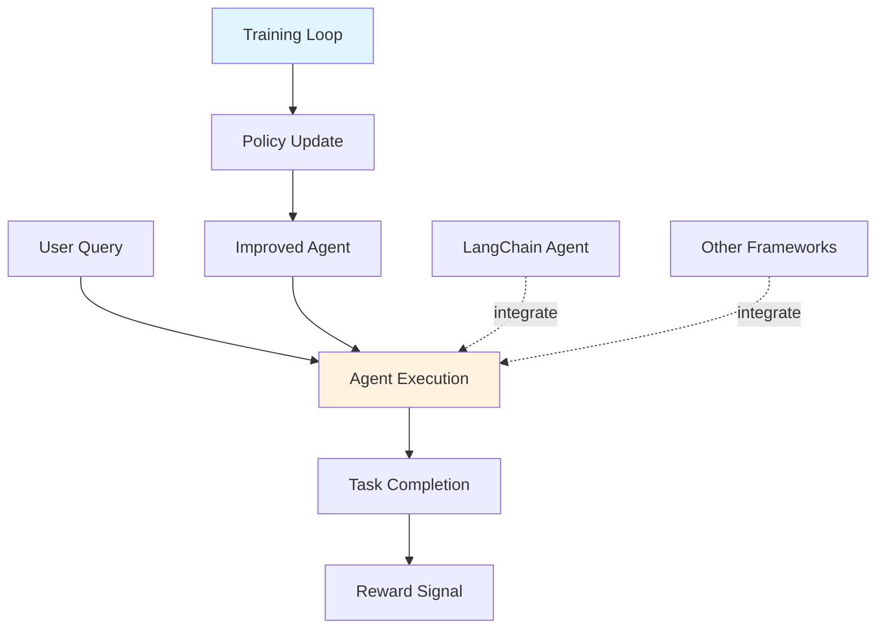

# Agent Lightning: RL Training for LLM Agents

## Overview

**Agent Lightning** is a flexible framework that enables reinforcement learning-based training of large language models for AI agents. This framework achieves complete decoupling between agent execution and training, allowing seamless integration with existing agents developed using frameworks like LangChain, and demonstrates stable, continuous improvements across various tasks.

## Research Background

- **Paper**: [Agent Lightning: RL Training for LLM Agents](https://arxiv.org/abs/2508.03680)
- **Published**: August 2025
- **Key Innovation**: Decoupled execution and training for LLM agents

## Core Concepts

### Decoupled Architecture

Agent Lightning separates:
- **Execution**: Agent runs normally, handling user queries
- **Training**: RL training happens separately, improving agent policy
- **Integration**: Seamless integration with existing agent frameworks

### Reinforcement Learning Approach

The framework uses:
- **Reward Signals**: Task completion, user satisfaction, efficiency
- **Policy Optimization**: Continuous improvement of agent behavior
- **Stable Training**: Techniques to ensure stable learning

## Architecture



## Experiment Design

### Key Research Questions

1. How effective is RL training for improving LLM agent performance?
2. What is the impact of decoupled execution and training?
3. How well does the framework integrate with existing agents?
4. What training stability techniques are most effective?

### Dataset Characteristics

- Multi-step task completion scenarios
- Integration with existing LangChain agents
- Multi-task learning environments
- Continuous improvement evaluation

## Implementation

### Agent Lightning Framework

```python
from agent_lightning import AgentLightning, RLTrainer

# Initialize framework
framework = AgentLightning()

# Integrate existing agent (e.g., LangChain)
from langchain.agents import create_agent
langchain_agent = create_agent(...)

# Wrap agent for RL training
trainable_agent = framework.wrap_agent(langchain_agent)

# Define reward function
def reward_function(task_result, execution_trace):
    reward = 0
    if task_result.completed:
        reward += 10
    reward -= execution_trace.steps * 0.1  # Efficiency penalty
    return reward

# Initialize RL trainer
trainer = RLTrainer(
    agent=trainable_agent,
    reward_function=reward_function
)

# Training loop (decoupled from execution)
for episode in range(training_episodes):
    # Execute agent
    result = trainable_agent.execute(task)

    # Collect training data
    trainer.collect_experience(result)

    # Update policy (separate from execution)
    if episode % update_frequency == 0:
        trainer.update_policy()
```

## Integration with LangChain

```python
from langchain.agents import AgentExecutor
from agent_lightning import AgentLightning

# Create LangChain agent
langchain_agent = AgentExecutor(...)

# Integrate with Agent Lightning
framework = AgentLightning()
trainable_agent = framework.integrate_langchain(langchain_agent)

# Agent can now be trained while maintaining LangChain compatibility
```

## Evaluation Metrics

1. **Task Completion Rate**: Percentage of successfully completed tasks
2. **Reward Accumulation**: Total reward over training episodes
3. **Policy Convergence**: Stability of learned policy
4. **Training Stability**: Consistency of training process
5. **Generalization Score**: Performance on unseen tasks
6. **Integration Ease**: Ease of integrating with existing agents

## Expected Outcomes

1. **Improved Agent Performance**: Better task completion through RL training
2. **Stable Training**: Consistent improvements without instability
3. **Seamless Integration**: Easy integration with existing agent frameworks
4. **Continuous Improvement**: Ongoing performance gains across tasks

## Running the Experiment

### Setup

```bash
pip install agent-lightning langsmith langchain
export LANGCHAIN_API_KEY="your-api-key"
```

### Execution

```python
from langsmith import Client
from agent_lightning import AgentLightning

client = Client()
dataset = client.read_dataset(dataset_name="agent-lightning-rl-training")

framework = AgentLightning()
results = framework.train_and_evaluate(dataset)
```

## Results Analysis

Analysis focuses on:
- Training effectiveness and convergence
- Impact of decoupled architecture
- Integration success with existing frameworks
- Stability and generalization improvements

## Future Work

- Advanced reward shaping techniques
- Multi-agent RL training
- Transfer learning across agent types
- Real-time training capabilities

## References

- [Agent Lightning Paper](https://arxiv.org/abs/2508.03680)
- [Reinforcement Learning for LLMs](https://arxiv.org/)
- [LangChain Documentation](https://python.langchain.com/)
