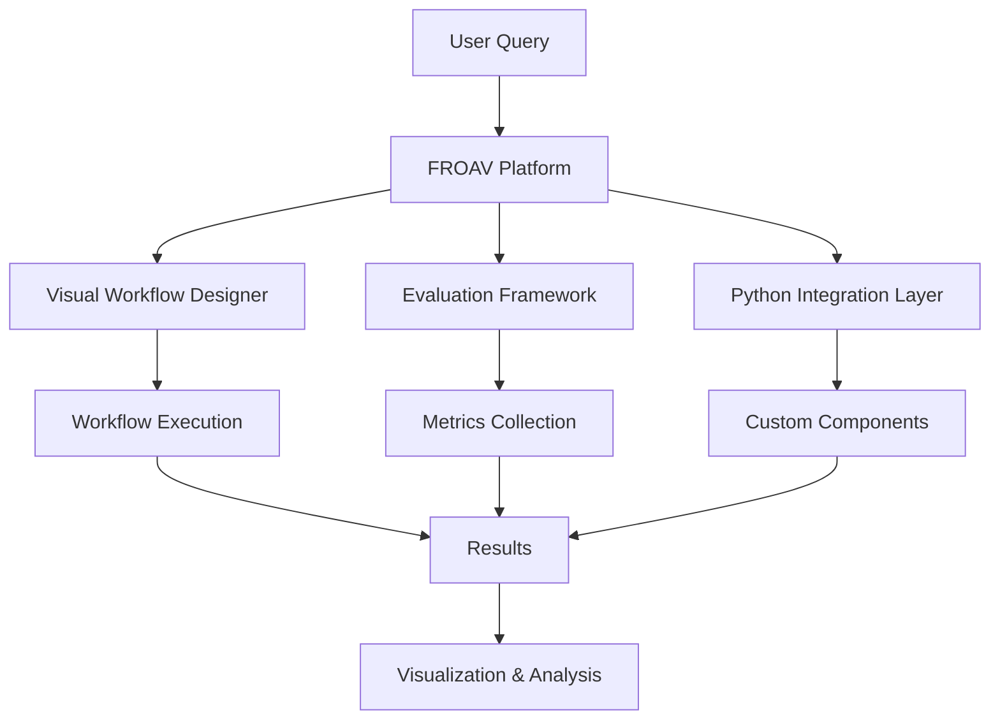

# FROAV: Framework for RAG Observation and Agent Verification

## Overview

**FROAV** is an open-source research platform that simplifies the development and evaluation of LLM-based agent workflows. It offers visual workflow orchestration, a comprehensive evaluation framework, and extensible Python integration, making LLM agent research more accessible.

## Research Background

- **Paper**: [FROAV: Framework for RAG Observation and Agent Verification](https://arxiv.org/abs/2601.07504)
- **Published**: January 2026
- **Key Innovation**: Unified platform for RAG workflow development and evaluation

## Core Features

### 1. Visual Workflow Orchestration

FROAV provides:
- **Graph-based Workflow Design**: Visual representation of agent workflows
- **Step Dependencies**: Clear visualization of component interactions
- **Real-time Monitoring**: Live workflow execution visualization
- **Debugging Tools**: Step-by-step workflow debugging

### 2. Comprehensive Evaluation Framework

The evaluation framework includes:
- **Multiple Metrics**: Accuracy, efficiency, generalization, etc.
- **Comparative Analysis**: Side-by-side comparison of different approaches
- **Automated Testing**: Automated evaluation of agent workflows
- **Result Visualization**: Clear presentation of evaluation results

### 3. Extensible Python Integration

Python integration features:
- **Custom Components**: Easy integration of custom agents and tools
- **API Compatibility**: Works with LangChain, LangSmith, and other frameworks
- **Plugin System**: Extensible architecture for new capabilities
- **Documentation**: Comprehensive documentation and examples

## Architecture



## Experiment Design

### Key Research Questions

1. How does visual workflow orchestration improve development efficiency?
2. What evaluation metrics are most useful for RAG workflows?
3. How extensible is the Python integration?
4. What is the learning curve for the platform?

### Dataset Characteristics

- Workflows requiring visual orchestration
- Tasks needing comprehensive evaluation
- Custom component integration scenarios
- Research-oriented agent workflows

## Implementation

### FROAV Platform Usage

```python
from froav import FROAVPlatform, WorkflowBuilder, EvaluationFramework

# Initialize platform
platform = FROAVPlatform()

# Build workflow visually or programmatically
workflow = WorkflowBuilder() \
    .add_step("query_analysis", QueryAnalyzer()) \
    .add_step("retrieval", RAGRetriever()) \
    .add_step("generation", LLMGenerator()) \
    .add_dependency("retrieval", "query_analysis") \
    .add_dependency("generation", "retrieval") \
    .build()

# Execute workflow
results = platform.execute(workflow, query)

# Evaluate workflow
evaluator = EvaluationFramework()
metrics = evaluator.evaluate(workflow, test_dataset)

# Visualize results
platform.visualize(results, metrics)
```

### Custom Component Integration

```python
from froav import CustomComponent

class DomainSpecificRetriever(CustomComponent):
    def __init__(self, domain):
        self.domain = domain
    
    def retrieve(self, query):
        # Custom retrieval logic
        return retrieved_docs
    
    def visualize(self):
        # Custom visualization
        return visualization

# Integrate custom component
workflow.add_component("domain_retriever", DomainSpecificRetriever("medical"))
```

## Evaluation Metrics

1. **Workflow Visualization Quality**: Clarity and usefulness of visualizations
2. **Evaluation Framework Completeness**: Coverage of evaluation metrics
3. **Python Integration Ease**: Ease of integrating custom components
4. **Extensibility Score**: How easy it is to extend the platform
5. **Overall Platform Usability**: General usability assessment

## Expected Outcomes

1. **Improved Development Efficiency**: Faster workflow development
2. **Better Evaluation**: More comprehensive evaluation capabilities
3. **Enhanced Extensibility**: Easy integration of custom components
4. **Increased Accessibility**: Lower barrier to entry for LLM agent research

## Running the Experiment

### Setup

```bash
pip install froav langsmith langchain
export LANGCHAIN_API_KEY="your-api-key"
```

### Execution

```python
from langsmith import Client
from froav import FROAVPlatform

client = Client()
dataset = client.read_dataset(dataset_name="froav-rag-observation-verification")

platform = FROAVPlatform()
results = platform.evaluate_workflows(dataset)
```

## Results Analysis

Analysis focuses on:
- Platform usability and learning curve
- Evaluation framework effectiveness
- Extensibility and integration ease
- Comparison with other platforms

## Future Work

- Enhanced visualization capabilities
- More evaluation metrics
- Better integration with other frameworks
- Community-driven component library

## References

- [FROAV Paper](https://arxiv.org/abs/2601.07504)
- [FROAV GitHub Repository](https://github.com/froav/froav)
- [LangSmith Documentation](https://docs.smith.langchain.com/)
