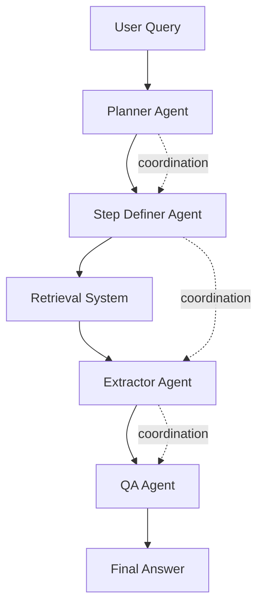

# MA-RAG: Multi-Agent Retrieval-Augmented Generation Experiment

## Overview

**MA-RAG** employs a collaborative set of specialized AI agents to address each stage of the RAG pipeline with task-aware reasoning. This approach effectively manages ambiguities and reasoning challenges in complex information-seeking tasks through agent specialization and coordination.

## Research Background

- **Paper**: [MA-RAG: Multi-Agent Retrieval-Augmented Generation](https://arxiv.org/abs/2505.20096)
- **Published**: May 2025
- **Key Innovation**: Specialized agent collaboration for enhanced RAG performance

## Architecture

### Agent Roles

1. **Planner Agent**
   - Analyzes query complexity
   - Breaks down tasks into sub-problems
   - Determines retrieval strategy

2. **Step Definer Agent**
   - Defines specific retrieval steps
   - Sequences operations
   - Manages dependencies between steps

3. **Extractor Agent**
   - Extracts relevant information from retrieved documents
   - Filters and prioritizes content
   - Identifies key passages

4. **QA Agent**
   - Synthesizes extracted information
   - Generates comprehensive answers
   - Ensures answer completeness

### Agent Collaboration Flow



## Experiment Design

### Key Research Questions

1. How does agent specialization improve RAG performance?
2. What coordination mechanisms are most effective?
3. How do multi-agent systems handle ambiguity?
4. What is the overhead vs. benefit trade-off?

### Dataset Characteristics

- Complex queries requiring multi-step reasoning
- Ambiguous queries needing clarification
- Cross-domain information synthesis tasks
- Technical queries with multiple sub-questions

## Implementation

### Agent Implementation

```python
class MARAGSystem:
    """
    Multi-Agent RAG System
    """
    def __init__(self):
        self.planner = PlannerAgent()
        self.step_definer = StepDefinerAgent()
        self.extractor = ExtractorAgent()
        self.qa_agent = QAAgent()
    
    def process_query(self, query, context=None):
        # Planner analyzes and breaks down query
        plan = self.planner.plan(query, context)
        
        # Step definer creates retrieval steps
        steps = self.step_definer.define_steps(plan)
        
        # Execute retrieval and extraction
        extracted_info = []
        for step in steps:
            retrieved = self.retrieve(step)
            extracted = self.extractor.extract(retrieved, step)
            extracted_info.append(extracted)
        
        # QA agent synthesizes final answer
        answer = self.qa_agent.synthesize(extracted_info, query)
        
        return answer
```

### Coordination Mechanisms

- **Message Passing**: Agents communicate via structured messages
- **Shared State**: Common knowledge base for agent coordination
- **Task Decomposition**: Hierarchical task breakdown
- **Conflict Resolution**: Mechanisms for handling agent disagreements

## Evaluation Metrics

1. **Agent Coordination Quality**: How well agents collaborate
2. **Retrieval Accuracy**: Precision and recall of retrieved documents
3. **Answer Completeness**: Coverage of query aspects
4. **Cross-Agent Communication Efficiency**: Overhead of coordination
5. **Task-Aware Reasoning Quality**: Appropriateness of reasoning for task type

## Expected Outcomes

1. **Improved Handling of Complex Queries**: Better decomposition and synthesis
2. **Better Ambiguity Resolution**: Specialized agents for clarification
3. **Enhanced Cross-Domain Synthesis**: Coordinated multi-domain retrieval
4. **Scalability**: Ability to handle increasingly complex queries

## Running the Experiment

### Setup

```bash
pip install langsmith langchain openai anthropic
export LANGCHAIN_API_KEY="your-api-key"
```

### Execution

```python
from langsmith import Client
from ma_rag import MARAGSystem

client = Client()
dataset = client.read_dataset(dataset_name="ma-rag-multi-agent-collaboration")

system = MARAGSystem()
results = system.evaluate(dataset)
```

## Results Analysis

Analysis focuses on:
- Comparison with single-agent RAG systems
- Impact of agent specialization
- Coordination overhead analysis
- Performance on different query types

## Future Work

- Dynamic agent role assignment
- Learning optimal coordination strategies
- Extending to more agent types
- Real-time agent adaptation

## References

- [MA-RAG Paper](https://arxiv.org/abs/2505.20096)
- [Multi-Agent Systems in AI](https://arxiv.org/abs/2601.07136)
- [LangSmith Multi-Agent Evaluation](https://docs.smith.langchain.com/)
