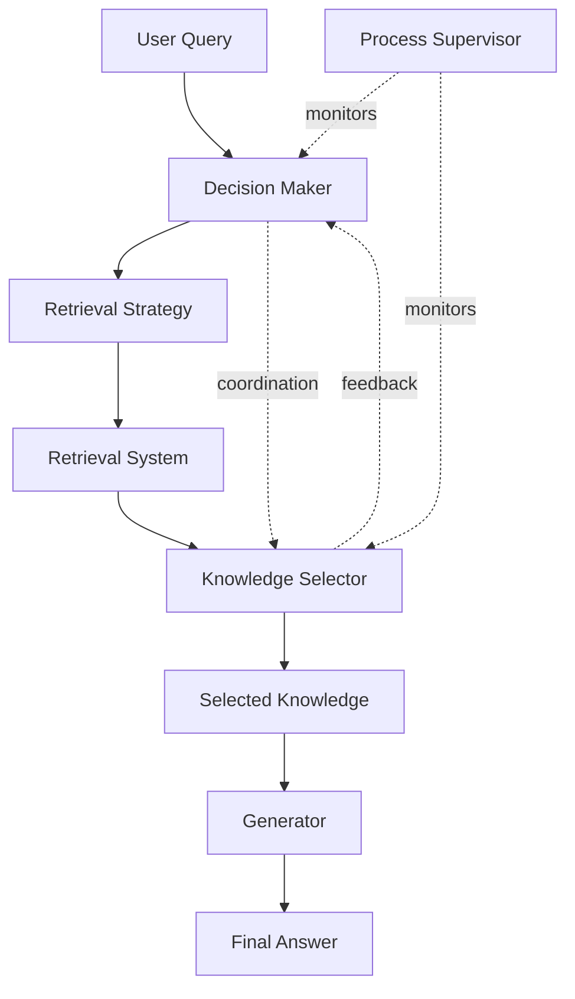

# SIRAG: Stable and Interpretable RAG Experiment

## Overview

**SIRAG** (Stable and Interpretable RAG) introduces a process-supervised multi-agent framework to bridge the gap between retriever and generator components in RAG systems. It incorporates a Decision Maker and a Knowledge Selector to enhance coordination, resulting in more accurate and interpretable reasoning trajectories.

## Research Background

- **Paper**: [SIRAG: Stable and Interpretable RAG](https://arxiv.org/abs/2509.18167)
- **Published**: September 2025
- **Key Innovation**: Process-supervised framework for stable and interpretable RAG

## Core Components

### Decision Maker Agent

The Decision Maker:
- Analyzes queries and determines retrieval strategy
- Makes decisions about what information to retrieve
- Plans multi-step reasoning when needed
- Handles uncertainty and ambiguity

### Knowledge Selector Agent

The Knowledge Selector:
- Selects most relevant knowledge chunks from retrieved documents
- Filters and prioritizes information
- Coordinates with Decision Maker for optimal selection
- Ensures balanced representation when needed

### Process Supervision

Process supervision ensures:
- **Stability**: Consistent reasoning across similar queries
- **Interpretability**: Visible reasoning trajectories
- **Coordination**: Effective communication between components

## Architecture



## Experiment Design

### Key Research Questions

1. How does process supervision improve RAG stability?
2. What makes reasoning trajectories interpretable?
3. How effective is the Decision Maker / Knowledge Selector coordination?
4. Can stability and interpretability be achieved simultaneously?

### Dataset Characteristics

- Queries requiring stable retrieval
- Tasks needing interpretable reasoning
- Multi-step reasoning scenarios
- Uncertainty handling cases

## Implementation

### SIRAG System

```python
class SIRAGSystem:
    """
    Stable and Interpretable RAG System
    """
    def __init__(self):
        self.decision_maker = DecisionMakerAgent()
        self.knowledge_selector = KnowledgeSelectorAgent()
        self.process_supervisor = ProcessSupervisor()
        self.generator = GeneratorAgent()
    
    def process_query(self, query, require_stability=True, require_interpretability=True):
        # Decision Maker determines retrieval strategy
        strategy = self.decision_maker.plan(query)
        
        # Process supervisor monitors decision
        if require_stability:
            strategy = self.process_supervisor.ensure_stability(strategy)
        
        # Retrieve documents
        retrieved = self.retrieve(strategy)
        
        # Knowledge Selector chooses relevant chunks
        selected = self.knowledge_selector.select(retrieved, strategy)
        
        # Process supervisor ensures interpretability
        if require_interpretability:
            trajectory = self.process_supervisor.track_reasoning(
                strategy, selected
            )
        
        # Generate answer
        answer = self.generator.generate(selected, query)
        
        return {
            "answer": answer,
            "reasoning_trajectory": trajectory if require_interpretability else None
        }
```

## Evaluation Metrics

1. **Stability Score**: Consistency across similar queries
2. **Interpretability Score**: Clarity of reasoning trajectories
3. **Decision Maker Quality**: Appropriateness of retrieval strategies
4. **Knowledge Selector Accuracy**: Relevance of selected knowledge
5. **Reasoning Trajectory Clarity**: Understandability of reasoning process
6. **Answer Quality**: Overall answer correctness and completeness

## Expected Outcomes

1. **Improved Stability**: More consistent results across queries
2. **Enhanced Interpretability**: Clear reasoning trajectories
3. **Better Coordination**: Effective Decision Maker / Knowledge Selector interaction
4. **Higher Quality Answers**: More accurate and complete responses

## Running the Experiment

### Setup

```bash
pip install langsmith langchain openai
export LANGCHAIN_API_KEY="your-api-key"
```

### Execution

```python
from langsmith import Client
from sirag import SIRAGSystem

client = Client()
dataset = client.read_dataset(dataset_name="sirag-stable-interpretable-rag")

system = SIRAGSystem()
results = system.evaluate(
    dataset,
    require_stability=True,
    require_interpretability=True
)
```

## Results Analysis

Analysis focuses on:
- Stability improvements over baseline RAG
- Interpretability gains
- Trade-offs between stability and interpretability
- Impact of process supervision

## Future Work

- Extending to more complex reasoning tasks
- Improving process supervision mechanisms
- Scaling to larger knowledge bases
- Real-time interpretability visualization

## References

- [SIRAG Paper](https://arxiv.org/abs/2509.18167)
- [Process Supervision in AI](https://arxiv.org/)
- [LangSmith Evaluation](https://docs.smith.langchain.com/)
