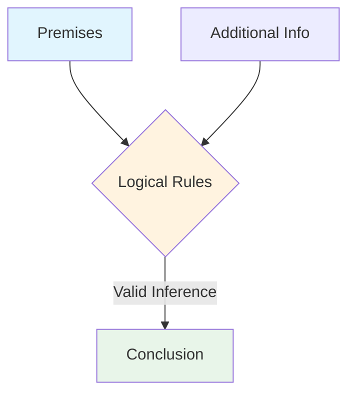
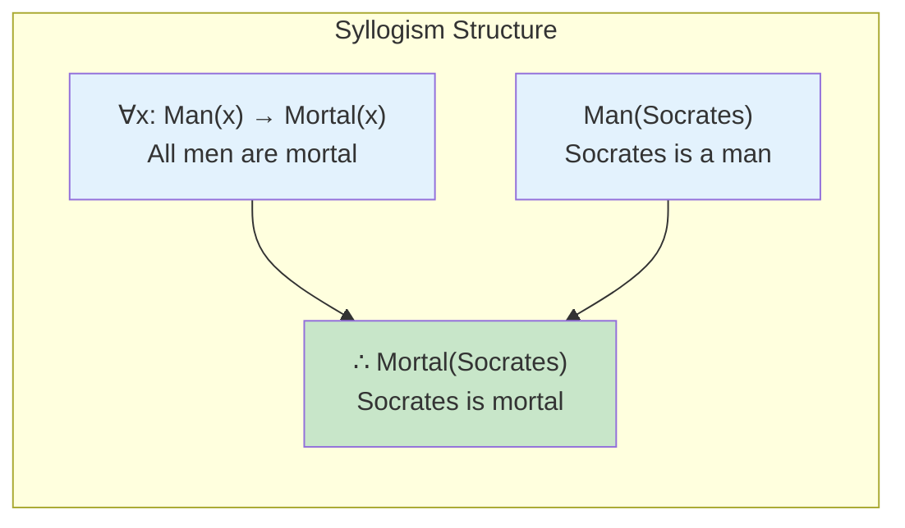
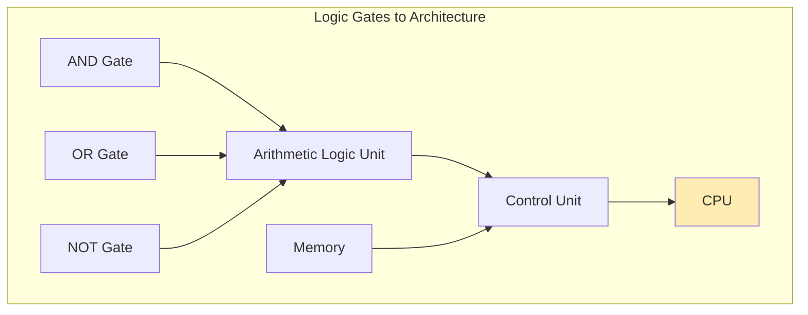
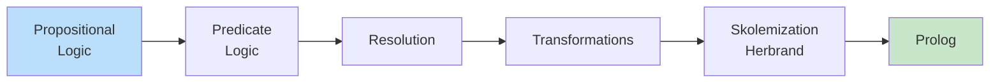

# 2025 08 25 Introduction To Logic For Computer Scientists
---
layout: post
title: "Introduction to Logic for Computer Scientists"
date: 2025-08-25
categories:
  - "Logic for Computer Scientists"
tags:
  - logic
  - propositional-logic
  - foundations
  - automated-reasoning
  - logic-for-computer-scientists
excerpt: "Discover how logic—the study of reasoning—forms the invisible foundation of every computer program, database query, and artificial intelligence system you build."
reading_time: 13
course: "Logic for Computer Scientists"
---

Welcome to CS 5384, a course that explores one of the most fundamental yet often overlooked pillars of computer science: logic. Before we dive into propositional calculus, resolution proofs, and Prolog programming, we need to understand a simple but profound truth—logic is the bridge between human reasoning and machine computation.

Consider this: every time you write an `if` statement, construct a SQL query, or design a neural network, you are applying principles that philosophers have studied for over two thousand years. The same logical rules that Aristotle used to analyze syllogisms now govern the behavior of processors with billions of transistors. This course will unravel those connections and give you a rigorous foundation for thinking like a computer scientist.

By the end of this post, you'll understand what logic is, why it matters for computer science, and how we'll progress from the basics of propositional logic all the way to building intelligent agents in Prolog.

## What Is Logic?

At its core, logic is a method of reasoning, the study of proving or disproving arguments, and a systematic way of making inferences. When we say someone is "logical," we mean they draw conclusions that follow necessarily from their premises—their reasoning is valid and sound.

Logic has three interconnected aspects that we'll explore throughout this course. First, there's **reasoning** itself—the process of drawing conclusions from given information. Second, there's **proof**—the rigorous demonstration that a conclusion must be true if the premises are true. Third, there's **inference**—the rules that tell us when one statement logically follows from others.

These concepts might seem abstract, but they appear everywhere in everyday life, often without us noticing. When you decide to take an umbrella because the sky is dark, you're making a logical inference: "If it's going to rain and I take an umbrella, I won't get wet. The sky suggests rain. Therefore, I should take an umbrella." This kind of reasoning—breaking down complex situations into premises and conclusions—is exactly what logic formalizes.

### Formal vs. Informal Reasoning

It's worth distinguishing between formal and informal reasoning right from the start. **Informal reasoning** is what we do in everyday conversation—we argue, persuade, and convince using context, intuition, and shared understanding. **Formal reasoning**, which is what this course teaches, strips away the context and expresses everything in precise symbols and rules. This formality is exactly what allows us to automate reasoning with computers.

| Aspect | Informal Reasoning | Formal Reasoning |
|--------|-------------------|------------------|
| Expression | Natural language | Symbolic notation |
| Precision | Context-dependent | Exact and unambiguous |
| Automation | Difficult | Possible and practical |
| Example | "That seems obvious" | $P \rightarrow Q, P \vdash Q$ |

## The Power of Logical Deduction

Let's make these concepts concrete with the classic example from ancient philosophy. The syllogism about Socrates goes like this: "All men are mortal. Socrates is a man. Therefore, Socrates is mortal." This argument is logically valid—the conclusion *must* be true if the premises are true, regardless of whether Socrates actually existed.

Breaking this down, we have two **premises**: $∀x(Man(x) → Mortal(x))$ and $Man(Socrates)$. From these, we can **infer** the **conclusion**: $Mortal(Socrates)$. The inference follows a standard rule of logic called **universal instantiation**: if something is true for all members of a category, it's true for any particular member of that category.

A second example from the lecture illustrates **transitive reasoning**: "London is in England and England is in Europe. Therefore, London is in Europe." Here, the inference rule is even simpler—if $A$ is in $B$ and $B$ is in $C$, then $A$ is in $C$. This transitivity appears everywhere in computer science: in database queries (if A relates to B and B relates to C, we can find A's relationship to C), in dependency analysis, and in graph algorithms.

Understanding these inference patterns—syllogisms, transitivity, and many others—is the first step toward appreciating how computers can be programmed to "think" logically.

## Logic in Computer Science

Now we come to the central question: why does a computer scientist need to study formal logic? The answer is that logic appears in every major area of computing, often in surprising ways.

### Computer Architecture

At the most fundamental level, computers are made of transistors that act as **logic gates**. An AND gate outputs true only if all its inputs are true; an OR gate outputs true if any input is true; a NOT gate reverses its input. These three primitive operations can be combined to build adders, multiplexers, memory units, and eventually entire processors.

Every instruction your computer executes ultimately reduces to combinations of these logical operations. Understanding propositional logic—the logic of true/false statements—is therefore understanding how computers work at their most basic level.

### Programming Principles

Beyond hardware, logic pervades software development. Every conditional statement (`if`, `while`, `switch`) is a logical expression. Every loop guard is a boolean condition. Every assertion and invariant is a logical claim about program state. Good programmers think logically by default, but this course will give you the formal tools to reason about your programs with mathematical precision.

### Databases

The relational model that underlies SQL is fundamentally logical. A database table is a set of tuples, and a SQL query is essentially a logical formula that selects certain tuples. When you write `SELECT * FROM Users WHERE age > 18`, you're expressing the logical predicate "is a user AND has age greater than 18." The database engine then uses optimized logical inference (through indices and query planning) to find the matching rows.

| Programming Construct | Logical Foundation |
|----------------------|-------------------|
| `if (condition)` | Implication: $condition → statement$ |
| `while (condition)` | Iteration over logical condition |
| `assert(condition)` | Logical claim that must be true |
| `&&`, `\|\|`, `!` | Conjunction, Disjunction, Negation |

### Artificial Intelligence

Perhaps nowhere is logic more central than in artificial intelligence. Early AI systems were explicitly based on logical knowledge representation—expert systems encoded rules and used logical inference to draw conclusions. Modern approaches like large language models might seem different, but they still rely on logical patterns in their training data and outputs.

Logic-based AI remains important for tasks requiring guaranteed correctness: automated theorem proving, program verification, and formal specification. When you need a system to *guarantee* correct behavior rather than just *probably* behave correctly, logic is your tool.

## Course Roadmap

This course will take you through a carefully designed progression from basic concepts to practical implementation.

We begin with **propositional logic**, the logic of true/false statements connected by operators like AND, OR, and IMPLIES. You'll learn to write formulas, build truth tables, and prove theorems using natural deduction and resolution.

Next, we explore **predicate logic**, which adds quantifiers ($\forall$ for "for all" and $\exists$ for "there exists") to express relationships between objects. This is the logic used in mathematics and is the foundation for more advanced topics.

**Resolution** is our first automated reasoning technique—a single inference rule that, combined with certain proof strategies, can determine whether a logical formula is provable. Resolution is also the basis for **logic programming** and the Prolog language.

We then study **transformations** that convert formulas into standard forms, making them easier to reason about automatically. **Skolemization** removes existential quantifiers, and **Herbrand logic** provides a foundation for understanding what it means for a logical consequence to hold.

Finally, we apply everything in **Prolog**, a programming language where you express logical rules and queries directly. You'll build a complete Prolog program that uses logical inference to answer questions.

## Assessment and Getting Started

Your success in this course depends on active engagement with the material. The assessment breakdown is:

| Component | Weight |
|-----------|--------|
| Assignments | 25% |
| Quizzes | 30% |
| Midterm Exam | 20% |
| Final Exam | 25% |

Here are some key study recommendations from Dr. Ikram:

- **Attend lectures**: Slides are available after class, but the live explanation provides context you can't get from slides alone.
- **Practice actively**: "Do not understand math by listening and watching. Practice math!" Work through problems, don't just read solutions.
- **Don't fall behind**: Each lecture builds on previous material. Missing one creates gaps that compound.
- **Ask questions**: Email the instructor or TA when confused—don't wait until the next lecture.

## Conclusion

Logic is not just an abstract mathematical curiosity—it's the precise framework underlying computation itself. From the silicon gates that execute instructions to the logical queries that retrieve data, from the conditionals in your code to the knowledge representations in AI systems, logic provides the structure that makes computing possible.

This course takes you from the basics of propositional calculus through automated theorem proving to practical logic programming in Prolog. Each step builds on previous concepts, so stay engaged, practice consistently, and embrace the challenge of thinking rigorously.

Your next step is simple: read Chapter 1 of the Nerode and Shore textbook, practice identifying logical arguments in everyday conversation, and come prepared for our deep dive into propositional logic syntax.

---

## External Resources

1. **[Stanford Encyclopedia of Philosophy: Logic](https://plato.stanford.edu/entries/logic/)** - An authoritative, comprehensive introduction to logic from a philosophical perspective, covering its history, major systems, and applications.

2. **[Wikipedia: Logic in Computer Science](https://en.wikipedia.org/wiki/Logic_in_computer_science)** - A broad overview of how logic principles are applied throughout computer science, from circuit design to artificial intelligence.

3. **[Logic.ly](https://logic.ly/)** - An interactive logic gate simulator that lets you experiment with AND, OR, NOT, and other gates by building circuits directly in your browser.

4. **[Nerode & Shore: Logic for Applications](https://www.springer.com/gp/book/9780387948935)** - The primary textbook for this course, available through the university bookstore or Springer.
