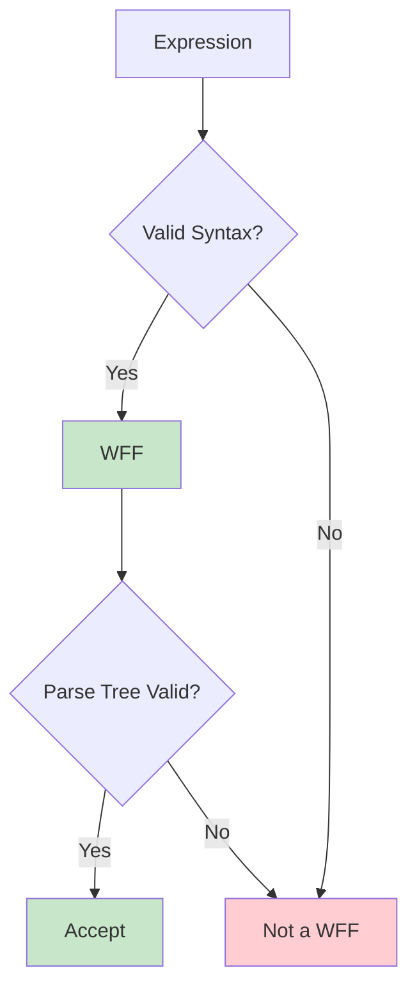
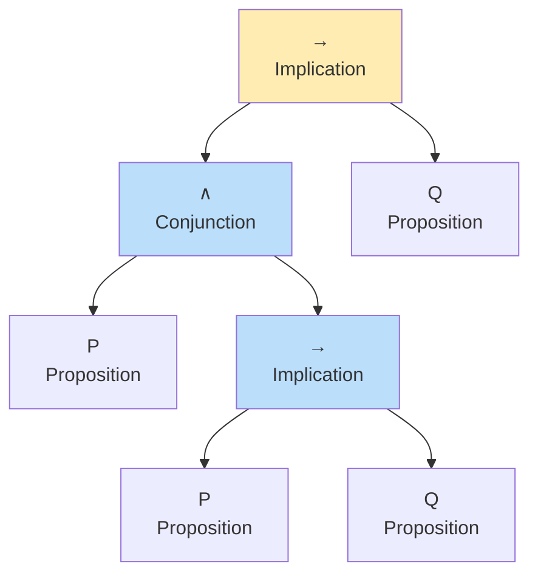
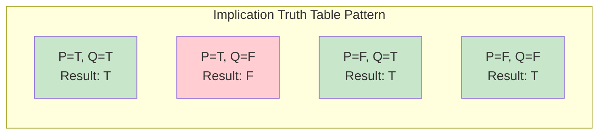
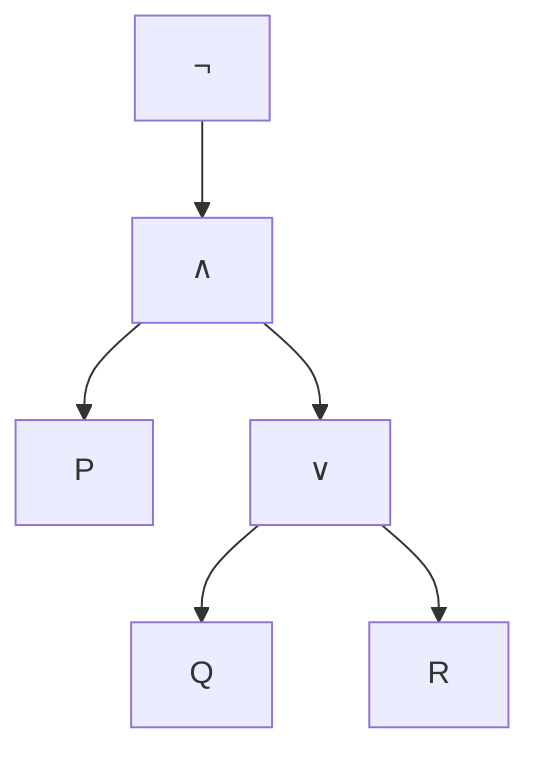

Welcome back to our journey through propositional logic. In the previous lecture, we established the foundations: propositional variables, logical connectives, and the definition of well-formed formulas. Today, we'll develop practical tools for analyzing logical formulas: **truth tables** and **formation trees**. These techniques let us systematically evaluate any propositional formula and verify its validity.

By the end of this post, you'll be able to construct truth tables for complex formulas, build formation trees to visualize formula structure, and classify formulas as tautologies, contradictions, or contingent statements.

## Announcements and Schedule Note

Before diving in, a quick reminder: there is no class on Monday, September 1st. Make sure to plan your study schedule accordingly, and if you're traveling, please arrange your travel around the exam dates announced for this course.

## Review: Propositions, Predicates, and Connectives

Let's briefly reinforce the key concepts from our previous lecture.

A **proposition** is a statement that is either true or false. Examples include "England is in Europe" (true), "17 > 15" (true), or "You own a BMW" (context-dependent, but still a proposition).

A **predicate** is a function that takes arguments and returns a truth value. The expression "$x + 25 = 45$" is a predicate—it becomes a proposition only when we specify $x$. If $x = 20$, it becomes the true proposition "$20 + 25 = 45$."

Our five logical connectives remain unchanged:

| Symbol | Name | Meaning |
|--------|------|---------|
| $\lor$ | Disjunction | At least one true |
| $\land$ | Conjunction | Both true |
| $\neg$ | Negation | Opposite truth value |
| $\to$ | Implication | False only when antecedent true, consequent false |
| $\leftrightarrow$ | Equivalence | Same truth value |

The recursive definition of well-formed formulas also carries forward: atomic propositions are WFFs, and combining WFFs with connectives (properly parenthesized) produces new WFFs.

## Identifying Well-Formed Formulas

Let's practice identifying WFFs. For each expression below, determine if it's a well-formed formula:

| Expression | Is WFF? | Explanation |
|------------|---------|-------------|
| $P$ | ✅ Yes | Atomic proposition |
| $Q$ | ✅ Yes | Atomic proposition |
| $(P \to Q)$ | ✅ Yes | Implication of two atomic propositions |
| $P \land \neg$ | ❌ No | Incomplete—$\neg$ requires an operand |
| $((P \land (P \to Q)) \to Q)$ | ✅ Yes | Fully parenthesized complex formula |
| $(P \to Q$ | ❌ No | Missing closing parenthesis |
| $\land \to Q$ | ❌ No | No operands for connectives |
| $((P \to Q) \to R)$ | ✅ Yes | Implication of implications |
| $(P \land Q) \to (P \lor R)$ | ✅ Yes | Implication with conjunction and disjunction |



## True or False: Evaluating Propositions

Now let's evaluate some expressions as propositions. Remember: a proposition must have a definite truth value.

| Expression | True or False | Reasoning |
|------------|---------------|-----------|
| $(e < \pi) \land 57\text{ is prime}$ | ❌ False | $e \approx 2.718 < \pi \approx 3.141$ is true, but 57 is divisible by 3 ($57 = 3 \times 19$), so "57 is prime" is false. True ∧ False = False. |
| $(2\text{ is rational}) \lor \frac{1+5}{2} < 2$ | ✅ True | 2 is rational ($\frac{2}{1}$), so first part is true. True ∨ anything = True. |
| "There are no integers $a$ and $b$ so that $\sqrt{2} = \frac{a}{b}$" | ✅ True | This is a famous result—$\sqrt{2}$ is irrational. |
| "For all integers $n \geq 0$, $n^2 + n + 42$ is prime" | ❌ False | Counterexample: let $n = 6$, then $6^2 + 6 + 42 = 36 + 6 + 42 = 84$, which is not prime (divisible by 2, 3, etc.). |

The last example demonstrates the importance of **quantifiers** and **predicates**—a statement about "all integers" is a predicate that becomes a proposition when we specify the domain.

## Formation Trees: Visualizing Formula Structure

A **formation tree** (also called a parse tree or derivation tree) visualizes how a complex formula is built from atomic propositions using connectives. This is analogous to a syntax tree in programming languages.

### Tree Construction Rules

1. **Leaves** are labeled with propositional variables ($P, Q, R, ...$)
2. **Internal nodes** are labeled with connectives
3. For binary connectives ($\land, \lor, \to, \leftrightarrow$), a node has exactly two children representing the left and right subformulas
4. For unary connective ($\neg$), a node has exactly one child

### Example: Building a Formation Tree

Let's build the formation tree for $((P \land (P \to Q)) \to Q)$:

```
                    →
                   / \
                  /   \
                 ∧     Q
                / \
               /   \
              P     →
                   / \
                  P   Q
```

Starting from the leaves (atomic propositions $P, Q$), we work upward:
1. $P \to Q$ combines $P$ and $Q$ with $\to$
2. $P \land (P \to Q)$ combines $P$ and $(P \to Q)$ with $\land$
3. $((P \land (P \to Q)) \to Q)$ combines the previous result with $Q$ using $\to$



### Invalid Formula Example

Consider $((A \land (\land \to B)) \to C)$. Can we build a formation tree for this?

Attempting to parse reveals the problem: "$\land \to$" is not a valid connective combination—$\land$ requires two operands but has none in this position. The formation tree construction fails, confirming this is not a WFF.

## Truth Tables: Systematic Evaluation

A **truth table** systematically lists all possible truth value combinations for the atomic propositions in a formula, then computes the truth value of the compound formula for each combination.

### Single Variable: Negation

| $P$ | $\neg P$ |
|-----|----------|
| T | F |
| F | T |

### Two Variables: Conjunction and Disjunction

| $P$ | $Q$ | $P \land Q$ | $P \lor Q$ |
|-----|-----|-------------|------------|
| T | T | T | T |
| T | F | F | T |
| F | T | F | T |
| F | F | F | F |

### Two Variables: Implication and Equivalence

| $P$ | $Q$ | $P \to Q$ | $P \leftrightarrow Q$ |
|-----|-----|-----------|----------------------|
| T | T | T | T |
| T | F | F | F |
| F | T | T | F |
| F | F | T | T |



The implication table is worth special attention. Consider the everyday statement: "If the weather is sunny, I will take you to the beach." This is false only when it's sunny ($P$ is true) but I don't take you to the beach ($Q$ is false). In all other cases (not sunny, or I take you regardless), the statement holds.

### Building a Complete Truth Table

For a formula with $n$ atomic propositions, a truth table has $2^n$ rows. For three propositions ($P, Q, R$), we need 8 rows.

### Example: Truth Table for $(P \land Q) \to R$

| $P$ | $Q$ | $R$ | $P \land Q$ | $(P \land Q) \to R$ |
|-----|-----|-----|-------------|---------------------|
| T | T | T | T | T |
| T | T | F | T | F |
| T | F | T | F | T |
| T | F | F | F | T |
| F | T | T | F | T |
| F | T | F | F | T |
| F | F | T | F | T |
| F | F | F | F | T |

Notice the pattern: the implication is false only in row 2, where both the antecedent ($P \land Q$) is true and the consequent ($R$) is false.

## From Truth Tables to Logical Properties

Truth tables reveal important classifications of formulas:

### Tautologies

A **tautology** is a formula that is true for all possible truth assignments. Example: $P \lor \neg P$ ("law of excluded middle")

| $P$ | $\neg P$ | $P \lor \neg P$ |
|-----|----------|-----------------|
| T | F | T |
| F | T | T |

### Contradictions

A **contradiction** is a formula that is false for all possible truth assignments. Example: $P \land \neg P$

| $P$ | $\neg P$ | $P \land \neg P$ |
|-----|----------|-----------------|
| T | F | F |
| F | T | F |

### Contingent Formulas

A **contingent** (or satisfiable) formula is true for some assignments and false for others. Most formulas fall into this category.

## Logical Equivalence

Two formulas $\alpha$ and $\beta$ are **logically equivalent** (written $\alpha \equiv \beta$) if they have the same truth value for every possible assignment of truth values to their atomic propositions. In terms of truth tables, this means the columns for $\alpha$ and $\beta$ are identical.

Proving logical equivalence is a fundamental task in logic, as it allows us to substitute one formula for another without changing the meaning of the overall expression.

### Common Logical Equivalences

| Name | Equivalence |
|------|-------------|
| **Identity Laws** | $P \wedge \mathbf{T} \equiv P$, $P \vee \mathbf{F} \equiv P$ |
| **Domination Laws** | $P \vee \mathbf{T} \equiv \mathbf{T}$, $P \wedge \mathbf{F} \equiv \mathbf{F}$ |
| **Idempotent Laws** | $P \vee P \equiv P$, $P \wedge P \equiv P$ |
| **Double Negation** | $\neg(\neg P) \equiv P$ |
| **Commutative Laws** | $P \vee Q \equiv Q \vee P$, $P \wedge Q \equiv Q \wedge P$ |
| **Associative Laws** | $(P \vee Q) \vee R \equiv P \vee (Q \vee R)$, $(P \wedge Q) \wedge R \equiv P \wedge (Q \wedge R)$ |
| **Distributive Laws** | $P \vee (Q \wedge R) \equiv (P \vee Q) \wedge (P \vee R)$, $P \wedge (Q \vee R) \equiv (P \wedge Q) \vee (P \wedge R)$ |

## De Morgan's Laws

Among the most important logical equivalences in computer science are **De Morgan's Laws**, which describe how to distribute negation over conjunction and disjunction:

1.  $\neg(P \wedge Q) \equiv \neg P \vee \neg Q$
2.  $\neg(P \vee Q) \equiv \neg P \wedge \neg Q$

Intuitively, these laws tell us that "not (A and B)" is the same as "(not A) or (not B)", and "not (A or B)" is the same as "(not A) and (not B)". You can verify these using truth tables. For example, for the first law:

| $P$ | $Q$ | $P \wedge Q$ | $\neg(P \wedge Q)$ | $\neg P$ | $\neg Q$ | $\neg P \vee \neg Q$ |
|-----|-----|--------------|--------------------|----------|----------|----------------------|
| T   | T   | T            | **F**              | F        | F        | **F**                |
| T   | F   | F            | **T**              | F        | T        | **T**                |
| F   | T   | F            | **T**              | T        | F        | **T**                |
| F   | F   | F            | **T**              | T        | T        | **T**                |

The identical columns for $\neg(P \wedge Q)$ and $\neg P \vee \neg Q$ prove the equivalence.

## Logical Implication

While equivalence ($\equiv$) tells us two formulas are "the same," **logical implication** (written $\alpha \models \beta$ or "$\alpha$ tautologically implies $\beta$") tells us that whenever $\alpha$ is true, $\beta$ must also be true.

Formally, $\alpha \models \beta$ if there is no truth assignment that makes $\alpha$ true and $\beta$ false. This is closely related to the material implication connective: $\alpha \models \beta$ if and only if the formula $\alpha \rightarrow \beta$ is a **tautology**.

Logical implication is the basis for valid arguments and formal proofs. If we know $\alpha$ is true and we know $\alpha \models \beta$, we can safely conclude that $\beta$ is true.

## Exercises

1.  **Prove logical equivalence**: Use a truth table to prove that $P \rightarrow Q \equiv \neg P \vee Q$.
2.  **Simplify formulas**: Use De Morgan's Laws and other equivalences to simplify $\neg(P \vee \neg Q)$.
3.  **Identify tautologies**: Determine if $((P \to Q) \wedge P) \to Q$ is a tautology.
4.  **Formation Trees**: Construct a formation tree for $\neg(P \wedge (Q \lor R))$.

---

### Exercise Solutions

**Exercise 1: Implication as Disjunction**

| $P$ | $Q$ | $P \rightarrow Q$ | $\neg P$ | $\neg P \vee Q$ |
|-----|-----|-------------------|----------|-----------------|
| T   | T   | **T**             | F        | **T**           |
| T   | F   | **F**             | F        | **F**           |
| F   | T   | **T**             | T        | **T**           |
| F   | F   | **T**             | T        | **T**           |

Since the columns for $P \rightarrow Q$ and $\neg P \vee Q$ are identical, the equivalence is proven.

**Exercise 2: Simplification**

$\neg(P \vee \neg Q) \equiv \neg P \wedge \neg(\neg Q)$ (by De Morgan's Law)
$\equiv \neg P \wedge Q$ (by Double Negation)

**Exercise 3: Modus Ponens**

The formula $((P \to Q) \wedge P) \to Q$ (known as Modus Ponens) is a **tautology**. If you construct the truth table, you will see it is true in all four rows.

**Exercise 4: Formation Tree**



## Conclusion

You've now added two essential tools to your logical toolkit: **truth tables** for systematic evaluation of formulas and **formation trees** for visualizing syntactic structure. These techniques work together—formation trees help us understand how to construct truth tables column by column.

In our next lecture, we'll explore **logical equivalence**, **tautological implication**, and powerful transformation rules like **De Morgan's Laws** that let us simplify and reason about logical formulas.

**Practice suggestions**: Build truth tables for formulas with 3 variables, construct formation trees for complex expressions, and identify which of your tables represent tautologies, contradictions, or contingent statements.

---

## External Resources

1. **[Stanford Encyclopedia of Philosophy: Logical Truth](https://plato.stanford.edu/entries/logical-truth/)** - Philosophical treatment of tautologies and logical truths.

2. **[Wikipedia: Truth Table](https://en.wikipedia.org/wiki/Truth_table)** - Comprehensive overview of truth tables with examples and applications.

3. **[Logic for Applications (Nerode & Shore)](https://www.springer.com/gp/book/9780387948935)** - Section 1.3 covers truth tables and logical properties in depth.

4. **[Wikipedia: Well-Formed Formula](https://en.wikipedia.org/wiki/Well-formed_formula)** - Details on parse trees and formula formation.
