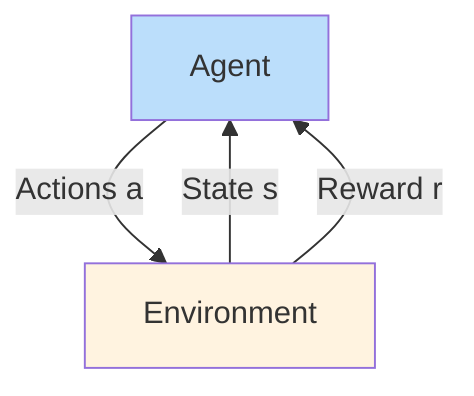
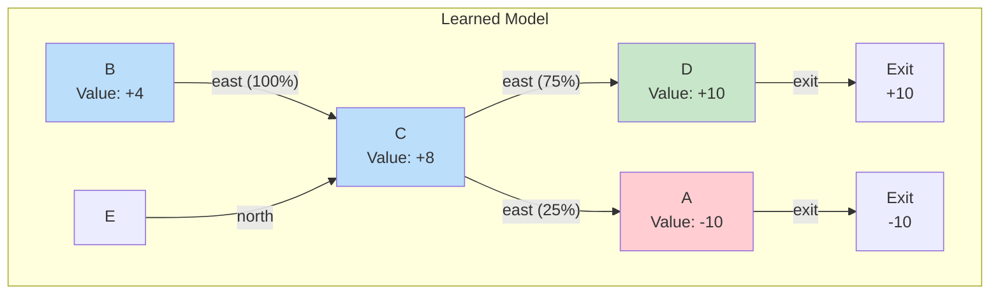
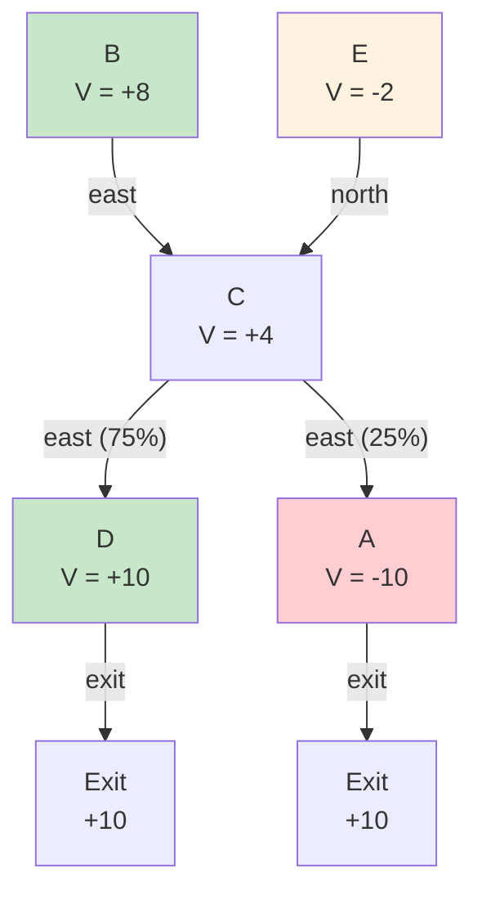

In our exploration of intelligent systems, we've examined approaches where the correct answer is known (supervised learning) and where patterns emerge from data without labels (unsupervised learning). Today, we explore a fundamentally different paradigm: **reinforcement learning (RL)**, where an agent learns to make decisions by receiving feedback in the form of rewards.

Reinforcement learning powers some of the most impressive achievements in modern AI: from AlphaGo defeating world champions at Go, to robots learning to walk and manipulate objects, to the AWS DeepRacer autonomous vehicles. By the end of this post, you'll understand the core ideas behind RL, how it differs from other machine learning paradigms, and the key approaches to learning from experience.

## The Reinforcement Learning Framework

At its heart, reinforcement learning addresses a deceptively simple question: how should an agent behave to maximize long-term rewards?

Unlike supervised learning, where we provide the algorithm with correct examples, or unsupervised learning, where we seek hidden structure, RL involves an **agent** interacting with an **environment** over time. At each step:

1. The agent observes the current **state** $s$ of the environment
2. Based on this state, the agent selects an **action** $a$
3. The environment transitions to a new state $s'$ and provides a **reward** $r$

The agent's goal is to learn a **policy** $\pi(s)$—a mapping from states to actions—that maximizes the expected sum of discounted rewards over time. This is formalized through **Markov Decision Processes (MDPs)**, which we assume have the following components:

- **States** $s \in S$: All possible situations the agent can encounter
- **Actions** $a \in A(s)$: Actions available in each state
- **Transition model** $T(s, a, s')$: Probability of reaching $s'$ from $s$ by taking $a$
- **Reward function** $R(s, a, s')$: Immediate reward received
- **Discount factor** $\gamma \in [0, 1)$: How much we value immediate vs. future rewards

The critical difference from our previous MDP discussions: in RL, we don't know $T$ or $R$! We must learn them through experience.

## Learning to Walk: RL in Action

To make this concrete, consider the classic example of a robot learning to walk. Initially, the robot's movements are clumsy—it stumbles, falls, takes erratic steps. But each fall provides negative feedback (or each successful step provides positive feedback), and over thousands of trials, the robot learns a coordinated walking pattern.

The same principle applies to the **Crawler** project you might encounter in Project 3: starting from random movements, an agent learns to navigate obstacles and reach goals through trial and error.

Another impressive example is **Sidewinding**, where robots learn efficient snake-like locomotion, and **DeepRacer**, Amazon's 1/18th scale autonomous race car that learns to navigate tracks through RL:

> DeepRacer demonstrates RL at scale—cars train in simulation, then deploy to physical devices that compete in global races.

## Model-Based vs. Model-Free Learning

Reinforcement learning approaches fall into two broad categories:

### Model-Based Learning

In model-based RL, the agent first learns an approximation of the environment's dynamics (the transition model $T$ and reward function $R$), then uses this learned model to plan optimal behavior.

**The approach:**
1. **Learn the model**: Observe many transitions $(s, a, s', r)$ and estimate $T(s, a, s')$ and $R(s, a, s')$ empirically
2. **Solve the MDP**: Apply familiar algorithms (value iteration, policy iteration) to the learned model

### Example: Model-Based Learning

Suppose we observe these episodes:

| Episode | Transitions Observed |
|---------|---------------------|
| 1 | $B \xrightarrow{east} C, -1 \to D, -1 \to exit, +10$ |
| 2 | $B \xrightarrow{east} C, -1 \to D, -1 \to exit, +10$ |
| 3 | $E \xrightarrow{north} C, -1 \to A, -1 \to exit, -10$ |
| 4 | $E \xrightarrow{north} C, -1 \to D, -1 \to exit, +10$ |

From these, we estimate:
- $T(B, east, C) = 1.0$ (always observed)
- $T(C, east, D) = 0.75$ (observed 3 out of 4 times)
- $T(C, east, A) = 0.25$ (observed 1 out of 4 times)
- $R(D, exit, x) = +10$
- $R(A, exit, x) = -10$

### Model-Free Learning

In model-free RL, we skip learning the model entirely and directly learn values or policies from experience. This is often more practical when the state space is huge or the model would be too expensive to learn.

The key insight: we don't need to know *why* a state is good or *what* actions do—we can learn directly from observed outcomes.

## Passive Reinforcement Learning: Learning from a Fixed Policy

Let's start with a simplified task: **passive RL** or **policy evaluation**. Here, we don't choose actions—we're given a fixed policy $\pi(s)$ and must learn the values of states under that policy.

**Setup:**
- Input: A fixed policy $\pi(s)$ telling us which action to take in each state
- Unknown: Transition model $T(s, a, s')$ and reward function $R(s, a, s')$
- Goal: Learn the state values $V^\pi(s)$

**The direct evaluation approach:**
1. Execute the policy $\pi$ in the environment
2. Every time we visit a state, record the total discounted reward from that point onward
3. Average together all observed values for each state

### Direct Evaluation Example

Given the same episodes as before, with $\gamma = 1$ (no discounting):

**Episode 1:** $B \to C \to D \to exit$ with rewards $-1, -1, +10 = +8$
**Episode 2:** Same as Episode 1: $+8$
**Episode 3:** $E \to C \to A \to exit$ with rewards $-1, -1, -10 = -12$
**Episode 4:** $E \to C \to D \to exit$ with rewards $-1, -1, +10 = +8$

Computing averages for each state:

| State | Observed Values | Average $V(s)$ |
|-------|-----------------|----------------|
| A | -10 | -10 |
| B | 8, 8 | +8 |
| C | 8, -12, 8 | +4 |
| D | 10, 10 | +10 |
| E | -12, 8 | -2 |

Direct evaluation is simple but has limitations: it can be slow to converge and doesn't reuse information efficiently between states.

## Temporal Difference Learning: Learning from Differences

A more powerful approach is **Temporal Difference (TD) Learning**, which combines ideas from dynamic programming and Monte Carlo methods. TD learning updates estimates based on other estimates, allowing for faster convergence than direct evaluation.

In TD learning, after observing a transition $(s, a, s', r)$, we update:
$$V(s) \leftarrow V(s) + \alpha \cdot (r + \gamma \cdot V(s') - V(s))$$

This "bootstrapping" approach—learning from predictions to improve predictions—is the foundation of Q-learning, which we'll explore in future lectures.

## Why Reinforcement Learning Matters

Reinforcement learning addresses problems where:

1. **Correct actions aren't known**: Unlike classification, there's no "ground truth" answer
2. **Delayed consequences matter**: Actions may have long-term effects not immediately visible
3. **Exploration is necessary**: Agents must try actions they haven't tried before
4. **Interaction is key**: Learning happens through interaction with an environment

These characteristics make RL ideal for:
- **Game playing**: Learning optimal strategies through self-play
- **Robotics**: Learning motor control for manipulation and locomotion
- **Recommendation systems**: Learning what content users prefer over time
- **Resource management**: Allocating computing, energy, or other resources
- **Language assistants**: Learning to respond helpfully to user queries

## Conclusion

You've now been introduced to the fundamentals of reinforcement learning. We covered:

- The **agent-environment framework** with states, actions, rewards
- The distinction between **model-based** and **model-free** learning
- **Passive RL** and **direct evaluation** for learning from a fixed policy
- How RL differs from supervised and unsupervised learning

In upcoming lectures, we'll explore:
- **Active RL**: How to choose actions to learn more efficiently
- **Q-learning**: Model-free learning of optimal action values
- **Deep RL**: Scaling RL with neural networks

**Practice suggestions**: Try implementing direct evaluation on a simple MDP, and think about how you would modify the approach for discounted rewards ($\gamma < 1$).

---

## External Resources

1. **[Berkeley AI Research (BAIR) Blog](https://bair.berkeley.edu/blog/)** - Original source of these lecture materials; excellent RL tutorials and research updates.

2. **[OpenAI Gym](https://gym.openai.com/)** - A toolkit for developing and comparing RL algorithms; perfect for hands-on experimentation.

3. **[AWS DeepRacer](https://aws.amazon.com/deepracer/)** - Amazon's RL-powered racing platform; demonstrates RL in action.

4. **[Spinning Up in Deep RL (OpenAI)](https://spinningup.openai.com/)** - Educational resource for understanding deep reinforcement learning.
