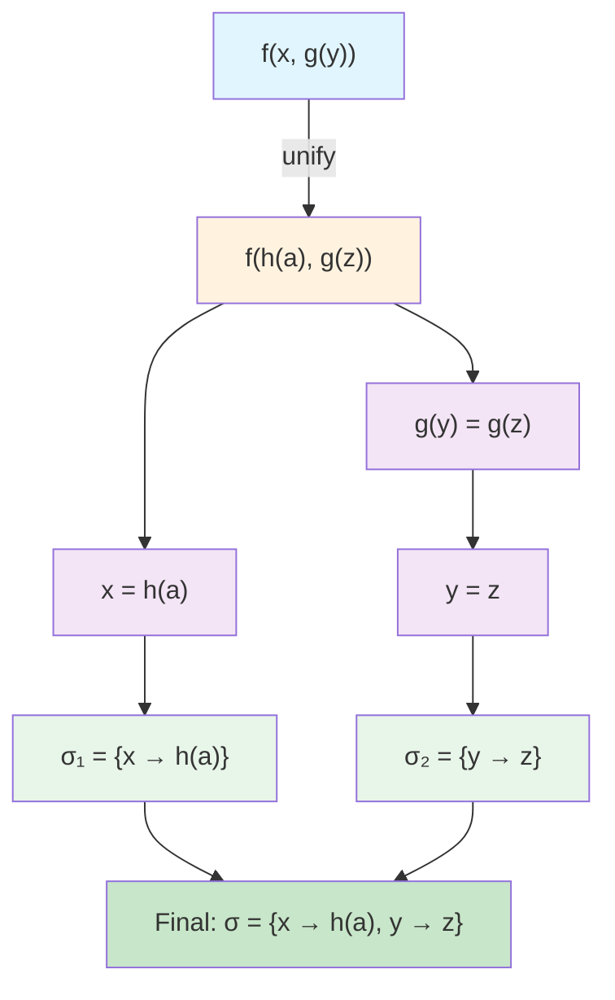

# 2025 11 14 Unification Algorithm
---
layout: post
title: "The Unification Algorithm: Finding Most General Unifiers in First-Order Logic"
date: 2025-11-14
categories:
  - "Logic for Computer Scientists"
tags:
  - logic-for-computer-scientists
  - unification
  - first-order-logic
  - automated-theorem-proving
  - substitutions
  - occur-check
excerpt: "Learn how the unification algorithm finds the most general unifier (MGU) that makes two terms identical, a fundamental operation in automated reasoning and logic programming."
reading_time: 15
course: "Logic for Computer Scientists"
---

## Introduction

In automated theorem proving and logic programming, one of the most fundamental operations is **unification**—the process of determining whether two terms can be made identical by substituting variables with appropriate terms. The **unification algorithm**, developed by Robinson in 1965, provides a systematic procedure for finding such substitutions, called **unifiers**. When the most restrictive (least specific) unifier exists, it is called the **Most General Unifier (MGU)**.

Unification is the backbone of resolution theorem proving, where it allows us to identify when two literals are complementary and can be resolved together. It also plays a central role in logic programming languages like Prolog, where pattern matching against program clauses relies on unification.

In this lesson, we'll explore the unification algorithm step by step, examine edge cases like the **occur check**, learn to identify **unification failure**, and work through numerous examples of finding MGUs for complex terms.

---

## Background: Terms and Substitutions

Before diving into the algorithm, let's establish the foundational concepts.

### What is a Term?

In first-order logic, **terms** are defined recursively:
- A **constant** (e.g., $a$, $b$, $c$) is a term
- A **variable** (e.g., $x$, $y$, $z$) is a term
- If $f$ is an $n$-ary function symbol and $t_1, t_2, \ldots, t_n$ are terms, then $f(t_1, t_2, \ldots, t_n)$ is a term

**Examples of terms:**
- Constants: $a$, $b$, $0$, $1$
- Variables: $x$, $y$, $z$
- Function applications: $f(x)$, $g(a, y)$, $h(f(x), z)$

### What is a Substitution?

A **substitution** $\sigma$ is a mapping from variables to terms, written as:
$$\sigma = \{x_1 \mapsto t_1, x_2 \mapsto t_2, \ldots, x_n \mapsto t_n\}$$

Applying a substitution $\sigma$ to a term $t$, denoted $t\sigma$, replaces all occurrences of each variable $x_i$ with the corresponding term $t_i$.

**Example:** If $\sigma = \{x \mapsto a, y \mapsto f(z)\}$, then:
- $g(x, y)\sigma = g(a, f(z))$
- $h(x, x)\sigma = h(a, a)$

### Composition of Substitutions

Substitutions can be **composed**. If $\sigma_1$ and $\sigma_2$ are substitutions, their composition $\sigma_1 \circ \sigma_2$ (apply $\sigma_2$ first, then $\sigma_1$) is:
$$(x)(\sigma_1 \circ \sigma_2) = ((x)\sigma_2)\sigma_1$$

---

## The Unification Problem

**Definition:** Two terms $s$ and $t$ are **unifiable** if there exists a substitution $\sigma$ such that $s\sigma = t\sigma$. We call $\sigma$ a **unifier** of $s$ and $t$.

**Most General Unifier (MGU):** A unifier $\mu$ is most general if for every other unifier $\sigma$, there exists a substitution $\tau$ such that $\sigma = \mu \circ \tau$. In other words, $\mu$ is the "least restrictive" unifier.

---

## The Unification Algorithm

The unification algorithm works by **structural induction**, recursively decomposing terms and building up substitutions. At each step, it examines the ** outermost structure** of the two terms being unified.

### Algorithm Pseudocode

```
UNIFY(s, t) returns (substitution, success/failure):

    if s is a variable:
        if s == t:
            return (empty substitution, SUCCESS)
        elif s occurs in t:
            return (failure, OCCUR_CHECK_ERROR)
        else:
            return ({s ↦ t}, SUCCESS)

    if t is a variable:
        if t occurs in s:
            return (failure, OCCUR_CHECK_ERROR)
        else:
            return ({t ↦ s}, SUCCESS)

    if s = f(s₁, ..., sₙ) and t = f(t₁, ..., tₙ) [same function symbol]:
        σ ← empty substitution
        for i from 1 to n:
            (σᵢ, result) ← UNIFY(sᵢσ, tᵢσ)
            if result is failure:
                return (failure, result)
            σ ← σ ∘ σᵢ
        return (σ, SUCCESS)

    else:
        return (failure, SYMBOL_MISMATCH)
```

### Key Operations

1. **Variable-Term Unification:** If one term is a variable and it doesn't occur in the other term, we can always unify by substituting the variable with the other term.

2. **Occur Check:** Before unifying a variable $x$ with a term $t$, we must verify that $x$ does not occur in $t$. If it does, we have a **circular substitution** (e.g., $\{x \mapsto f(x)\}$), which would lead to infinite terms.

3. **Function Symbol Matching:** When both terms are compound (function applications), they must have the **same function symbol** and the **same arity** (number of arguments).

4. **Recursive Unification:** After matching function symbols, we recursively unify the corresponding arguments and compose the resulting substitutions.

---

## Worked Examples

Let's work through several examples to build intuition.

### Example 1: Unifying Constants

**Unify:** $a$ and $a$

| Step | Action | Substitution |
|------|--------|--------------|
| 1 | Both are constants, equal | $\emptyset$ |

**Result:** $\emptyset$ (empty substitution, already identical)

### Example 2: Unifying a Variable with a Constant

**Unify:** $x$ and $a$

| Step | Action | Substitution |
|------|--------|--------------|
| 1 | $x$ is a variable, $a$ is a constant | $\{x \mapsto a\}$ |

**Result:** $\{x \mapsto a\}$

### Example 3: Unifying Compound Terms

**Unify:** $f(x, a)$ and $f(y, a)$

| Step | Action | Substitution |
|------|--------|--------------|
| 1 | Both start with $f$, arity 2 | Continue |
| 2 | Unify arguments: $x$ and $y$ | $\{x \mapsto y\}$ |
| 3 | Apply substitution to second arguments | $a$ and $a$ |
| 4 | Unify $a$ and $a$ | $\emptyset$ |
| 5 | Compose: $\{x \mapsto y\} \circ \emptyset$ | $\{x \mapsto y\}$ |

**Result:** $\{x \mapsto y\}$ (both arguments now $y$ and $a$)

### Example 4: Unifying with Nested Functions

**Unify:** $f(g(x), y)$ and $f(g(a), b)$

| Step | Action | Substitution |
|------|--------|--------------|
| 1 | Both start with $f$, arity 2 | Continue |
| 2 | Unify first arguments: $g(x)$ and $g(a)$ | |
| 2a | Both start with $g$, arity 1 | Continue |
| 2b | Unify $x$ and $a$ | $\{x \mapsto a\}$ |
| 2c | Compose | $\sigma_1 = \{x \mapsto a\}$ |
| 3 | Apply $\sigma_1$ to second arguments: $y$ and $b$ | |
| 4 | Unify $y$ and $b$ | $\{y \mapsto b\}$ |
| 5 | Compose: $\{x \mapsto a\} \circ \{y \mapsto b\}$ | $\sigma = \{x \mapsto a, y \mapsto b\}$ |

**Result:** $\{x \mapsto a, y \mapsto b\}$

After substitution: $f(g(a), b)$ and $f(g(a), b)$ ✓

### Example 5: Unifying with Multiple Occurrences

**Unify:** $f(x, x)$ and $f(a, b)$

| Step | Action | Substitution |
|------|--------|--------------|
| 1 | Both start with $f$, arity 2 | Continue |
| 2 | Unify first arguments: $x$ and $a$ | $\{x \mapsto a\}$ |
| 3 | Apply substitution to second arguments: $x$ and $b$ becomes $a$ and $b$ | |
| 4 | Unify $a$ and $b$ | **FAILURE** |

**Result:** Failure - the same variable $x$ must be unified with two different constants, which is impossible.

---

## The Occur Check: Why It Matters

The **occur check** is a critical safeguard in the unification algorithm. It prevents the creation of **cyclic substitutions** where a variable is mapped to a term containing itself.

### The Problem with Cyclic Substitutions

Consider what happens **without** occur check when unifying $x$ and $f(x)$:

| Without Occur Check |
|---------------------|
| Algorithm returns $\{x \mapsto f(x)\}$ |

Now, if we try to apply this substitution:
- $x\{x \mapsto f(x)\} = f(x)$
- $f(x)\{x \mapsto f(x)\} = f(f(x))$

The terms are **not equal**! The substitution failed to unify them because applying it creates an infinite, expanding term.

With the occur check, we correctly identify this as a **failure** case because $x$ occurs in $f(x)$.

### Example: Occur Check Failure

**Unify:** $x$ and $f(g(x, a))$

The variable $x$ occurs in the term $f(g(x, a))$, so unification **fails** with occur check error.

**Why this matters:** This prevents infinite loops in resolution-based theorem provers and ensures that substitutions always produce finite terms.

---

## Unification Failure: Complete Classification

Unification can fail for several reasons:

| Failure Type | Condition | Example |
|--------------|-----------|---------|
| **Symbol Mismatch** | Different function symbols | $f(x)$ and $g(x)$ |
| **Arity Mismatch** | Same symbol, different arity | $f(x, y)$ and $f(x)$ |
| **Constant Clash** | Different constants | $a$ and $b$ |
| **Occur Check** | Variable in term | $x$ and $f(x)$ |
| **Multiplicity Conflict** | Variable unified with conflicting terms | $x$ and $a$ AND $x$ and $b$ (indirectly) |

---

## Finding Most General Unifiers: A Systematic Approach

When unification succeeds, the algorithm produces the MGU. Let's verify this property with an example.

### Example: $f(x, g(y))$ and $f(h(a), g(z))$

**Step-by-step unification:**

1. **Match function symbols:** Both start with $f$, arity 2 ✓
2. **Unify first arguments:** $x$ and $h(a)$
   - $x$ is a variable, doesn't occur in $h(a)$
   - Substitution: $\sigma_1 = \{x \mapsto h(a)\}$
3. **Apply $\sigma_1$ to second arguments:**
   - Original: $g(y)$ and $g(z)$
   - After substitution: still $g(y)$ and $g(z)$ (no $x$ present)
4. **Match function symbols:** Both start with $g$, arity 1 ✓
5. **Unify inner arguments:** $y$ and $z$
   - Substitution: $\sigma_2 = \{y \mapsto z\}$
6. **Compose substitutions:**
   $$\sigma = \sigma_1 \circ \sigma_2 = \{x \mapsto h(a)\} \circ \{y \mapsto z\}$$
   - This is equivalent to $\{x \mapsto h(a), y \mapsto z\}$

**Verification:**
- $f(x, g(y))\{x \mapsto h(a), y \mapsto z\} = f(h(a), g(z))$
- $f(h(a), g(z))\{x \mapsto h(a), y \mapsto z\} = f(h(a), g(z))$

**Result:** $\sigma = \{x \mapsto h(a), y \mapsto z\}$ is the MGU.

### Why is it Most General?

Any other unifier must be more specific. For example:
- $\{x \mapsto h(a), y \mapsto z, z \mapsto b\}$ is more specific (adds constraint on $z$)
- $\sigma$ leaves maximum flexibility for further unification

---

## Visual Representation: Unification as Tree Building

We can visualize the unification process as building a substitution tree:



---

## Practical Applications

### 1. Resolution in Automated Theorem Proving

In resolution-based provers, unification identifies when two literals are complementary:

```
Clause 1: P(x) ∨ Q(x)
Clause 2: ¬P(f(y))

Unify P(x) and P(f(y)) → {x ↦ f(y)}
Apply to Clause 1: P(f(y)) ∨ Q(f(y))
Resolve with Clause 2: Q(f(y))
```

### 2. Logic Programming (Prolog)

In Prolog, unification is used for pattern matching against program clauses:

```prolog
% Program:
parent(alice, bob).
parent(bob, charlie).

% Query:
?- parent(X, Y).
% Unifies: X = alice, Y = bob  (first clause)
% Backtracks: X = bob, Y = charlie  (second clause)
```

### 3. Type Inference

In Hindley-Milner type systems, unification matches type constraints:

```
Expression: map(f, list)
Type constraints:
  f: α → β
  list: [α]
  map: (α → β) → [α] → [β]
Result: Types α and β are unified with concrete types from context
```

---

## Summary Table: Unification Cases

| Term 1 | Term 2 | Result | Substitution |
|--------|--------|--------|--------------|
| $x$ | $t$ ($x \notin vars(t)$) | Success | $\{x \mapsto t\}$ |
| $x$ | $t$ ($x \in vars(t)$) | **Failure** | Occur check error |
| $a$ | $a$ | Success | $\emptyset$ |
| $a$ | $b$ | **Failure** | Constant clash |
| $f(s_1,\ldots,s_n)$ | $f(t_1,\ldots,t_n)$ | Recurse | Compose results |
| $f(s_1,\ldots,s_n)$ | $g(t_1,\ldots,t_m)$ | **Failure** | Symbol mismatch |

---

## Exercises

### Exercise 1: Simple Unification

Determine if these pairs are unifiable. If yes, find the MGU.

1. $x$ and $f(y)$
2. $a$ and $b$
3. $g(x, y)$ and $g(a, b)$
4. $h(x, x)$ and $h(f(y), f(y))$

**Answers:**
1. $\{x \mapsto f(y)\}$
2. **Failure** (constant clash)
3. $\{x \mapsto a, y \mapsto b\}$
4. $\{x \mapsto f(y)\}$

### Exercise 2: Occur Check

Identify which unifications fail the occur check:

1. $x$ and $f(x)$
2. $y$ and $g(h(y))$
3. $z$ and $a$
4. $w$ and $f(g(w, a))$

**Answers:** 1, 2, and 4 all fail the occur check.

### Exercise 3: Complex Unification

Find the MGU for: $p(f(x), y, g(y))$ and $p(z, f(a), g(f(a)))$

**Solution:**
1. Match $p$, arity 3
2. Unify $f(x)$ and $z$: $\{z \mapsto f(x)\}$
3. Unify $y$ and $f(a)$: $\{y \mapsto f(a)\}$
4. Apply substitutions: $g(y)$ becomes $g(f(a))$, $g(f(a))$ stays $g(f(a))$
5. Unify $g(f(a))$ and $g(f(a))$: $\emptyset$
6. **Final substitution:** $\{z \mapsto f(x), y \mapsto f(a)\}$

**Verification:**
- $p(f(x), y, g(y))\{z \mapsto f(x), y \mapsto f(a)\} = p(f(x), f(a), g(f(a)))$
- $p(z, f(a), g(f(a)))\{z \mapsto f(x), y \mapsto f(a)\} = p(f(x), f(a), g(f(a)))$

**Result:** $\{z \mapsto f(x), y \mapsto f(a)\}$

---

## Conclusion

The unification algorithm is a cornerstone of automated reasoning. By systematically decomposing terms and building substitutions through structural induction, it efficiently determines whether two terms can be made identical.

Key takeaways:
- **Unification** finds substitutions that make terms identical
- The **MGU** is the most general (least restrictive) unifier
- The **occur check** prevents cyclic substitutions that would create infinite terms
- Unification failure can occur due to symbol mismatches, arity mismatches, constant clashes, or occur check violations

Understanding unification is essential for working with resolution theorem provers, logic programming languages, and type inference systems.

---

## External Resources

- [Robinson, J. A. (1965). "A Machine-Oriented Logic Based on the Resolution Principle"](https://academic.oup.com/jcs/issue/12/1) - The original paper introducing unification and resolution
- [Unification in First-Order Logic](https://en.wikipedia.org/wiki/Unification_(computer_science)) - Comprehensive overview on Wikipedia
- [Logic for Applications (Chapter 8.3)](file:///Users/sdw/CS-5384-Logic-for-Computer-Scientists/Books/LogicForApplications.pdf) - Textbook coverage of the unification algorithm
