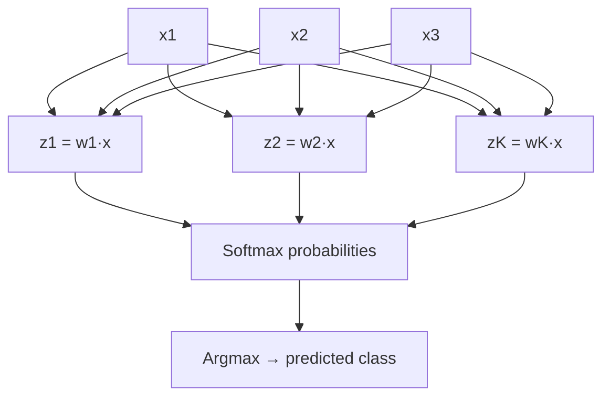
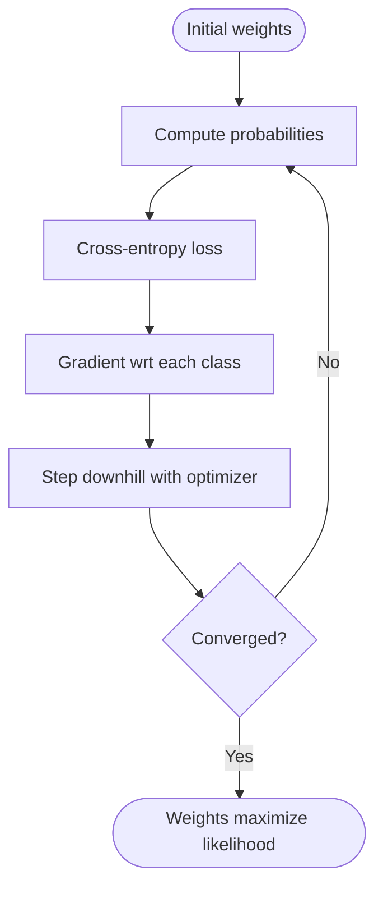

# Logistic Regression and Softmax: Probabilistic Linear Models for Classification

The perceptron draws a hard line between classes: if the weighted sum is positive, predict one label; if negative, predict the other. That is fast but brittle when data is noisy or non-separable. **Logistic regression** keeps the same linear score yet wraps it in a **sigmoid** that outputs calibrated probabilities, making the model both interpretable and trainable with maximum likelihood. Its multiclass sibling, **softmax regression**, extends the idea to many labels and forms the final layer of most neural networks.

In this post you will:
- Diagnose when the perceptron struggles and how logistic regression fixes it.
- Derive the sigmoid link, cross-entropy loss, and gradients.
- Extend to multiclass softmax with the softmax function and one-vs-all intuition.
- See how these models become the output layers of deep networks.
- Practice with a small worked example and implementation tips.

## From Hard Decisions to Probabilities

The perceptron predicts with a sign function $\hat{y} = \text{sign}(w \cdot x)$ and updates weights only on mistakes. Two recurring problems from lecture:
- **Non-separable data**: When classes overlap, weights thrash because no single hyperplane perfectly splits the points.
- **Overtraining risk**: Even on separable data, late updates can widen the margin in arbitrary ways that hurt held-out accuracy.

Logistic regression keeps the linear score $z = w \cdot x$ but maps it to a probability with the **sigmoid**:
$$\sigma(z) = \\frac{1}{1 + e^{-z}}$$
Now predictions become $\hat{p}(y=1 \mid x) = \sigma(w \cdot x)$ and thresholds at $0.5$ by default, though you can move the threshold for precision/recall trade-offs. Because the output is probabilistic, we can optimize a smooth objective—the log-likelihood—rather than relying on mistake-driven updates.

### Visual: Perceptron vs. Logistic Regression

| Aspect | Perceptron | Logistic Regression |
|--------|------------|---------------------|
| Output | $\{-1, +1\}$ hard label | Probability in $[0,1]$ via $\sigma(w \cdot x)$ |
| Objective | Implicit mistake minimization | Negative log-likelihood (cross-entropy) |
| Separability need | Converges only if separable | Works on overlapping classes |
| Calibration | None | Provides calibrated confidence |
| Update signal | Only on mistakes | On every example (smooth gradients) |

## Deriving the Binary Logistic Regression Objective

Assume binary labels $y \\in \\{0,1\\}$ and score $z = w \\cdot x$. The model posits:
$$P(y=1 \mid x; w) = \\sigma(z), \\quad P(y=0 \mid x; w) = 1 - \\sigma(z)$$

Given a dataset $\\{(x^{(i)}, y^{(i)})\\}_{i=1}^N$, the log-likelihood is:
$$\\ell(w) = \\sum_{i=1}^N \\left[ y^{(i)} \\log \\sigma(w \\cdot x^{(i)}) + (1 - y^{(i)}) \\log (1 - \\sigma(w \\cdot x^{(i)})) \\right]$$

We **maximize** this log-likelihood (or minimize its negative, the binary cross-entropy). Differentiating gives the gradient:
$$\\nabla_w \\ell(w) = \\sum_{i=1}^N \\left( y^{(i)} - \\sigma(w \\cdot x^{(i)}) \\right) x^{(i)}$$

Intuition: If predicted probability is too low for a positive example, the gradient nudges weights in the direction of $x^{(i)}$; if too high for a negative example, it nudges in the opposite direction.

### Visual: Gradient Flow for One Update

```mermaid
flowchart LR
    x[Feature vector x] --> dot[Linear score z = w · x]
    dot --> sig[Sigmoid σ(z)]
    ytrue[True label y] --> loss[Cross-entropy L(y, σ(z))]
    sig --> loss
    loss --> grad[Gradient ∂L/∂w = (σ(z)-y)·x]
    grad --> update[Update w ← w - η·grad]
```

## Optimizing with Gradient Descent

Because the objective is smooth and convex for binary logistic regression, **gradient ascent** (or descent on the negative log-likelihood) converges to the global optimum. A standard update for learning rate $\\eta$ is:
$$w \\leftarrow w + \\eta \\sum_{i=1}^N \\left( y^{(i)} - \\sigma(w \\cdot x^{(i)}) \\right) x^{(i)}$$

- **Batch**: Uses all examples per step; stable but slower.
- **Stochastic**: Updates on each example; faster but noisy, often used with a decaying learning rate.
- **Mini-batch**: Balanced trade-off and GPU friendly.

Regularization combats overfitting on high-dimensional features (e.g., bag-of-words). Add an $L2$ penalty to the loss:
$$J(w) = -\\ell(w) + \\lambda \\lVert w \\rVert_2^2$$
The gradient gains an extra $2 \\lambda w$ term, shrinking weights toward zero to improve generalization.

### Worked Update on a Toy Email Example

Suppose binary features $x = [1, \\text{win}=1, \\text{game}=0, \\text{vote}=1]$, initial $w = [0,0,0,0]$, and label $y=1$ (spam). The score is $z = 0$, so $\\sigma(z)=0.5$. With $\\eta=0.1$:
- Error term: $(y - \\sigma(z)) = 0.5$
- Weight update: $\\Delta w = 0.1 \\times 0.5 \\times x = [0.05, 0.05, 0, 0.05]$
- New weights favor phrases like "win" and "vote," pushing future scores upward for similar messages.

### Visual: Training Loop (Mini-batch SGD)

```mermaid
flowchart TD
    start([Initialize w=0]) --> epoch[For each epoch]
    epoch --> batch[Draw mini-batch B]
    batch --> forward[Compute σ(w·x) for x in B]
    forward --> loss[Compute batch cross-entropy]
    loss --> grad[Compute gradient over B]
    grad --> step[Update w with learning rate η]
    step --> check{Early stopping?}
    check -->|No| batch
    check -->|Yes| done([Stop; keep best w on validation])
```

## Limitations of the Perceptron and How Logistic Regression Addresses Them

- **Non-separable data**: Sigmoid and cross-entropy provide graded feedback even when examples overlap, avoiding weight thrashing.
- **Calibration**: Outputs $\\hat{p}$ that can drive threshold tuning, cost-sensitive decisions, or downstream ranking.
- **Mistake bounds vs. likelihood**: Perceptron minimizes mistakes but not probability estimates; logistic regression directly maximizes conditional likelihood.
- **Robustness**: With $L2$ or $L1$ regularization and early stopping, logistic regression generalizes better on noisy text or vision features.

### Visual: Decision Boundary Intuition

```mermaid
graph LR
    A[Negative region (p<0.5)] -- margin --> B[Boundary p≈0.5]
    B -- margin --> C[Positive region (p>0.5)]
    subgraph Feature Space
    A;B;C
    end
```

## Multiclass Logistic Regression (Softmax)

Binary logistic regression does not directly handle $K>2$ classes. The lecture extends the linear score to one weight vector per class:
$$z_k = w_k \\cdot x$$
The **softmax** converts these scores to a probability distribution:
$$P(y=k \\mid x) = \\frac{e^{z_k}}{\\sum_{j=1}^K e^{z_j}}$$

The log-likelihood for one example with one-hot label $y$ is:
$$\\ell(w) = \\sum_{k=1}^K y_k \\log P(y=k \\mid x)$$

Gradient for class $k$:
$$\\nabla_{w_k} \\ell(w) = (y_k - P(y=k \\mid x)) x$$

Learning uses the same optimization ideas: gradient ascent/descent with optional regularization and early stopping.

### Visual: Softmax Classifier as a Network Layer



## Connection to Neural Networks

Slides framed multiclass logistic regression as a **special case of a neural network**: the softmax layer sits on top of engineered features $f(x)$. Deep networks add hidden layers that learn those features automatically:
- Final layer remains a softmax (classification) or sigmoid (binary).
- Hidden layers apply nonlinear activations (ReLU, tanh, GELU) to compose features.
- Training still minimizes cross-entropy with gradient-based optimization (often using Adam or momentum).

Key takeaway: mastering logistic regression gives you the mathematical core of deep classification models; the difference is that deep networks learn richer features before the softmax.

## Practical Guidance from Lecture Themes

- **Feature scaling**: Normalize continuous features to avoid extremely large or small logits that saturate the sigmoid or softmax.
- **Class imbalance**: Adjust decision thresholds, weight the loss, or oversample minority classes to keep probabilities calibrated.
- **Regularization and early stopping**: Track validation loss; stop when it rises to avoid memorization.
- **Evaluation**: Because outputs are probabilities, prefer metrics like log-loss, AUC, and calibrated precision/recall over raw accuracy when costs differ.
- **Interpretability**: Weight magnitudes signal feature influence; $w_j > 0$ pushes toward the positive class, $w_j < 0$ toward the negative.

## Worked Softmax Example: Three-Topic News Classifier

Imagine classes politics ($k=1$), sports ($k=2$), and tech ($k=3$). One-hot features indicate word presence: $x = [1, \\text{election}=1, \\text{goal}=0, \\text{chip}=0]$.

1. Scores: $z_k = w_k \\cdot x$. Suppose $z = [2.1, 0.4, -0.3]$.
2. Probabilities: $P = \\text{softmax}(z) \\approx [0.74, 0.17, 0.09]$.
3. If the true label is politics, the gradient for $w_1$ is $(1 - 0.74)x = 0.26x$; for $w_2$ it is $(0 - 0.17)x = -0.17x$, nudging scores toward the correct class and away from others.

### Visual: Loss Landscape Intuition (Softmax)



## Quick Implementation Checklist

- Use **cross-entropy loss** (`log_loss` in scikit-learn, `BCEWithLogitsLoss` / `CrossEntropyLoss` in PyTorch).
- Initialize weights to zeros or small random values; include a bias term.
- Prefer **mini-batch gradient descent** with a tuned learning rate; monitor validation loss.
- Apply **$L2$ regularization** (weight decay) to reduce overfitting; consider $L1$ for sparsity.
- For multiclass, ensure labels are one-hot (or integer class IDs) and use softmax, not multiple sigmoids.
- Track both **accuracy** and **calibration** (reliability plots, expected calibration error).

## Conclusion and Next Steps

Logistic regression replaces the perceptron's brittle hard decisions with smooth, probabilistic outputs optimized by maximum likelihood. Softmax extends those ideas to many classes and doubles as the output layer of neural networks. Together they form the bridge from linear models to deep learning: same loss, same gradients, richer features. From here, you can explore how hidden layers learn feature representations, experiment with different activation functions, and compare optimizers (SGD vs. momentum vs. Adam) while keeping the logistic/softmax head unchanged.

## External Resources

- **Stanford CS229 Notes: Logistic Regression** — Clear derivation of the sigmoid link, loss, and gradients, plus optimization details. https://see.stanford.edu/materials/aimlcs229/cs229-notes1.pdf
- **Pattern Recognition and Machine Learning (Bishop), Chapter 4** — Probabilistic discriminative models with maximum likelihood and regularization. https://www.microsoft.com/en-us/research/uploads/prod/2006/01/Bishop-Pattern-Recognition-and-Machine-Learning-2006.pdf
- **scikit-learn User Guide: Logistic Regression** — Practical tips on solvers, regularization, and multiclass handling. https://scikit-learn.org/stable/modules/linear_model.html#logistic-regression
- **MIT 6.S191 Deep Learning Lecture Notes** — Shows softmax layers and activation functions inside neural networks. http://introtodeeplearning.com
