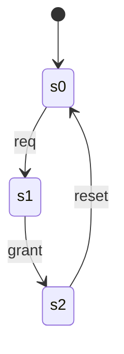
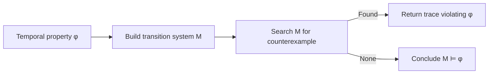
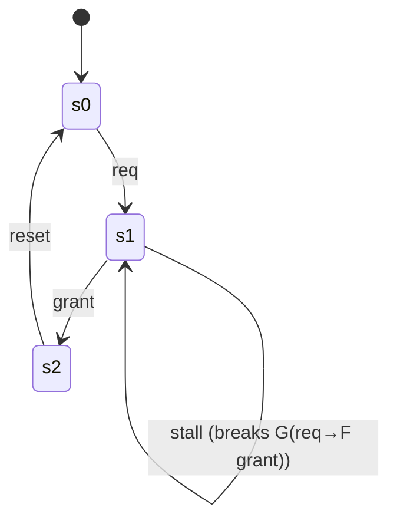

# Model Checking and Logic Review: Validating Systems and Concepts

As we approach the end of our journey in **Logic for Computer Scientists**, it is crucial to consolidate our understanding of the various proof systems and semantic structures we have encountered. This post serves as a review of key topics from our recent lectures, specifically focusing on **Hilbert Systems**, the **Tableaux Method**, and the foundational concepts of **Herbrand Logic**. We will also touch upon the significance of these methods in the context of **Model Checking**, a vital technique for verifying the correctness of hardware and software systems.

## The Hilbert Proof System: Proving Invalidity

We have spent considerable time deriving valid formulas using the Hilbert Proof System. However, an equally important skill is identifying when a formula is *not* valid.

### Counter-Examples and Quantifiers

A common source of confusion in first-order logic is the order of quantifiers. It is essential to remember that swapping quantifiers often changes the meaning of a sentence entirely.

Consider the formula:
$$ \exists x \forall y A(x, y) \to \forall x \exists y A(x, y) $$

Is this valid? Intuitively, if there is *some* $x$ that works for *all* $y$, does that imply that for *every* $x$ there is *some* $y$? In this specific direction, it often holds in standard models, but let's look at the converse or similar structures where distinct variable independence matters.

A classic invalid implication is:
$$ \forall x \exists y A(x, y) \to \exists x \forall y A(x, y) $$

To prove this is invalid, we provide a **counter-example**.
*   **Domain:** Integers $\mathbb{Z}$
*   **Interpretation of $A(x, y)$:** $x < y$
*   **Premise:** "For every integer $x$, there exists an integer $y$ such that $x < y$." (True, $y = x+1$)
*   **Conclusion:** "There exists an integer $x$ such that for every integer $y$, $x < y$." (False, there is no smallest integer)

Since the premise is true and the conclusion is false under this interpretation, the formula is not valid. This method of finding a concrete model where the formula fails is a fundamental tool in logic.

## The Tableaux Method: Systematic Proofs

The Tableaux Method (or Semantic Tableaux) provides a systematic algorithm for checking validity. By attempting to construct a counter-model (a situation where the formula is false), we can prove validity if every branch of the attempt leads to a contradiction (closes).

### Practice with Predicate Logic Trees

Let's examine a few logical forms to understand how the Tableaux method decomposes them.

**Problem 1:**
$$ (\exists y)(\neg R(y,y) \lor P(y,y)) \land (\forall x)R(x,x) $$

To determine satisfiability or validity, we would:
1.  Decompose the conjunction ($\land$): We have $(\exists y)(\neg R(y,y) \lor P(y,y))$ AND $(\forall x)R(x,x)$.
2.  Instantiate the existential quantifier ($\exists y$) with a new constant, say $c$: $\neg R(c,c) \lor P(c,c)$.
3.  Branch for the disjunction ($\lor$):
    *   **Branch 1:** $\neg R(c,c)$
    *   **Branch 2:** $P(c,c)$
4.  Instantiate the universal quantifier ($\forall x$) with the constant $c$: $R(c,c)$.
5.  **Check for closure:**
    *   Branch 1 contains $\neg R(c,c)$ and $R(c,c)$. **Contradiction!** This branch closes.
    *   Branch 2 contains $P(c,c)$ and $R(c,c)$. This branch remains open unless further information contradicts $P(c,c)$.

This process illustrates how the interaction between existential instantiations (new constants) and universal instantiations (matching existing constants) drives the proof.

**Problem 2 (worked):**
$$ \forall x(P(x) \to Q(x)) \to \forall x(P(x) \to \forall x(Q(x))) $$

1. Negate to test validity: $\neg\big(\forall x(P(x) \to Q(x)) \to \forall x(P(x) \to \forall x(Q(x)))\big)$.
2. Push negation: $\forall x(P(x) \to Q(x)) \land \neg \forall x(P(x) \to \forall x(Q(x)))$.
3. Replace implications: $(\forall x(\neg P(x) \lor Q(x))) \land (\exists x(P(x) \land \neg \forall x(Q(x))))$.
4. Skolemize the existential with constant $c$: $(\forall x(\neg P(x) \lor Q(x))) \land (P(c) \land \neg \forall x(Q(x)))$.
5. Move inside: $P(c)$ and $\exists x \neg Q(x)$; introduce new constant $d$ for the existential: $\neg Q(d)$.
6. From the universal with $x=d$, add clause $\neg P(d) \lor Q(d)$.
7. **Tableaux branches**:
   - Branch A: choose $\neg P(d)$ to satisfy $\neg P(d) \lor Q(d)$; branch remains **open** with literals $\{P(c), \neg Q(d), \neg P(d)\}$.
   - Branch B: choose $Q(d)$, which contradicts $\neg Q(d)$ and **closes**.

Because an open branch survives, the implication is **not valid**. The worked steps expose how nested quantifiers and scope interact.

### Visual: Tableaux Expansion (Problems 1 and 2)

```mermaid
flowchart TD
    root[Root formula] --> conj[Split on ∧]
    conj --> exist[Instantiate ∃ with c]
    exist --> disj[Branch on ∨: ¬R(c,c) | P(c,c)]
    conj --> forall[Instantiate ∀ with c or d]
    disj --> branch1[Branch 1: ¬R(c,c)]
    disj --> branch2[Branch 2: P(c,c)]
    branch1 --> close1[Contradiction with R(c,c) → closed]
    branch2 --> open1[Remains open unless P(c,c) contradicted]
    forall --> qscope[Handle ∀x in implication]
    qscope --> bA[Branch A: ¬P(d) stays open]
    qscope --> bB[Branch B: Q(d) closes with ¬Q(d)]
```

## Herbrand Logic: A Syntactic Approach

Standard first-order logic relies on arbitrary domains (numbers, people, graph nodes). **Herbrand Logic** simplifies this by restricting the domain to the syntactic terms of the language itself. This is particularly useful in automated theorem proving and logic programming (like Prolog).

### Vocabulary and Terms

*   **Constants:** Represent specific objects (e.g., $a, b$) or functions ($f, g$).
*   **Variables:** Placeholders for any term.
*   **Functional Terms:** Complex terms built from functions and constants, like $f(a)$ or $g(f(b))$. These can be nested arbitrarily deep.
*   **Relational Sentences:** Predicates applied to terms, like $q(a)$ or $p(f(c))$. These evaluate to True/False and cannot be nested inside other terms (e.g., you cannot have $f(p(a))$).

### Herbrand Semantics

The core idea of Herbrand Semantics is to fix the universe of discourse to the **Herbrand Universe**—the set of all ground (variable-free) terms that can be constructed from the vocabulary.

*   **Herbrand Base:** The set of all ground atoms (predicates applied to ground terms).
    *   Example: If constants are {$a, b$} and predicate is $P$, the base is {$P(a), P(b)$}.
    *   If we add a function $f$, the base becomes infinite: {$P(a), P(f(a)), P(f(f(a))), \dots$}.
*   **Herbrand Model:** A specific interpretation is simply a subset of the Herbrand Base. If an atom is in the subset, it is True; otherwise, it is False.

This reduction allows us to treat validity and satisfiability as combinatorial problems over sets of strings, rather than abstract model theory problems. As noted in lecture, "It is a whole lot less work than going through all possible interpretations."

### Visual: Herbrand Universe Snapshot

| Component | Description | Example (constants $\\{a,b\\}$, function $f$) |
|-----------|-------------|----------------------------------------------|
| Herbrand Universe | All ground terms | $\\{a, b, f(a), f(b), f(f(a)), \\dots\\}$ |
| Herbrand Base | All ground atoms | $\\{P(a), P(b), P(f(a)), P(f(b)), \\dots\\}$ |
| Herbrand Model | Chosen true atoms | e.g., $\\{P(a), P(f(a))\\}$ |

## Model Checking: Putting the Pieces Together

Model checking evaluates whether a **transition system** satisfies a **temporal property**. The proof tools above (Hilbert, Tableaux, Herbrand) help formalize formulas and reason about satisfiability; model checking automates the satisfaction test over a state graph.

### Minimal Transition System

- **States**: $s_0$ (idle), $s_1$ (request), $s_2$ (grant)
- **Initial state**: $s_0$
- **Transitions**: $(s_0 \\to s_1), (s_1 \\to s_2), (s_2 \\to s_0)$
- **Atomic propositions**: $\\{req, grant\\}$



### Checking Safety and Liveness Properties

- **Safety (LTL)** — "Never grant without a request": $$\\mathbf{G} (grant \\to req)$$
  Labeling: $L(s_0)=\\emptyset$, $L(s_1)=\\{req\\}$, $L(s_2)=\\{grant\\}$. Check: $s_0$ (holds), $s_1$ (holds), $s_2$ (grant true, req false) → **violation**. Counterexample trace: $s_0 \\to s_1 \\to s_2$.
- **Liveness (LTL)** — "Every request is eventually granted": $$\\mathbf{G}(req \\to \\mathbf{F}\\,grant)$$
  On the current graph, every path from $s_1$ reaches $s_2$ then returns to $s_0$, so the property holds. If we add a self-loop $s_1 \\to s_1$ (stall), the infinite path $s_0 \\to s_1 \\to s_1 \\to \\dots$ violates liveness while the original safety violation at $s_2$ still exists.
- **Branching-time (CTL)** — $$\\mathbf{AF}\\,grant$$ holds (all paths eventually see grant) on the original graph; $$\\mathbf{AG}(grant \\to req)$$ fails as shown. With the stall loop, $\\mathbf{AF}\\,grant$ fails if any path can remain in $s_1$ forever.

This illustrates the model-checking loop: generate the state space, label states, and search for counterexample traces; a single extra transition can flip liveness results while leaving safety unchanged.

### Visual: Model Checking Workflow



### Why the Earlier Pieces Matter

- **Hilbert/Tableaux**: Craft and validate the logical form of properties before checking.
- **Herbrand**: Grounds reasoning about interpretations; inspires state-space abstractions.
- **Countermodels**: Model checking is an automated countermodel search over transitions.

### Visual: CTL/LTL Satisfaction Sketch



The added stall loop at $s_1$ demonstrates how branching-time paths impact CTL/LTL formulas: safety still fails at $s_2$, but liveness can now fail along the stalling path.

## Conclusion

This review covered the essential tools for verifying logical systems:
1.  **Hilbert Systems** for rigorous deductive proofs and understanding counter-examples.
2.  **Tableaux Methods** for algorithmic validity checking.
3.  **Herbrand Logic** for bridging the gap between abstract logic and computational implementation.

These concepts form the bedrock of **Model Checking**, where we verify that a system (represented logically) satisfies a specification (also represented logically). Whether checking a hardware circuit or a software protocol, the ability to formalize and prove properties is indispensable—and the concrete counterexample traces produced by model checkers connect directly to the countermodels studied in Hilbert, Tableaux, and Herbrand reasoning.

## Further Reading

*   **Logic in Computer Science: Modelling and Reasoning about Systems** by Huth and Ryan - Excellent resource for Model Checking.
*   [Stanford Encyclopedia of Philosophy: Automated Reasoning](https://plato.stanford.edu/entries/reasoning-automated/)
*   [Introduction to Herbrand Logic](http://intrologic.stanford.edu/display/ea/Herbrand+Logic) - A clear overview of the syntax and semantics.
