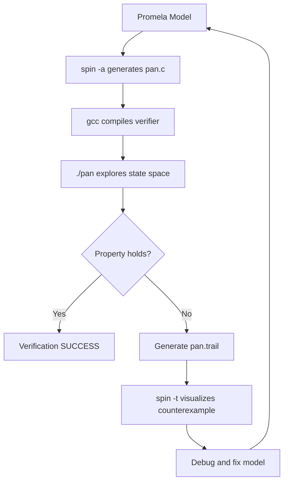

# Research Model Checking with SPIN and Promela

SPIN (Simple Promela Interpreter) is one of the most widely-used model checkers in both academia and industry for verifying concurrent software systems. Developed by Gerard Holzmann at Bell Labs, SPIN uses the **Promela** (Process Meta Language) modeling language to describe system behavior and verify properties expressed in Linear Temporal Logic (LTL).

## Introduction to SPIN and Promela

SPIN operates on a simple principle: it explores all possible interleavings of concurrent processes to verify that a system satisfies specified correctness properties. Unlike testing, which samples particular execution paths, SPIN provides **exhaustive verification** up to the modeled state space.

### Key Capabilities

- **Deadlock detection**: Find states where no process can make progress
- **Assertion checking**: Verify invariants hold in all reachable states
- **LTL property verification**: Prove temporal properties like "a request is eventually followed by a response"
- **Acceptance cycles**: Detect liveness violations in non-terminating systems

## Promela Language Basics

Promela models consist of **processes**, **channels**, **variables**, and **message types**. Processes execute concurrently and communicate through channels or shared variables.

### Basic Syntax

```promela
// Message type definition
mtype = { REQUEST, RESPONSE, ACK };

// Channel declaration: buffer size 3, carrying mtype messages
chan buffer = [3] of { mtype };

// Global variable
bool flag = false;

// Process definition
active proctype Sender() {
    // Local variable
    int count = 0;
    
    do
    :: count < 5 ->
        buffer!REQUEST(count);  // Send REQUEST with data
        printf("Sent request %d\n", count);
        count++
    :: else -> break
    od
}

active proctype Receiver() {
    mtype msg;
    int data;
    
    do
    :: buffer?REQUEST(data) ->
        printf("Received request %d\n", data);
        buffer!RESPONSE(data)
    :: timeout -> break  // Exit if no message arrives
    od
}
```

### Key Promela Constructs

| Construct | Description | Example |
|-----------|-------------|---------|
| `active proctype` | Process that starts automatically | `active proctype P() { ... }` |
| `chan` | Channel for message passing | `chan c = [5] of { int }` |
| `!` | Send operation | `c!value` |
| `?` | Receive operation | `c?variable` |
| `->` | Guard/implication | `guard -> statement` |
| `::` | Branch in selection/repetition | `:: guard -> stmt` |
| `do...od` | Repetition (like do-while) | `do :: ... od` |
| `if...fi` | Selection (non-deterministic) | `if :: ... fi` |

## Example: Verifying a Simple Protocol

Let's model a simple acknowledgment protocol where a sender transmits data and waits for confirmation.

```promela
mtype = { DATA, ACK, NAK };

chan to_receiver = [2] of { mtype, int };
chan to_sender = [2] of { mtype, int };

#define MAX_RETRIES 3
#define TIMEOUT 100

active proctype Sender() {
    int seq = 0;
    int retries = 0;
    bool acked = false;
    
    do
    :: !acked && retries < MAX_RETRIES ->
        to_receiver!DATA(seq);
        printf("Sender: sent DATA %d\n", seq);
        retries++;
        
        if
        :: timeout(TIMEOUT) ->
            printf("Sender: timeout waiting for ACK\n")
        :: to_sender?ACK(seq) ->
            printf("Sender: got ACK for %d\n", seq);
            acked = true;
            retries = 0;
            seq = (seq + 1) % 2  // Toggle sequence number
        :: to_sender?NAK(seq) ->
            printf("Sender: got NAK for %d, retrying\n", seq)
        fi
    :: acked -> break
    :: retries >= MAX_RETRIES -> 
        printf("Sender: max retries exceeded\n");
        break
    od
}

active proctype Receiver() {
    mtype msg;
    int seq;
    
    do
    :: to_receiver?DATA(seq) ->
        printf("Receiver: got DATA %d\n", seq);
        // Simulate occasional NAK
        if
        :: to_sender!ACK(seq)
        :: to_sender!NAK(seq)
        fi
    :: timeout -> break
    od
}
```

## Adding Assertions and Invariants

Promela supports `assert()` statements that are checked in all reachable states:

```promela
// Invariant: sequence number should always be 0 or 1
active proctype Checker() {
    do
    :: true ->
        assert(seq == 0 || seq == 1);
        // In SPIN, assertions can be placed anywhere
    od
}
```

## LTL Properties in SPIN

SPIN verifies properties expressed in LTL. Properties are specified using the `ltl` keyword or added via never claims.

### Common LTL Patterns

```promela
// Property 1: Always eventually send (liveness)
// Formula: []<>sent
ltl p1 { [] (eventually(sent)) }

// Property 2: If request then eventually grant (response)
// Formula: [](request -> <>grant)
ltl p2 { [](request -> eventually(grant)) }

// Property 3: Mutual exclusion (safety)
// Formula: [](!(critical_section_1 && critical_section_2))
ltl p3 { [](!(cs1 && cs2)) }
```

### Using the `never` Claim

The `never` claim specifies behaviors that should **never** occur:

```promela
// Never claim: system should never deadlock
never {
    do
    :: true -> skip  // SPIN checks for unreachable states
    od
}
```

## Verification Workflow with SPIN

The typical SPIN verification workflow:

```bash
# 1. Generate verifier from Promela model
spin -a model.pml

# 2. Compile the verifier
gcc -o pan pan.c

# 3. Run verification (default: check for assertion violations, deadlocks)
./pan

# 4. Verify specific LTL property
spin -a -ltl p1 model.pml
gcc -o pan pan.c
./pan -a  # -a shows acceptance cycles

# 5. Check for non-progress cycles (liveness)
./pan -l

# 6. Generate counterexample trail
./pan -t -c1  # Creates pan.trail

# 7. Visualize counterexample
spin -t -p model.pml  # Print execution
spin -t -g model.pml  # Show state changes
spin -t -s model.pml  # Show stack information
```

### Understanding SPIN Output

- **errors: 0**: Property holds in all explored states
- **errors: 1**: Violation found, check `pan.trail` for counterexample
- **state-vector 40 byte**: Memory per state (affects state space size)
- **depth reached: 1000**: Maximum depth of search
- **states stored: 5000**: Number of unique states explored

## State Space Explosion and Reduction

The main challenge in model checking is the **state space explosion**. SPIN provides several techniques to manage this:

### Partial Order Reduction (POR)

SPIN uses POR by default to reduce redundant interleavings:

```bash
# Disable POR to see full state space (slower)
./pan -d  # Disable partial order reduction
```

### Collapsing States

```bash
# Use bitstate hashing (probabilistic, may miss errors)
./pan -bitstate

# Use compression
./pan -i  # Use maximal compression
```

### Abstraction Example

Instead of modeling exact values, abstract to equivalence classes:

```promela
// Instead of: int value = 0..1000000
// Use: bool is_positive = false  // Abstracted
```

## Advanced Feature: Atomic Sequences

Promela's `atomic` keyword ensures a sequence executes without interleaving:

```promela
active proctype CriticalSection() {
    atomic {
        flag = true;
        // Both assignments happen atomically
        counter = counter + 1
    }
    // Other processes cannot interleave here
    flag = false
}
```

## Real-World Application: Verifying Mutual Exclusion

Here's a complete example verifying a simple mutex protocol:

```promela
bool lock = false;
bool wantp = false;
bool wantq = false;

active proctype P() {
    do
    :: true ->
        wantp = true;
        (wantq == false || lock == false);  // Wait condition
        // Critical section
        assert(!(wantq && lock));  // Should not be in CS with Q
        lock = true;
        printf("P in critical section\n");
        // End critical section
        lock = false;
        wantp = false
    od
}

active proctype Q() {
    do
    :: true ->
        wantq = true;
        (wantp == false || lock == true);
        lock = true;
        printf("Q in critical section\n");
        lock = false;
        wantq = false
    od
}

// LTL property: mutual exclusion
ltl mutex { [](!(lock && wantp && wantq)) }
```

## Visual: SPIN Verification Process



## Conclusion

SPIN and Promela provide a powerful framework for verifying concurrent systems. Key takeaways:

1. **Model first**: Abstract the system to essential behaviors and communication patterns
2. **Start small**: Begin with simple properties (assertions, deadlock freedom)
3. **Iterate**: Use counterexamples to refine the model and fix bugs
4. **Manage complexity**: Apply abstraction and reduction techniques for larger systems
5. **Combine methods**: Use SPIN alongside testing and theorem proving for comprehensive verification

For research purposes, SPIN's ability to produce concrete counterexamples makes it invaluable for understanding why a property fails—a feature that complements more abstract reasoning techniques like theorem proving.

## Further Reading

* **SPIN Model Checker Documentation**: [spinroot.com](http://spinroot.com/)
* **"The SPIN Model Checker" by Gerard J. Holzmann** - The definitive guide to SPIN
* **"Model Checking" by Edmund M. Clarke et al.** - Theoretical foundations
* **Promela Language Reference**: [spinroot.com/spin/Doc/](http://spinroot.com/spin/Doc/)
* **SPIN in Practice**: Many protocols (TCP, Bluetooth, IEEE 1394) have been verified using SPIN
