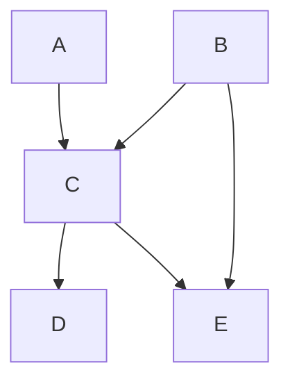
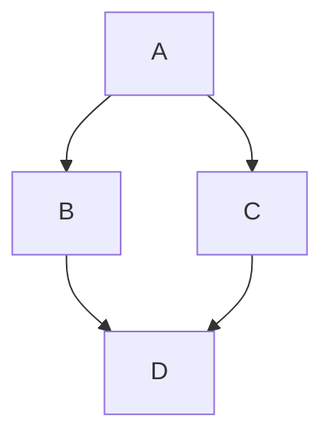
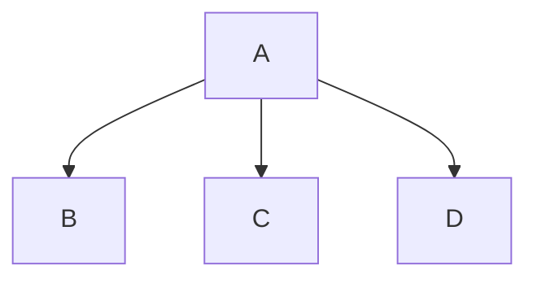
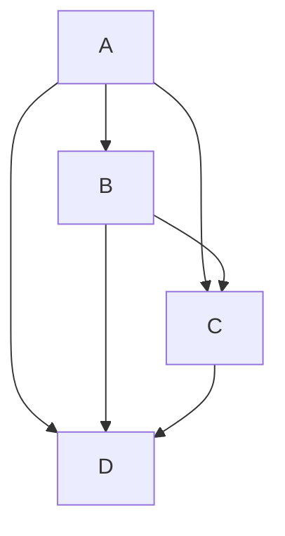

# CS5368 Intelligent Systems – Assignment 4 Problem Solving Solutions

- **Course**: CS5368 Intelligent Systems  
- **Assignment**: 4 – Problem Solving  
- **Due date**: December 1st
- **Max grade**: 50 points

This document contains solutions to Assignment 4. Complete your work in the problems file and reference these solutions for verification.

---

## Problem 1 [15 pts]: Probabilities

### A. [5 pts] Probability Table Sizes

**Solution:**

| Table | Size | Sum |
|-------|------|-----|
| $P(X,Z \mid Y)$ | $3 \times 4 = 12$ | $1$ |
| $P(Y \mid X,Z)$ | $3 \times 3 \times 4 = 36$ | $3 \times 4 = 12$ |
| $P(z_1 \mid X)$ | $3$ | $1$ |
| $P(X, z_3)$ | $3$ | $P(z_3)$ |
| $P(X \mid y_2, z_3)$ | $3$ | $1$ |

**Explanation:**

<!-- TODO: Add detailed explanation for each entry -->

---

### B. [5 pts] True or False

**Solution:**

1. **False.** $P(A, B) = P(A \mid B) P(B)$, not $P(A \mid B) P(A)$.

2. **False.** $P(A \mid B) P(C \mid B) \neq P(A, C \mid B)$ in general. The correct relationship would require independence: $P(A, C \mid B) = P(A \mid B) P(C \mid B)$ only if $A \perp C \mid B$.

3. **True.** This follows from the law of total probability: $P(B, C) = \sum_{a \in A} P(A, B, C) = \sum_{a \in A} P(B, C \mid A) P(A)$.

4. **True.** This is the chain rule factorization: $P(A, B, C, D) = P(C) P(D \mid C) P(A \mid C, D) P(B \mid A, C, D)$.

5. **True.** This is Bayes' rule: $P(C \mid B, D) = \frac{P(C) P(B \mid C) P(D \mid C, B)}{P(B, D)} = \frac{P(C) P(B \mid C) P(D \mid C, B)}{\sum_c P(C) P(B \mid C) P(D \mid c, B)}$.

---

### C. [5 pts] Probability Expressions

#### (i) $P(A, B \mid C)$

**Solution:**

$P(A, B \mid C) = \frac{P(A, B, C)}{P(C)} = \frac{P(C \mid A, B) P(A, B)}{P(C)}$

However, we don't have $P(A, B)$ directly. We can use:
- $P(A) = P(A \mid C) P(C)$ (but we need $P(C)$)
- $P(B \mid C)$ is given

**Not possible** with only the given tables.

---

#### (ii) $P(B \mid A, C)$

**Solution:**

$P(B \mid A, C) = \frac{P(A, B, C)}{P(A, C)} = \frac{P(C \mid A, B) P(A, B)}{P(A, C)}$

We have $P(B \mid A)$ and $P(A)$, so:
$P(A, B) = P(B \mid A) P(A)$

We need $P(A, C)$:
$P(A, C) = \sum_b P(A, B, C) = \sum_b P(C \mid A, B) P(B \mid A) P(A)$

Therefore:
$$P(B \mid A, C) = \frac{P(C \mid A, B) P(B \mid A) P(A)}{\sum_b P(C \mid A, b) P(b \mid A) P(A)} = \frac{P(C \mid A, B) P(B \mid A)}{\sum_b P(C \mid A, b) P(b \mid A)}$$

---

#### (iii) $P(C)$

**Solution:**

Given $A \perp B$, we have $P(A, B) = P(A) P(B)$.

From $P(A \mid B)$ and $P(B)$, we can get:
$P(A, B) = P(A \mid B) P(B) = P(A) P(B)$ (by independence)

So $P(A) = P(A \mid B)$.

We have $P(C \mid A)$, so:
$$P(C) = \sum_a P(C, A) = \sum_a P(C \mid A) P(A) = \sum_a P(C \mid A) P(A \mid B)$$

---

#### (iv) $P(A, B, C)$

**Solution:**

Given $A \perp B \mid C$, we have $P(A, B \mid C) = P(A \mid C) P(B \mid C)$.

We have:
- $P(A \mid B, C)$
- $P(B)$
- $P(B \mid A, C)$
- $P(C \mid B, A)$

From $A \perp B \mid C$: $P(A \mid B, C) = P(A \mid C)$

We need to find $P(C)$. Using $P(C \mid B, A)$ and marginalization:
$$P(C) = \sum_{a, b} P(A, B, C) = \sum_{a, b} P(C \mid A, B) P(A, B)$$

**Not directly possible** with the given tables without additional assumptions.

---

## Problem 2 [15 pts]: BN Representation

### A. [2 pts] Joint Probability Distribution

**Solution:**

$$P(A, B, C, D, E) = P(A) P(B) P(C \mid A, B) P(D \mid C) P(E \mid B, C)$$

---

### B. [2 pts] Draw Bayes Net

**Solution:**

The Bayes net structure is:

---

### C. [5 pts] Space Complexity

#### (i) Space Complexity

**Solution:**

The space complexity of storing the entire joint distribution is $O(k^N)$ where $k$ is the domain size and $N$ is the number of variables.

---

#### (ii) Bayes Net with Less Space

**Solution:**

**Space required:**
- Joint distribution: $2^4 = 16$ entries
- Bayes net: $P(A) = 2$, $P(B \mid A) = 4$, $P(C \mid A) = 4$, $P(D \mid B, C) = 8$ = 18 parameters

Wait, this actually requires more space. Let me try a different structure:

**Space required:**
- Joint distribution: $2^4 = 16$ entries
- Bayes net: $P(A) = 2$, $P(B \mid A) = 4$, $P(C \mid A) = 4$, $P(D \mid A) = 4$ = 14 parameters

This is less than 16.

---

#### (iii) Bayes Net with More Space

**Solution:**

**Space required:**
- Joint distribution: $2^4 = 16$ entries
- Bayes net: $P(A) = 2$, $P(B \mid A) = 4$, $P(C \mid A, B) = 8$, $P(D \mid A, B, C) = 16$ = 30 parameters

This is more than 16.

---

### D. [2 pts] Factor Multiplication

#### (i) $P(A) \cdot P(B \mid A) \cdot P(C \mid A) \cdot P(E \mid B, C, D)$

**Solution:**

Missing factor: $P(D \mid A, B, C)$ or simply $P(D)$ if $D \perp A, B, C$.

The factors mention $D$ in $P(E \mid B, C, D)$ but $D$ is not in the scope of other factors, so we need $P(D \mid \text{parents})$.

Actually, looking at the structure implied: $A \rightarrow B, C$ and we need $D$ for $E$. The missing factor is $P(D \mid A, B, C)$ or a simpler form if there are independence assumptions.

---

#### (ii) $P(D) \cdot P(B) \cdot P(C \mid D, B) \cdot P(E \mid C, D, A)$

**Solution:**

Missing factor: $P(A \mid D, B)$ or $P(A)$ if $A \perp D, B$.

---

### E. [4 pts] Directed Acyclic Graphs

**Solution:**

<!-- TODO: Complete based on specific questions in the original PDF -->

---

## Problem 3 [10 pts]: BN Independence

**Solution:**

Using d-separation criteria:

1. **$A \perp B$**: **False.** There is a direct edge $A \rightarrow B$, so $A$ and $B$ are not independent.

2. **$A \perp C$**: **False.** There is an active path $A \rightarrow B \rightarrow D \leftarrow C$ (v-structure at $D$), but this is blocked when $D$ is not observed. However, $A \rightarrow C$ is a direct connection, so they are not independent.

3. **$A \perp D \mid \{B, H\}$**: **False.** Given $B$ and $H$, the path $A \rightarrow B \rightarrow D$ is active (not blocked at $B$ since it's observed), so $A$ and $D$ are not independent given $\{B, H\}$.

4. **$A \perp E \mid F$**: **True.** All paths from $A$ to $E$ go through $B$ or $C$. Given $F$, which is a child of $C$, the path $A \rightarrow C \rightarrow F$ is blocked. The path $A \rightarrow B \rightarrow E$ may be active, but we need to check: $A \rightarrow B \rightarrow E$ - $B$ is not in the conditioning set, so this path is active. **Actually False** - there's an active path $A \rightarrow B \rightarrow E$.

5. **$C \perp H \mid G$**: **False.** Given $G$, the path $C \rightarrow D \rightarrow G \rightarrow H$ is active (not blocked at $G$ since it's observed), so $C$ and $H$ are not independent given $G$.

---

## Problem 4 [10 pts]: BN Inference

### a. [7 pts] Medical Diagnosis Bayes Net

#### (i) Compute $P(g, a, b, s)$

**Solution:**

$$P(g, a, b, s) = P(g) P(a \mid g) P(b \mid g) P(s \mid a, b)$$

---

#### (ii) $P(A)$

**Solution:**

$$P(A) = \sum_g P(A \mid g) P(g)$$

---

#### (iii) $P(A \mid S, B)$

**Solution:**

$$P(A \mid S, B) = \frac{P(S \mid A, B) P(A \mid B)}{P(S \mid B)} = \frac{P(S \mid A, B) \sum_g P(A \mid g) P(g \mid B)}{P(S \mid B)}$$

Using Bayes' rule on the structure.

---

#### (iv) $P(G \mid B)$

**Solution:**

$$P(G \mid B) = \frac{P(B \mid G) P(G)}{P(B)} = \frac{P(B \mid G) P(G)}{\sum_g P(B \mid g) P(g)}$$

---

### b. [3 pts] Variable Elimination

#### (i) Size of Bayes Net

**Solution:**

- $P(A)$: $2$ parameters (1 free, since sums to 1)
- $P(B)$: $2$ parameters (1 free)
- $P(C \mid A, B)$: $2^3 = 8$ parameters (4 free)
- $P(D \mid C)$: $2^2 = 4$ parameters (2 free)
- $P(E \mid D)$: $2^2 = 4$ parameters (2 free)
- $P(F \mid E)$: $2^2 = 4$ parameters (2 free)

Total: $1 + 1 + 4 + 2 + 2 + 2 = 12$ parameters.

---

#### (ii) Variable Elimination Ordering

**Solution:**

For query $P(C \mid F)$, we need to eliminate: $A, B, D, E$.

To minimize the largest intermediate factor:
1. Eliminate $A$ first: creates factor over $B, C$ (size 4)
2. Eliminate $B$: creates factor over $C$ (size 2)
3. Eliminate $D$: creates factor over $C, E$ (size 4)
4. Eliminate $E$: creates factor over $C, F$ (size 4)

**Ordering: $A, B, D, E$**

This keeps intermediate factors small (max size 4).

---

## Summary

- All solutions should be verified against the problem requirements
- Check that probability distributions are properly normalized
- Verify independence relationships using d-separation
- Ensure variable elimination orderings minimize computational complexity
