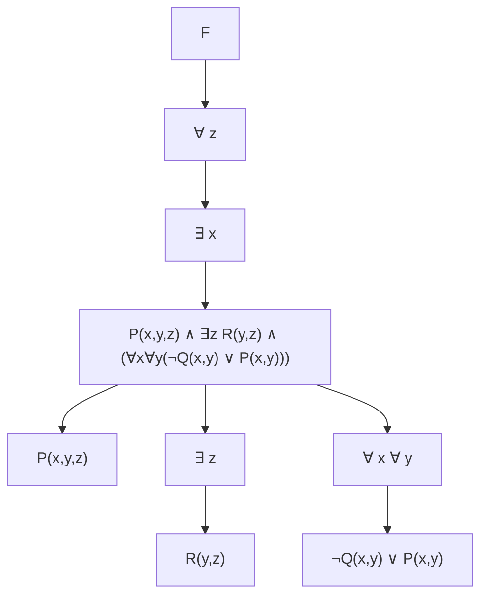

## Logic for Computer Scientists – Homework 3 – Solutions

This document is a Markdown conversion of the official solution PDF for Homework 3, using MathJax for formulas and Mermaid for tree structures.

---

### Problem 1

Let

\[
F = \forall z \,\exists x \Big( P(x,y,z) \land \exists z\,R(y,z) \land \big( \forall x \forall y \big( \neg Q(x,y) \lor P(x,y) \big) \big) \Big).
\]

#### (a) Predicate logic tree

One possible predicate logic tree for \(F\) is:

#### (b) Bound and free variables / scoping

- **Bound variables**:
  - \(z\) bound by the outer \(\forall z\).
  - \(x\) bound by \(\exists x\).
  - The inner \(z\) in \(\exists z R(y,z)\) is bound by that quantifier.
  - The inner \(x, y\) in \(\forall x \forall y(\neg Q(x,y) \lor P(x,y))\) are bound there.
- **Free variables**:
  - As written, \(y\) in \(P(x,y,z)\) and \(R(y,z)\) is free (no top-level quantifier for \(y\)).

Scopes:

- Scope of \(\forall z\): the entire formula that follows.
- Scope of \(\exists x\): the big conjunction following it.  
- Scope of the inner \(\exists z\): just \(R(y,z)\).  
- Scope of \(\forall x\forall y\): \(\neg Q(x,y) \lor P(x,y)\).

---

### Problem 2

We use the following propositional variables as in the solutions:

- For part (a):  
  - \(p\): Polar bears live in the arctic.  
  - \(q\): Polar bears rely on sea ice for hunting seals.

The example solution is:

\[
(p \land q) \to q.
\]

#### (b) Joshua

- \(p\): Joshua is an excellent runner.  
- \(q\): Joshua can work as a running coach.

From the English:

1. \(p\)  
2. \(p \to q\)  
3. \(\big(p \land (p \to q)\big) \to q\)   (or by Modus Ponens)

#### (c) Jessica

- \(p\): Jessica will work at a hair salon during summer.  
- \(q\): Jessica will stay home during summer.

We can write:

\[
p \to (p \lor q)
\]

using the **Addition** rule.

#### (d) Weather and kids baseball game

- \(p\): Weather is over 100 degrees.  
- \(q\): There will be a kids baseball game.

From the English:

- \(\neg p\)  
- \(p \lor q\)

In the solution sheet this is summarized as:

\[
\big(\neg p \land (p \lor q)\big) \to q
\]

which encodes **Disjunctive Syllogism**.

---

### Problem 3

We introduce atomic propositions:

- \(p\): It rains.  
- \(q\): There is thunder.  
- \(r\): Swimming classes will be held.  
- \(s\): Lifesaving demonstrations will take place.  
- \(t\): Students will learn a new swimming stroke.

Formalization:

1. \((\neg p \lor \neg q) \to (r \land s)\)  (premise)  
2. \(\neg t\)  (premise)  
3. \(r \to t\)  (premise)

Using rules of inference:

4. \(\neg r\) from 2 and 3 by **Modus Tollens**  
5. \(\neg r \lor \neg s\) from 4 by **Addition**  
6. \(\neg(r \land s)\) from 5 by **De Morgan’s law**  
7. \(\neg(\neg p \lor \neg q)\) from 1 and 6 by **Modus Tollens**  
8. \(p \land q\) from 7 by **De Morgan’s law**  
9. \(p\) from 8 by **Simplification**

Thus, it rained.

---

### Problem 4

Let:

- \(G\): Mark plays golf.  
- \(H\): Mark is happy.  
- \(S\): Mark sleeps.

Original statement:

\[
(G \land H) \lor (\neg H \land S).
\]

The solution converts this to CNF. A simplified CNF is:

\[
(G \lor \neg H) \land (H \lor S).
\]

The provided solution shows the detailed algebraic steps (distribution, De Morgan, anti-distribution, etc.) to reach this form.

---

### Problem 5

Define the following predicates (as in the solution):

- \(LLL(x)\): student \(x\) sleeps late on weekends.  
- \(ULU(x)\): student \(x\) wakes up early on weekdays.  
- \(LLLU(x)\): student \(x\) sleeps late on weekdays.  
- \(F(x)\): student \(x\) remains fresh all day.  
- \(T(x)\): student \(x\) plays tennis in the afternoon.  
- \(S(x)\): student \(x\) sleeps at 10pm every day.

Then:

- **(a)** Every CS5384 student sleeps late on weekends:

  \[
  \forall x\, LLL(x).
  \]

- **(b)** CS5384 students who wake up early on weekdays stay fresh throughout the day:

  \[
  \forall x \big( ULU(x) \to F(x) \big).
  \]

- **(c)** Some CS5384 students who sleep late all week stay fresh throughout the day if they play tennis in the afternoon (as written in the solution):

  \[
  \neg \forall x \Big( \big( LLL(x) \land LLLU(x) \land T(x) \big) \to F(x) \Big).
  \]

- **(d)** All CS5384 students sleep at 10pm every day:

  \[
  \forall x\, S(x).
  \]

