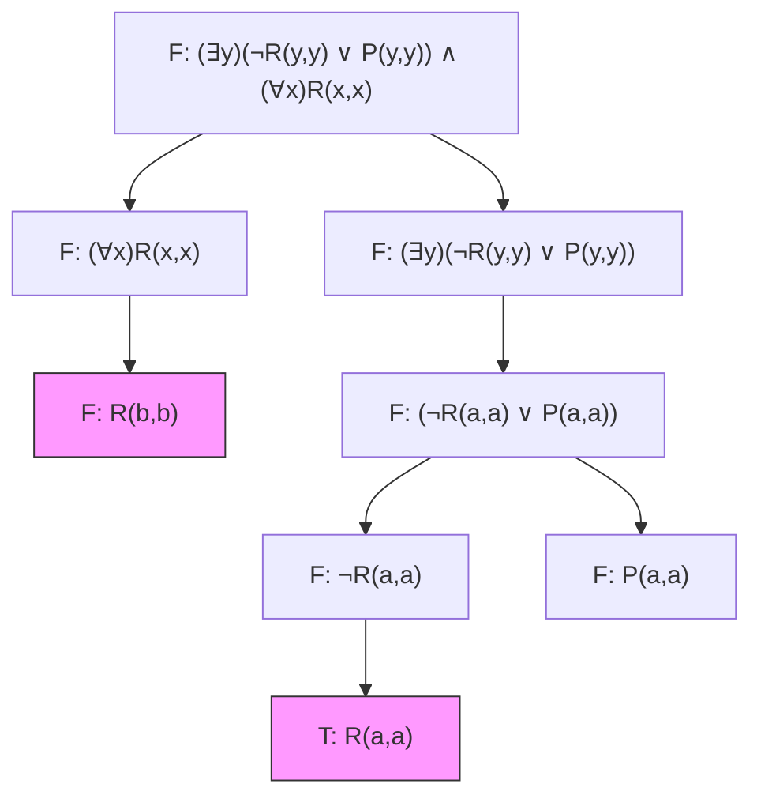
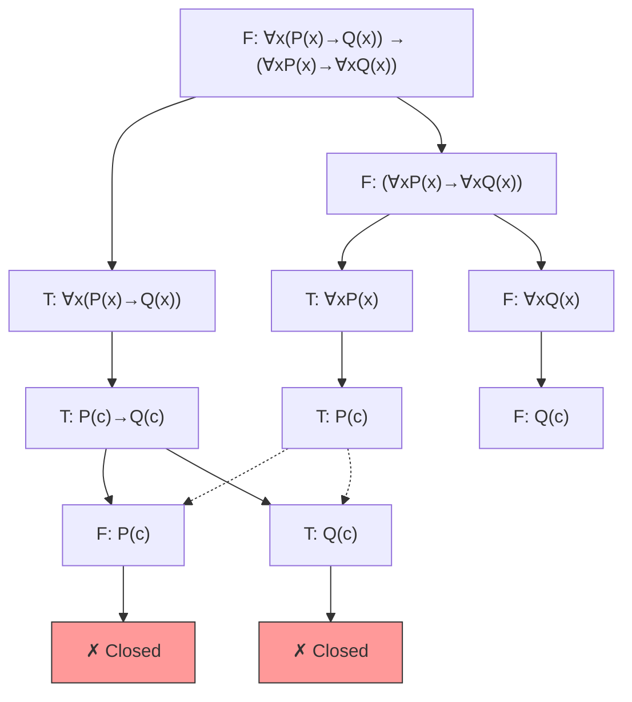
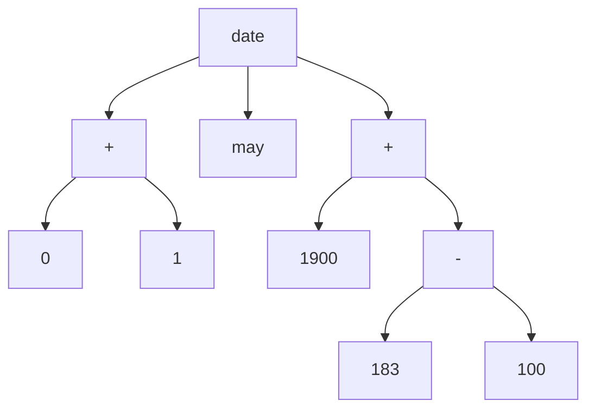
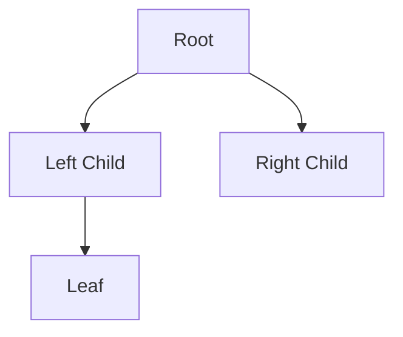

# Logic for Computer Scientists - Practice Problems

This page contains worked problems from the last four lectures of CS 5384, demonstrating propositional logic, Herbrand semantics, Tableaux proofs, and Prolog programming.

## Problem 1: Skolemization

**Problem**: Skolemize the following formula:

$$\exists x \exists y [P(x) \land S(y,x)]$$

**Solution**:

The existential quantifiers $\exists x$ and $\exists y$ are replaced with Skolem constants since they are not within the scope of any universal quantifiers.

$$P(c) \land S(d, c)$$

where $c$ and $d$ are new constant symbols (Skolem constants).

---

## Problem 2: Quantifier Interchange

**Problem**: Prove or disprove: $\exists x \forall y A(x,y) \to \forall x \exists y A(x,y)$

**Proof**:

Using the sequent notation:

$$\exists x \forall y A(x,y) \vdash \exists x \forall y A(x,y)$$

$$\exists x \forall y A(x,y) \vdash \forall y A(a,y)$$

where $a$ is a Skolem constant from $\exists x$.

$$\exists x \forall y A(x,y) \vdash A(a,b)$$

where $b$ is any ground term for $\forall y$.

$$\exists x \forall y A(x,y) \vdash \exists y A(a,y)$$

$$\exists x \forall y A(x,y) \vdash \forall x \exists y A(x,y)$$

**Conclusion**: The formula is **valid** (provable). ✓

---

## Problem 3: Quantifier Non-Interchange

**Problem**: Prove or disprove: $\exists x \forall y A(x,y) \to \forall y \exists x A(y,x)$

**Analysis**:

$$\exists x \forall y A(x,y) \vdash \exists x \forall y A(x,y)$$

$$\exists x \forall y A(x,y) \vdash \forall y A(a,y)$$

$$\exists x \forall y A(x,y) \vdash A(a,b)$$

Now we need $\forall y \exists x A(y,x)$, which requires $A(b,x)$ for arbitrary $b$ and some $x$.

However, $a$ and $b$ are **independent constants** from two independent variables $x$ and $y$. We cannot swap them because they may represent two independent quantities.

**Conclusion**: The formula is **not valid** (cannot be proven). ✗

---

## Problem 4: Herbrand Base and Model

**Problem**: Given the vocabulary $\{a, b, p, q\}$ where $a, b$ are object constants, $p$ is a unary function, and $q$ is a binary relational sentence, construct the Herbrand base and one possible Herbrand model.

**Herbrand Base**:

The Herbrand base contains all ground atoms that can be formed:

$$\text{Base} = \{p(a), p(b), q(a,a), q(a,b), q(b,a), q(b,b)\}$$

Note: This is a **finite** set for this vocabulary without function constants that can create infinite terms.

**Herbrand Model** (one possibility):

$$\text{Model} = \{p(a), q(b,a)\}$$

This is a subset of the Herbrand base representing one possible interpretation.

---

## Problem 5: Herbrand Model with Functions

**Problem**: Given object constants $c, d$, unary function terms $f, p$, and unary relation sentence $q$, describe the Herbrand base and provide one model.

**Herbrand Base**:

With function symbols, the base is **infinite**:

$$\text{Base} = \{f(c), q(d), q(f(c)), p(f(f(c))), q(f(f(c))), p(f(f(f(c)))), \ldots\}$$

**Herbrand Model** (one possibility):

$$\text{Model} = \{q(d), q(f(c))\}$$

---

## Problem 6: Tableaux Method Proof (Problem 1 from Lecture 27)

**Problem**: Use the Tableaux method to prove or disprove:

$$\left(\exists y\right)\left(\neg R(y,y) \lor P(y,y)\right) \land (\forall x) R(x,x)$$

**Tableaux Proof**:

We try to prove the formula is **unsatisfiable** by assuming it is **false** and deriving a contradiction.

<div data-test-id="tableaux-proof-1">



</div>

**Explanation**:

1. Start with the negation of the formula: $F: (\exists y)(\neg R(y,y) \lor P(y,y)) \land (\forall x) R(x,x)$
2. Apply conjunction rule: Split into both conjuncts must be false
3. $F: (\forall x) R(x,x)$ gives us $F: R(b,b)$ for some constant $b$
4. $F: (\exists y)(\neg R(y,y) \lor P(y,y))$ means the existential is false, so  $F: (\neg R(a,a) \lor P(a,a))$ for any $a$
5. Disjunction false means both disjuncts false: $F: \neg R(a,a)$ and $F: P(a,a)$
6. $F: \neg R(a,a)$ means $T: R(a,a)$

**Result**: The tree has open branches (no contradiction), so the formula is **satisfiable** (not a tautology).

---

## Problem 7: Tableaux Method Proof (Problem 2 from Lecture 27)

**Problem**: Use Tableaux method to prove or disprove:

$$\forall x (P(x) \to Q(x)) \to (\forall x P(x) \to \forall x Q(x))$$

**Approach**: Assume the formula is **false** and try to derive a contradiction.

<div data-test-id="tableaux-proof-2">



</div>

**Result**: All branches close with contradictions. The formula is a **tautology** (valid). ✓

---

## Problem 8: Herbrand Interpretations

**Problem**: For the Herbrand base $\{r(a,a), r(a,b), r(b,a), r(b,b)\}$, enumerate several Herbrand interpretations.

**Solution**:

The power set of the Herbrand base gives us all possible interpretations:

- $\{\}$ (empty set)
- $\{r(a,a)\}$
- $\{q(a)\}$
- $\{p(a), q(a)\}$
- $\{p(b)\}$
- $\{q(b)\}$
- $\{p(b), q(b)\}$
- $\{p(a), p(b)\}$
- $\{p(a), p(b), q(a)\}$
- $\{p(a), p(b), q(b)\}$
- $\{p(a), p(b), q(a), q(b)\}$
- ... (16 total interpretations for 4 base atoms)

Each subset represents a different interpretation (model) of the propositional variables.

---

## Problem 9: Prolog List Length

**Problem**: Write a Prolog program to calculate the length of a list.

**Solution**:

```prolog
% Base case: empty list has length 0
listlen([], 0).

% Recursive case: length of [Head|Tail] is 1 + length of Tail
listlen([_|TAIL], N) :-
    listlen(TAIL, M),
    N is M + 1.
```

**Example queries**:

```prolog
?- listlen([a,b,c], N).
N = 3.

?- listlen([], N).
N = 0.

?- listlen([1,2,3,4,5], N).
N = 5.
```

---

## Problem 10: Prolog List Concatenation

**Problem**: Write a Prolog program to concatenate two lists.

**Solution**:

```prolog
% Base case: concatenating empty list with L gives L
listconcat([], L, L).

% Recursive case: move head from first list to result
listconcat([X1|L1], L2, [X1|L3]) :-
    listconcat(L1, L2, L3).
```

**Example queries**:

```prolog
?- listconcat([a,b], [c,d], Result).
Result = [a,b,c,d].

?- listconcat([1,2,3], [4,5], Result).
Result = [1,2,3,4,5].
```

---

## Problem 11: Prolog Family Relationships

**Problem**: Define Prolog facts and rules for a family where Adam and Ashley have children Robert and Rory, with grandfathers Bob (paternal) and Brian (maternal). Write rules for `mgf(X,Y)` (maternal grandfather) and `pgf(X,Y)` (paternal grandfather).

**Solution**:

```prolog
% Facts
mother(ashley, robert).
mother(ashley, rory).
father(adam, robert).
father(adam, rory).
father(bob, adam).
father(brian, ashley).

% Rules
% Maternal grandfather: mother's father
mgf(X, Y) :- mother(Z, X), father(Y, Z).

% Paternal grandfather: father's father
pgf(X, Y) :- father(Z, X), father(Y, Z).
```

**Example queries**:

```prolog
?- mgf(robert, GF).
GF = brian.

?- mgf(rory, GF).
GF = brian.

?- pgf(robert, GF).
GF = bob.

?- pgf(rory, GF).
GF = bob.
```

---

## Problem 12: Prolog Sum of List with Negation

**Problem**: Write a Prolog program to calculate the sum of list elements multiplied by -1.

**Solution**:

```prolog
% Base case: empty list sums to 0
sum([], 0).

% Recursive case: subtract head from tail sum
sum([H|T], Sum) :-
    sum(T, SumT),
    Sum is SumT - H.
```

**Example queries**:

```prolog
?- sum([4,2,3], S).
S = -9.

?- sum([1,2,3,4], S).
S = -10.
```

---

## Advanced: Expression Trees (from Prolog Lecture)

Prolog structures can be visualized as trees. For example:

$$\text{date}(+(0,1), \text{may}, +(1900, -(183,100)))$$

Can be represented as:



**LaTeX equivalent** (using `qtree` package):

```latex
\Tree [.date [.+ 0 1 ] may [.+ 1900 [.- 183 100 ] ] ]
```

---

## Notes on Tree Rendering

### Mermaid (for Web/Markdown)

Use `mermaid` code blocks with `graph TD` (top-down) or `graph LR` (left-right):

````markdown

````

### LaTeX (for Academic Papers)

Use the `qtree`, `forest`, or `prooftrees` package:

```latex
% Using qtree
\usepackage{qtree}
\Tree [.S [.NP Det N ] [.VP V NP ] ]

% Using forest (more powerful)
\usepackage{forest}
\begin{forest}
  [S [NP [Det] [N]] [VP [V] [NP]]]
\end{forest}

% Using prooftrees for tableaux
\usepackage{prooftrees}
\begin{prooftree}
{line numbering=false}
[F: P \land Q
  [F: P, close]
  [F: Q, close]
]
\end{prooftree}
```

---

## Summary of Key Notation

### Quantifiers

- Universal: $\forall x$, $\forall x \forall y \forall z$
- Existential: $\exists x$, $\exists y$

### Logical Connectives

- Conjunction: $\land$ (and)
- Disjunction: $\lor$ (or)
- Implication: $\to$ (implies)
- Negation: $\neg$ (not)
- Biconditional: $\leftrightarrow$ (if and only if)

### Predicates and Relations

- Unary: $P(x)$, $Q(x)$
- Binary: $R(x,y)$, $A(x,y)$
- Ternary: $r(x,y,z)$

### Proof Notation

- Entailment: $\vdash$ (proves, entails)
- Sequent: $\Gamma \vdash \phi$ (from premises $\Gamma$, we can derive $\phi$)
- Skolem constants: $c, d, a, b$ (lowercase letters)
- Skolem functions: $f, g, h$ (lowercase function symbols)

### Set Notation

- Herbrand Base: $\{p(a), q(b,a), r(a,a,b)\}$
- Herbrand Model: $\{p(a), q(b,a)\} \subseteq \text{Base}$

---

**Course**: CS 5384 - Logic for Computer Scientists
**Institution**: Texas Tech University
**Semester**: Fall 2025
**Lectures Covered**: Dec 1, Dec 3, Dec 5, Dec 8
