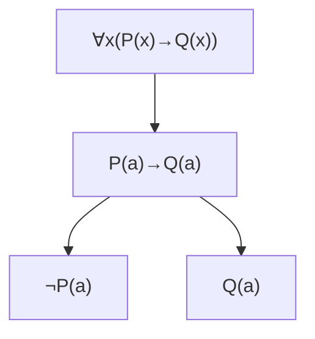

# Math Rendering Rules

This page exercises inline math, display math, and common LaTeX constructs to verify KaTeX rendering in markdown.

## Inline Variables and Fonts

  $a$,
  $x$,
  $y$,
  $\mathcal{R}$,
  $\mathcal{S}$,
  $\mathbb{N}$,
  $\mathbb{Z}$,
  $\mathbb{Q}$,
  $\mathbb{R}$

## Multiplication, Logs, Trig

  $2x$, $x \cdot y$, $x \times y$, $\log x$, $\sin x$, $\cos x$

## Percentages and Fractions

  $x\% = \frac{x}{100} = x/100$

## Floor, Ceil, Absolute Value, Factorial

  $\lfloor 3.7 \rfloor = 3$, $\left\lceil \frac{x}{2}\right\rceil$, $\lvert -2 \rvert = 2$, $n!$

## Sets, Intervals, Binomial

  $\{1,2,3\}$, $[0,1]$, $\mathbb{Z}_{\geq 5}$, $\binom{5}{2} = 10$

## Display Equations and Environments

$$
2x + 3y = 7
$$

$$
\left \lceil \frac{x}{2} \right \rceil + \left\lfloor \frac{x}{2} \right\rfloor = x
$$

## Overlines and Sequences

  $\overline{12} = 12$, $\overline{ab} = 12$, $a \neq 0$, $b=2$

## Lists with Math
- $\angle ABC = 60^\circ$ and $\triangle ABC$ use standard geometry notation.
- $x \in [0,1]$ chosen uniformly at random.
- Empty set operations: $\sum_{\emptyset} 0 = 0$, $\prod_{\emptyset} 1 = 1$.

## Power Towers and Binomials

  $2^{3^2} = 512$

  $\binom{0}{0} = 1$, $\binom{3}{5} = 0$

## Propositional Logic - Quantifiers

  Universal: $\forall x$, $\forall x \forall y P(x,y)$ 
  Existential: $\exists x$, $\exists y Q(y)$ 
  Mixed: $\forall x \exists y R(x,y)$

## Logical Connectives

  $P \land Q$ (and), $P \lor Q$ (or), $P \to Q$ (implies), $\neg P$ (not), $P \leftrightarrow Q$ (iff)

## Predicates and Relations

  Unary: $P(x)$, $Q(a)$ 
  Binary: $R(x,y)$, $S(a,b)$ 
  Ternary: $T(x,y,z)$

## Proof Notation

  Entailment: $\Gamma \vdash \phi$ (from $\Gamma$, we derive $\phi$) 
  Skolem constants: $c, d, a, b$

## Herbrand Sets

  Base: $\{p(a), p(b), q(a,a), q(a,b)\}$ 
  Model: $\{p(a), q(b,a)\} \subseteq \text{Base}$

## Tree Rendering with Mermaid

